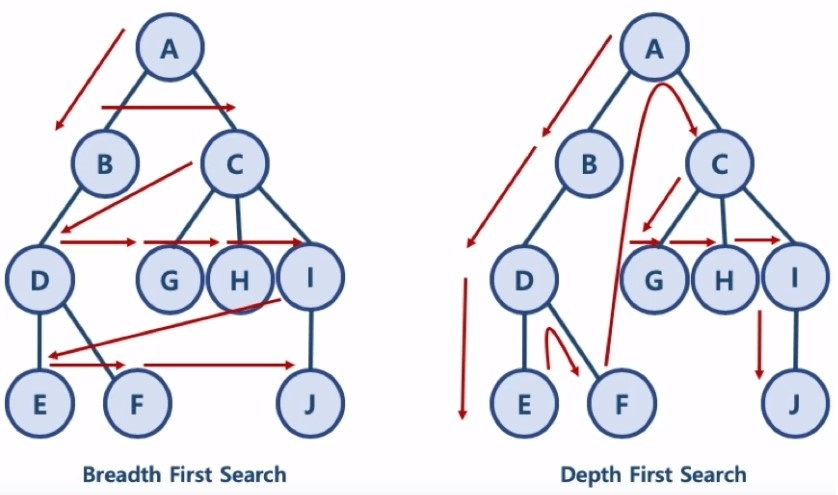
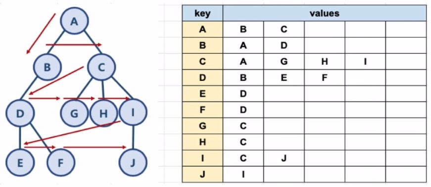

# 너비우선탐색 (BFS) & 깊이우선탐색 (DFS)

## 1) 그래프 탐색 알고리즘
- 너비우선탐색(BFS) : 정점들과 같은 레벨에 있는 노드(형제 노드)들을 먼저 탐색하는 방식
- 깊이우선탐색(DFS) : 정점의 자식들을 먼저 탐색하는 방식

## 2) BFS, DFS 이해를 위한 예제

<p align="center"></p>

 - BFS 방식 : A - B - C - D - G - H - I - E - F - J
   (한 단계씩 내려가면서, 해당 노드와 같은 레벨에 있는 노드(형제 노드)들을 먼저 순회함
 - DFS 방식 : A - B - D - E - F - C - G - H - I - J
   (한 노드의 자식을 타고 끝까지 순회한 후, 다시 돌아와서 다른 형제들의 자식을 타고 내려가며 순회함

## 3) 파이썬에서의 그래프 표현

<p align="center"></p>

- 파이썬 딕셔너리와 리스트 자료구조를 활용하여 표현

```python
graph = dict()

graph['A'] = ['B', 'C']
graph['B'] = ['A', 'D']
graph['C'] = ['A', 'G', 'H', 'I']
graph['D'] = ['B', 'E', 'F']
graph['E'] = ['D']
graph['F'] = ['D']
graph['G'] = ['C']
graph['H'] = ['C']
graph['I'] = ['C', 'J']
graph['J'] = ['I']

graph
```

## 4) BFS 알고리즘 구현

- 자료구조 Queue 활용 (need_visit과 visited 두 개의 Queue 생성)

```python
def bfs(gragh, start_node):
    visited = list()
    need_visit = list()

    need_visit.append(start_node)

    while need_visit:
        # 맨 앞의 데이터 pop (queue)
        node = need_visit.pop(0)
        if node not in visited:
            visited.append(node)
            need_visit.extend(graph[node])

    return visited

bfs(graph, 'A')
```

## 5) BFS 시간복잡도

- 노드 수 : V
- 간선 수 : E
- 위 코드에서 while문은 V + E번 수행함. 즉, 시간복잡도는 $O(V+E)$

## 6) DFS 알고리즘 구현

```python
def dfs(gragh, start_node):
    visited = list()
    need_visit = list()

    need_visit.append(start_node)

    while need_visit:
        # 맨 끝의 데이터 pop (stack)
        node = need_visit.pop()
        if node not in visited:
            visited.append(node)
            need_visit.extend(graph[node])

    return visited

dfs(graph, 'A')
```

## 7) DFS 시간복잡도

- 노드 수 : V
- 간선 수 : E
- 위 코드에서 while문은 V + E번 수행함. 즉, 시간복잡도는 $O(V+E)$