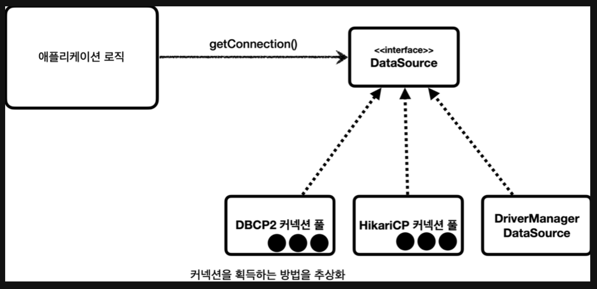

# DB 커넥션

## 1. 일반적인 DB 커넥션

<p align="center"></p>

- 애플리케이션 로직이 DB 드라이버를 통해 커넥션 조회
- DB 드라이버는 DB와 TCP/IP 커넥션을 연결
- 커넥션이 연결되면 ID, PW와 기타 부가 정보를 DB에 전달
- ID, PW를 통해 인증이 완료되면 내부 세션 생성
- DB는 세션 생성 완료를 통해 커넥션 생성이 끝났다는 응답을 보냄
- DB 드라이버는 커넥션 객체를 생성해서 클라이언트에 반환

### 1-1. 일반적인 DB 커넥션 생성의 단점

- 위와 같이 커넥션을 생성하는 것은 여러 단계가 필요하며, 네트워크 커넥션이 사용되므로 매우 복잡하고 많은 시간이 소요됨
- 즉, 사용자 요청이 들어왔을 때, 커넥션 생성 시간 + SQL 실행 시간이 더해져 응답 속도에 영향을 주게 됨

## 2. 커넥션 풀

<p align="center"></p>

- 커넥션 풀은 커넥션 생성의 속도에 대한 단점을 해결하기 위해 고안되었으며, 대표적인 커넥션 풀 오픈 소스는 commons-dbcp2, HikariCP(Spring Boot 2.0 이상 부터 기본으로 사용) 등이 있음
- 애플리케이션 실행 시점에 미리 커넥션들을 생성해두고, 필요할 때 커넥션 객체들의 참조를 가져와서 재사용하는 방식
- 즉, 커넥션 풀에 존재하는 커넥션들은 모두 DB와 TCP/IP 연결이 맺어지고, DB 내부에서는 각 커넥션에 매칭되는 세션이 생성된 상태

### 2-1. 커넥션 풀 사용 과정

- DB 드라이버가 아닌 커넥션 풀에서 커넥션을 가져옴
- 커넥션 사용 후 재사용할 수 있도록 커넥션 풀에 살아있는 상태로 반환 (커넥션 종료를 하지 않음)

### 2-2. 커넥션 풀의 장점

- 커넥션 생성에 필요한 6가지 단계가 모두 처리된 상태이므로 언제든지 SQL문을 DB에 전달할 수 있어 사용자 응답 속도가 빨라짐
- 서버당 최대 커넥션 갯수를 제한할 수 있어 DB에 무한정 커넥션이 되는 것을 막아 DB를 보호하는 효과도 존재

## 3. DataSource

- 커넥션을 획득하는 방법은 아래와 같은 방법들이 있음
    - JDBC DriverManager를 직접 사용해서 매번 커넥션 생성
    - HicariCP와 같은 커넥션 풀 사용
- 만약 한 애플리케이션에서 커넥션을 획득하는 방법을 바꾸는 경우 의존 관계가 바뀌므로 코드를 변경하는 문제가 발생하는데, 이러한 문제를 Java에서 제공하는 추상화된 인터페이스 javax.sql.DataSource를 통해 해결할 수 있음

<p align="center"></p>

- 위와 같이 DataSource는 인터페이스로 추상화되었기 때문에 구현체에 직접 의존하지 않게 되며, 커넥션 풀을 획득하는 방법을 바꾸고 싶다면 애플리케이션의 로직 변경 없이 구현체만 갈아끼우면 됨

### 3-1. DataSource의 장점

- 객체의 설정과 사용 시점을 분리할 수 있음
    - 설정 : DataSource를 만들고 필요한 속성들을 사용해서 URL, USERNAME, PASSWORD 정보 입력
    - 사용 : 설정은 신경쓰지 않고 DataSource의 getConnection()만 호출해서 사용
    
    ```java
    public class MemberRepository{
        private final DataSource dataSource;
    
        public MemberRepositoryV1(DataSource dataSource) {
            this.dataSource = dataSource;
        }
        ...
    }
    ```
    
- 만일 Repository가 DataSource를 의존 관계 주입으로 받고 있는 상태라면, 필요한 데이터들을 DataSource 생성 시점에 외부에서 미리 다 넣어둘 수 있기 때문에 Repository에서는 datasource.getConnection()만 호출하면 됨
- 애플리케이션 개발 시 설정은 주로 한 곳에서, 사용은 수 많은 곳에서 하기 때문에 이는 중요한 장점이 됨
- Dependency Injection을 통해 DataSource를 주입받는 것으로 기존의 코드를 변경하지 않으면서 기능을 추가할 수 있는 개방 폐쇄 원칙을 지킬 수 있음(OCP 원칙)

---

참고 : https://velog.io/@semi-cloud/Spring-DB-DB-%EC%BB%A4%EB%84%A5%EC%85%98-%ED%92%80%EA%B3%BC-DataSource