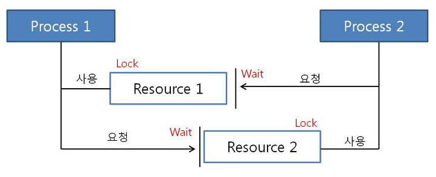

# 교착상태 (Dead Lock)

## 1. 교착상태란?
- Dead Lock이라고도 하며, 한정된 자원을 여러 곳에서 사용하려할 때 발생한다.

- 멀티 프로그래밍 환경에서 한정된 자원을 사용하려고 서로 경쟁하는 상황, 혹은 어떠한 프로세스가 자원을 요청했을 때 그 자원을 사용할 수 없는 상황인 경우 프로세스가 대기 상태로 들어가게되며, 이러한 상황을 교착 상태(Dead Lock)라 한다.

## 2. Dead Lock 발생 조건
- Dead Lock은 한 시스템 내에서 다음의 4가지 조건이 동시에 성립할 때 발생한다.
- 따라서, 아래의 4가지 조건 중 하나라도 성립하지 않도록 한다면, Dead Lock을 해결할 수 있다.

### 2-1. 상호배제(Mutual Exclusion)
- 자원은 한 번에 한 프로세스만 사용할 수 있어야한다.

### 2-2. 점유대기(Hold And Wait)
- 자원을 최소한 하나 보유하고, 다른 프로세스에 할당된 자원을 점유하기 위해 대기하는 프로세스가 존재해야한다.

### 2-3. 비선점(No Preemption)
- 다른 프로세스에 할당된 자원은 사용이 끝날 때까지 강제로 빼앗을 수 없다.

### 2-4. 순환대기(Circular Wait)
- 대기 프로세스의 집합이 순환형태로 자원을 대기하고 있어야한다.

## 3. Dead Lock 해결법 - 예방

- 기본적으로 예방은 Dead Lock 발생조건 4가지 중 하나라도 발생하지 않게 하는 것
  
### 3-1. 상호배제 조건 방지
- 한 번에 여러 프로세스가 공유 자원을 사용할 수 있도록 함
- 그러나 추후 동기화 관련 문제가 발생할 수 있음

### 3-2. 점유대기 조건 방지
- 프로세스 실행에 필요한 모든 자원을 한꺼번에 요구하고, 허용할 때까지 작업을 보류하여 나중에 또 다른 자원을 점유하기 위한 대기 조건을 성립하지 않도록 함

### 3-3. 비선점 조건 방지
- 이미 다른 프로세스에 할당된 자원이 선점권이 없다고 가정할 때, 높은 우선순위의 프로세스가 해당 자원을 선점할 수 있도록 함

### 3-4. 순환대기 조건 방지
- 자원을 순환형태로 대기하지 않도록 일정한 한 쪽 방향으로만 자원을 요구할 수 있도록 함

### => 이렇게 Dead Lock을 예방하는 방법의 단점은 시스템의 처리량이나 효율성을 떨어지게 할 수도 있음
### => 따라서, 경우에 따라 회피하는 방법을 고려해야 할 수도 있음

## 4. Dead Lock 해결법 - 회피

### 4-1. Safe State
- 시스템의 프로세스들이 요청하는 모든 자원을 교착상태를 발생시키지 않으면서도 차례로 모두에게 할당해 줄 수 있는 상태
- 회피 알고리즘은 자원을 할당한 후에도 시스템이 항상 Safe State에 있을 수 있도록 할당을 허용하는 것
- 이와 반대로 Dead Lock이 발생할 수 있는 상태를 불안정 상태라고 함

### 4-2. Safe Sequence
- 프로세스들에게 자원을 할당하고, 실행 및 종료 작업을 할 때 교착상태가 발생하지 않는 특정한 순서

### 4-3. 은행원 알고리즘
- 다익스트라가 제안한 대표적인 회피 알고리즘
- 어떤 자원의 할당을 허용하는지에 관한 여부를 결정하기 전, 미리 결정된 모든 자원들의 최대 가능한 할당량을 가지고 시뮬레이션해서 Safe State에 들 수 있는지 여부를 검사함
- 즉, 대기중인 다른 프로세스들의 활동에 대한 교착상태 가능성을 미리 조사하는 것
- 자원 할당량을 사전에 파악하여 Dead Lock을 회피하는 방법이기 때문에, 미리 최대 자원 요구량을 알아야하고, 할당할 수 있는 자원 수가 일정해야하는 등 사용에 제약조건이 많다는 단점과 자원 이용도 하락의 단점이 있음

## 5. Dead Lock 해결법 - 탐지 및 회복

- 시스템이 예방이나 회피 법을 사용하지 않았을 때, Dead Lock이 발생할 수 있으니 해당 시점에서 탐지 및 회복하는 알고리즘

### 5-1. 탐지
- Allocation, Request, Available 등으로 시스템에 교착상태가 발생했는지 여부 탐색
- 은행원 알고리즘 방식과 유사하게 현재 시스템의 자원 할당 상태를 가지고 파악
- 자원 할당 그래프를 통해서도 파악 가능

### 5-2. 회복
- 탐지 기법을 통해 교착상태 발견 시, 순환대기에서 벗어나 Dead Lock에서 회복하는 방법
- 단순히 1개 이상의 프로세스를 중단
  - 교착상태인 모든 프로세스를 중단하는 방법
    - 계속 연산중이던 프로세스들도 일시 중단되어 부분 결과가 폐기될 수 있는 상황이 발생할 수 있음
  - 프로세스를 하나씩 중단시킬 때마다 탐지 알고리즘을 통해 Dead Lock 탐지하며 회복시키는 방법
    - 매번 탐지 알고리즘을 호출하고 수행해야 하므로 부담이 될 수 있음
- 자원 선점하기
  - 프로세스에 할당된 자원을 선점하여 교착상태를 해결할 때까지 그 자원을 다른 프로세스에 할당하는 방법