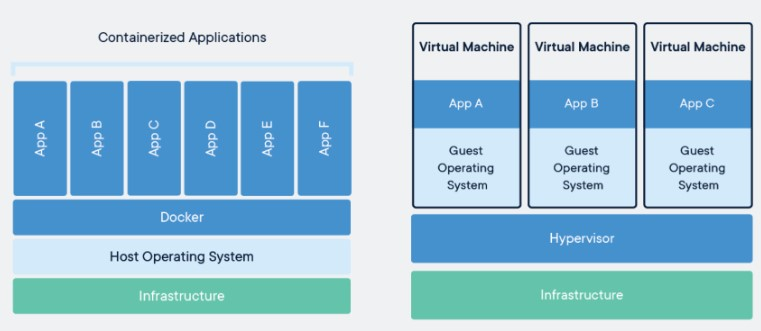
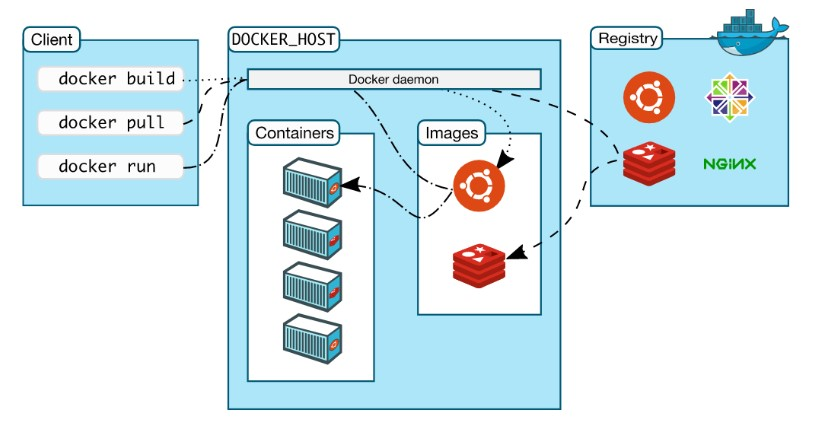
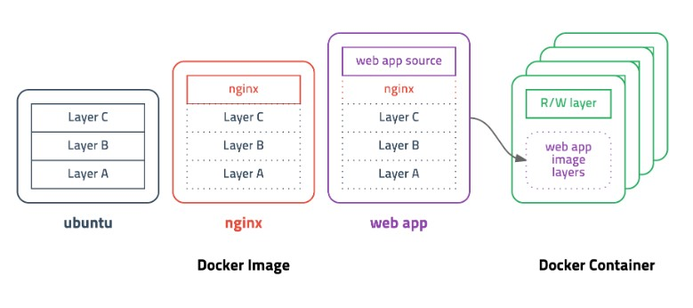
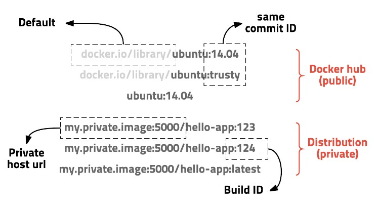

# Container & Docker

## 1. Container
- 보통 SW는 OS와 라이브러리에 의존하게 되는데, Container는 개별 SW 실행에 필요한 실행 환경을 독립적으로 운용할 수 있도록 함
- 다른 실행 환경과의 간섭을 막고, 실행의 독립성을 확보해주는 OS 수준의 격리 기술

## 2. Container와 VM의 차이

<p align="center"></p>

### 2-1. VM
- Hypervisor
  - Host OS 1대에서 다수의 OS를 동시에 실행할 수 있도록 해주는 가상 플랫폼 기술
  - 높은 수준의 관리 및 모니터링 도구에 대한 인터페이스 제공
  - OS 간 서로 방해하지 못하도록 VM에 대한 자원 및 메모리 할당
- 이러한 Hypervisor를 통해 가상화 기술을 구현하고, 독립적인 Guest OS를 관리하는 것
- 하지만, 독립적인 플랫폼을 증가시킬 때마다 OS를 만들어주는 작업을 해야하기 때문에 확장성이 떨어지며, 자원을 유동적으로 관리 할 수 없어 비효율적이라는 단점이 있음

### 2-2. Container
- 하나의 Host OS에서 각각의 독립적인 프로그램처럼 관리되며, 추가 Guest OS를 만들거나 Infra를 독립적으로 나눌 필요가 없음
- Container의 장점
  - 어플리케이션 레벨 고립
  - VM보다 빠른 셋업
  - VM보다 적은 메모리 소모
  - VM보다 크기가 작기 때문에 마이그레이션, 백업, 전송이 쉬움
  - HW와의 빠른 커뮤니케이션으로 성능에 효과적
  - 어플리케이션 배치와 유지보수 향상
  - 어플리케이션 전달 시간 감소

## 3. Docker
- Container 기반의 오픈소스 가상화 플랫폼
- 어플리케이션을 분리하고, Container로 추상화하여 프로그램의 배포 및 관리를 단순하게 해줌
- 하나의 Host OS에서 여러 Container를 동시에 실행할 수 있으며, Container의 Life-Cycle을 관리하고 어플리케이션을 Orchestration(Work-Flow의 자동화)된 서비스로 배포할 수 있음
- AWS, Azure, Google Cloud 등 어디에서든 사용 가능

## 4. Docker의 아키텍쳐

<p align="center"></p>

- Docker는 Client-Server 아키텍쳐로 Docker Client와 Docker Demon이 REST API를 사용하여 통신함

### 4-1. Docker Demon
- Docker API 요청 수신, Image, Container, Network와 같은 Docker 객체 및 Docker 서비스 관리

### 4-2. Docker Client
- Docker 사용자가 Docker와 상호작용하기 위해 사용되며, 기본적인 Docker 명령어를 통해 Docker Demon과 통신함

### 4-3. Docker Registry
- Docker Image를 저장, Docker Hub라는 Public Registry와 Private Resistry가 있음
  - docker pull, docker run : Docker의 필수 Image를 가져옴
  - docker push : Registry에 저장

### 4-4. Docker 객체
- Docker Image : Container 실행에 필요한 파일과 설정 값 등을 포함
- Container : Docker Image의 실행 가능한 인스턴스

## 5. Docker Image
- Container 실행에 필요한 파일과 설정 값 등을 포함하고 있음
- Container에 따른 상태 값이 변하지 않으므로 라이브러리의 버젼이 의도치 않게 바뀌는데에 따른 의존성 문제가 발생하지 않음
- Container는 Image를 실행한 상태라고 볼 수 있고, 변하는 값은 Container에 저장됨 (Docker Image는 변하지 않음)
- 같은 Image에서 여러 개의 Container를 생성할 수 있음

### 5-1. Docker Layer

- Docker Image가 변할 때마다 새롭게 다운받는다면 비효율적이기 때문에 사용되는 개념
  
<p align="center"></p>

- ubuntu의 Image는 A+B+C이며, nginx는 A+B+C+nginx를 하고 싶을 때, Layer 기능을 이용하면 ubuntu에 nginx만 쌓으면 됨

### 5-2. Image의 경로

<p align="center"></p>

### 5-3. Docker File - Docker Image의 생성 과정

- Image를 빌드하려면 Image를 만들고 실행하는데 필요한 단계를 정의하는 명령어로 Docker File을 만듬
- Docker File의 각 명령어는 Image에 Layer를 만들고, Docker File을 변경하고 Image를 다시 빌드하면 변경된 Layer만 빌드되게 됨

```docker
# vertx/vertx3 debian version
FROM subicura/vertx3:3.3.1
MAINTAINER chungsub.kim@purpleworks.co.kr


ADD build/distributions/app-3.3.1.tar /
ADD config.template.json /app-3.3.1/bin/config.json
ADD docker/script/start.sh /usr/local/bin/
RUN ln -s /usr/local/bin/start.sh /start.sh


EXPOSE 8080
EXPOSE 7000


CMD ["start.sh"]
```
