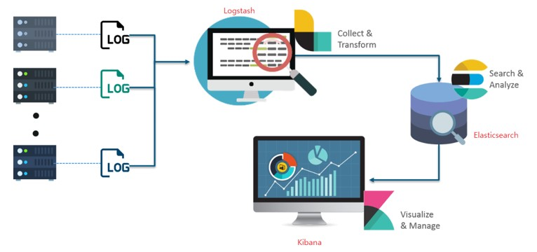
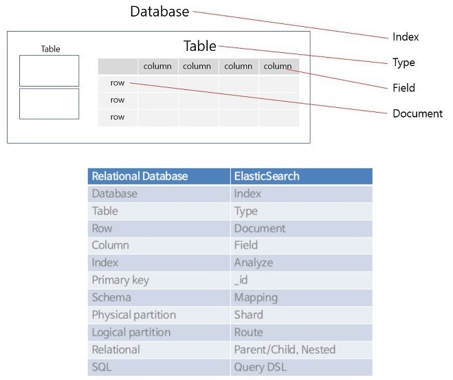
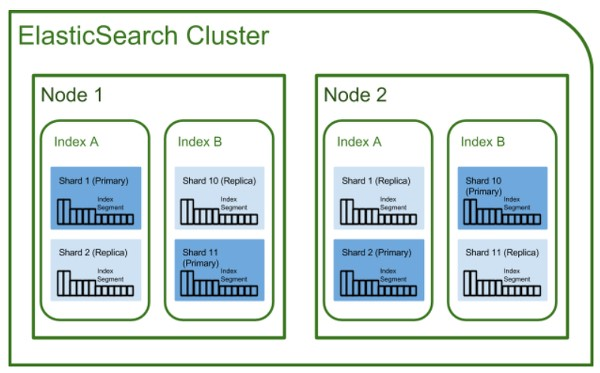

# Elasticsearch

## 1. Elasticsearch란?

- Apache Lucene 기반의 Java 오픈소스 분산 검색 엔진
- Elasticsearch를 통해 Lucene 라이브러리를 단독으로 사용할 수 있으며, 방대한 양의 데이터를 거의 실시간으로 신속하게 저장, 검색, 분석할 수 있음
- Inverted Index (역색인)
  - Elasticsearch는 텍스트를 파싱하여 검색어 사전을 만든 다음, Inverted Index 방식으로 텍스트를 저장하기 때문에 RDBMS보다 더 빠른 성능을 보임

<br/>

## 2. ELK 스택

<p align="center"></p>

- Logstash
  - 다양한 소스(DB, csv 파일 등)의 로그 또는 트랜잭션 데이터를 수집, 집계 파싱하여 Elasticsearch로 전달
- Elasticsearch
  - Logstash로부터 받은 데이터를 검색 및 집계하여 관심있는 정보 획득
- Kibana
  - Elasticsearch의 빠른 검색을 통해 데이터 시각화 및 모니터링

<br/>

## 3. Elasticsearch와 RDBMS와의 비교

- 흔히 사용하고 있는 관계형 DB는 Elasticsearch에서 각각 다음과 대응시킬 수 있음

<p align="center"></p>

<br/>

## 4. Elasticsearch 아키텍처 / 용어 정리

<p align="center"></p>

### 4-1. Cluster
- Elasticsearch에서 가장 큰 시스템 단위, 최소 하나 이상의 Node로 이루어진 Node들의 집합
- 서로 다른 Cluster는 데이터의 접근, 교환을 할 수 없는 독립적인 시스템으로 유지됨
- 여러 서버가 하나의 Cluster를 구성할 수도 있고, 한 서버에 여러개의 Cluster가 존재할 수도 있음

### 4-2. Node
- Elasticsearch를 구성하는 하나의 단위 프로세스
- Master-Eligible Node
  - Cluster를 제어하는 마스터 Node
  - 인덱스 생성, 삭제
  - Cluster Node들의 추적, 관리
  - 데이터 입력시 어느 Shard에 할당할 것인지 결정
- Data Node
  - 데이터와 관련된 CRUD 작업과 관련
  - Data Node는 CPU, 메모리 등 자원을 많이 소모하므로 모니터링이 필요하며, Master Node와 분리되는 것이 좋음
- Ingest Node
  - 데이터를 변환하는 등 사전 처리 파이프라인을 실행하는 역할
- Coordination Only Node
  - Data Node와 Master-Eligible Node의 일을 대신하며, 대규모 Cluster에서 큰 이점이 있음
  - 즉, 로드밸런서와 비슷한 역할을 함

### 4-3. Index, Shard, Replica
- Index
  - RDBMS의 Database와 같은 개념
- Shard
  - Sharding : 데이터를 분산해서 저장하는 방법을 의미
  - 즉, Elasticsearch에서 Scale-Out을 위해 Index를 여러 Shard로 쪼개는 것
  - 기본적으로 1개가 존재하며, 검색 성능 향상을 위해 Cluster의 Shard 갯수를 조정하기도 함
- Replica
  - 또 다른 형태의 Shard로, Node를 손실했을 경우 데이터의 신뢰성을 위해 Shard를 복제하는 것
  - 따라서 Replica는 서로 다른 Node에 존재하는 것이 권장됨

<br/>

## 5. Elasticsearch의 특징

### 5-1. Scale-Out
- Shard를 통해 규모가 수평적으로 늘어날 수 있음

### 5-2. 고가용성
- Replica를 통해 데이터의 안정성을 보장함

### 5-3. Schema Free
- JSON 문서를 통해 데이터 검색을 수행하므로, Schema의 개념이 없음

### 5-4. Restful
- CRUD 작업은 HTTP Restful API를 통해 수행
    <p align="center"></p>

<br/>

## 6. Elasticsearch 예제

### 6-1. document 생성

```linux
curl -XPOST 'localhost:9200/victolee/blog/1?pretty' -d '{"postName" : "elasticsearch", "category" : "IT"}' -H 'Content-Type: application/json'
```

- -d 옵션 : 추가할 데이터를 JSON 포맷으로 전달
- -H 옵션 : 헤더 명시
- ?pretty : 결과를 가시성이 있게 보여주도록 수정

### 6-2. document 조회

```linux
curl -XGET 'localhost:9200/victolee/blog/1?pretty'
```