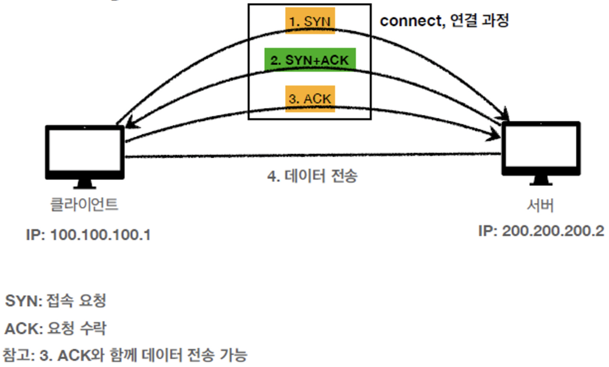

# IP & TCP & UDP

## 1. IP (Internet Protocol)

### 1-1. 인터넷 프로토콜의 역할
- 지정한 IP 주소에 데이터 전달
- 패킷이라는 통신 단위로 데이터 전달
- IP 패킷의 정보 : 출발지 IP, 도착지 IP, 기타 등

### 1-2. IP 프로토콜의 한계
- 비연결성
	- 패킷을 받을 대상이 없거나 서비스 불능 상태여도 패킷 전송

- 비신뢰성
	- 중간에 패킷이 사라지거나 순서대로 패킷이 도착하는 것을 보장하지 못함

- 프로그램 구분
	- 같은 IP를 사용하는 서버에서 통신하는 어플리케이션이 둘 이상이라면 문제 발생

## 2. TCP & UDP

### 2-1. 인터넷 프로토콜 스택 4계층
- 어플리케이션 계층 : HTTP, FTP
- 전송 계층 : TCP, UDP
- 인터넷 계층 : IP
- 네트워크 인터페이스 계층

### 2-2. 프로토콜 계층

### 2-3. TCP/IP 패킷 정보

### 2-4. TCP의 특징
- 전송 제어 프로토콜로, IP 프로토콜의 한계를 보완
- 연결지향 (TCP 3 Way Handshake (가상 연결)) : 연결(논리적)을 한 뒤에 메시지를 보냄

- 데이터 전달 보증 : 메시지가 누락되었는지 알 수 있음

- 순서 보장

- 신뢰할 수 있는 프로토콜
- 현재 대부분 TCP를 사용함

### 2-5. UDP의 특징
- 사용자 데이터그램 프로토콜 (User Datagram Protocol)
- 기능이 거의 없음 (하얀 도화지와 같음)
- 연결지향 X, 데이터 전달 보증 X, 순서 보장 X
- 데이터 전달 및 순서가 보장되지 않지만, 단순하고 빠름
- 즉, IP와 거의 같이지만 PORT와 체크섬이 추가되어 있으며, 어플리케이션에서 추가 작업이 필요함
- 물론 TCP가 신뢰할 수 있는 프로토콜이긴 하지만, 더 빠르고 최적화하기 위해서 HTTP3에서 UDP를 채택, 최근 UDP가 각광받고 있음

## 3. PORT

### 3-1. TCP/IP 패킷 정보

### 3-2. PORT의 역할
- PORT는 같은 IP 내에서의 프로세스를 구분해줌

### 3-3. PORT의 특징
- 0~65535까지 할당 가능
- 0~1023까지는 잘 알려진 포트이기 때문에 사용하지 않는 것이 좋음
    - FTP : 20, 21
    - TELNET : 23
    - HTTP : 80
    - HTTPS : 443