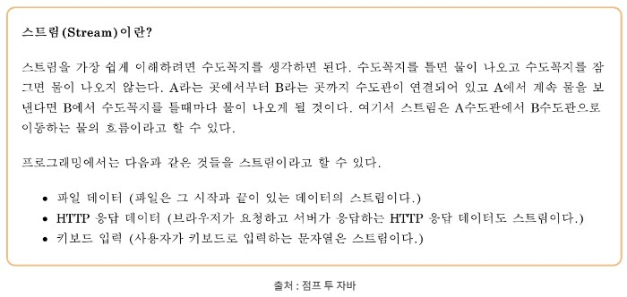
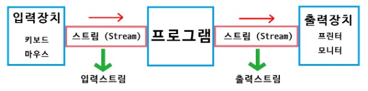
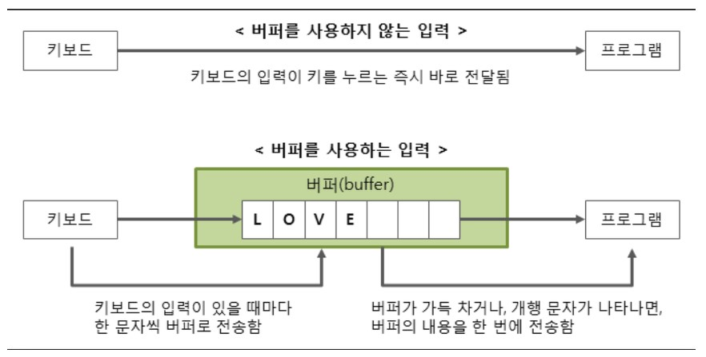

# Java - 데이터 입출력 (BufferedReader & BufferedWriter)

## 1. Java의 데이터 입력

### 1-1. Stream

<p align="center"></p>

- 데이터 입력에 대해 이해하기 전에 먼저 Stream에 대해 알아보자면, 출발지와 도착지를 이어주는 역할로, 한 곳에서 다른 한 곳으로의 데이터 흐름을 Stream이라 함

<p align="center"></p>

- Stream은 단방향이기 때문에, 입력과 출력이 동시에 발생할 수 없어 용도에 따라 입력 Stream과 출력 Stream으로 나뉨

### 1-2. System.in & InputStream
- System.in은 InputStream 타입의 정적 필드로, InputStream 타입의 새 변수를 선언하고, 그 변수에 System.in을 할당 시킬 수 있음
- InputStream은 byte Stream으로, 1 byte씩 읽기 때문에 문자를 온전하게 읽어들일 수 없음

### 1-3. Scanner(System.in) & InputStreamReader(System.in)
- Scanner(System.in)은 byte Stream인 InputStream을 통해 표준 입력을 받지만, 1 byte씩 읽기 때문에 문자를 온전하게 읽어들일 수 없고, InputStreamReader를 통해 문자(char) 단위로 데이터를 변환시켜 온전한 문자를 읽어들임

### 1-4. BufferedReader
- InputStreamReader는 문자(char) 단위로 처리하기 때문에, buffer를 통해 문자열을 효율적으로 다루기 위해 사용

## 2. Buffer

<p align="center"></p>

- Buffer를 이용하여 입출력하는 함수로, 입출력의 효율성을 높여줌
- 키보드나 모니터와 같은 외부 장치와의 입출력은 생각보다 많은 시간이 걸리는 작업인데, 입출력을 바로 프로그램에 전달하는 것보단 Buffer를 두어 데이터를 한데 묶어서 이동시키는 것이 보다 효율적이고 빠름

## 3. BufferedReader
- Scanner와 같은 역할을 하지만, 띄어쓰기와 개행문자를 경계로하여 입력 값을 인식하는 Scanner와 달리, BufferedReader는 개행문자만 경계로 인식함
- BufferedReader는 데이터가 String으로 고정된다는 단점이 있지만, Scanner보다 속도가 더 빠르고, Buffer 사이즈도 더 크기 때문에 입출력이 많을 때 많이 쓰임
- BufferedReader는 Scanner와 달리 동기화가 되기 때문에 멀티쓰레드 환경에서도 안전함

### 3-1. BufferedReader 선언
- readLine() 메소드를 사용하여 입력(String으로 return 값이 고정되어 있어 다른 타입으로 입력받으려면 형변환을 해야 함)
- 반드시 예외처리를 필요로 함(try~catch 혹은 throws IOException)

```java
BufferedReader br = new BufferedReader(new InputStreamReader(System.in)); // 선언
String s = br.readLine();
int i = Integer.parseInt(br.readLine());
```

### 3-2. 데이터 가공
- BufferedReader는 개행문자 단위로 문자열을 나누기 때문에, StringTokenizer나 split()을 사용하여 가공해야 함

```java
// StringTokenizer 
BufferedReader br = new BufferedReader(new InputStreamReader(System.in));

StringTokenizer st = new StringTokenizer(br.readLine());
int N = Integer.parseInt(st.nextToken());
int M = Integer.parseInt(st.nextToken());

// String.split() 함수
String arr[] = s.split(" ");
```

### 3-3. BufferedReader의 메인 함수

|Modifier and Type|Method and Description|
|---|---|
|void|close() : 입력 스트림을 닫고, 사용하던 자원을 해제|
|void|mark(int , readAheadLimit) : 스트림의 현재 위치를 마킹|
|int|read() : 한 글자만 읽어 정수형으로 반환 (ex. '3'을 읽어 정수형인 (int)'3' = 51로 반환)|
|String|readLine() : 한 줄을 읽음|
|boolean|ready() : 입력 스트림이 사용할 준비가 되었는지 확인 (1이 준비 완료)|

## 4. BufferedWriter
- System.out.println()과 같지만, 많은 양의 출력을 할 땐 buffer를 두는 BufferedWriter를 사용하는 것이 더 효율적

### 4-1. BufferedWriter 선언
- BufferedWriter는 출력과 개행을 동시에 해주지 않기 때문에 개행을 위해선 bw.newLine() 혹은 bw.write(\\n)을 사용해주어야 함
- BufferedWriter의 경우 잡아놓은 buffer를 풀어주기 위해 사용한 후 반드시 bw.flush()와 bw.close()를 해주어야 함

```java
BufferedWriter bw = new BufferedWriter(new OutputStreamWriter(System.out)); // 선언

String str = "abcdef"; // 출력할 문자열

bw.write(str); // 출력
bw.newLine(); // 줄바꿈
bw.flush(); // 남아있는 데이터 모두 출력
bw.close();
```

|Modifier and Type|Method and Description|
|---|---|
|void|flush() : 스트림을 비움(남아있는 데이터 모두 출력)|
|void|close() : 스트림을 닫음|
|void|newLine() : 개행 문자 역할|
|void|write(char[] buf, int offset, int length) : offset 위치부터 length 크기 만큼 write|
|void|ready() : write(int c) : 한 글자 쓰기|
|void|write(String s, int offset, int length) : offset에서부터 일정 길이만큼 write|


