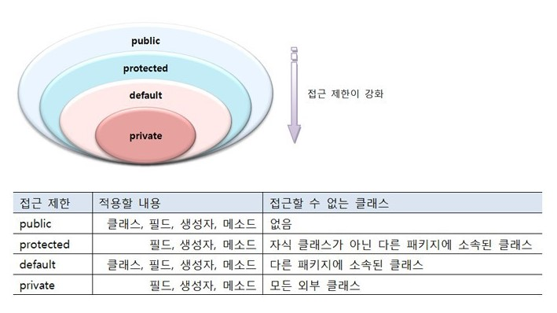

# Java - 캡슐화와 접근제한자

## 1. 캡슐화
- Java 프로그래밍에서 중요한 개념으로, 항상 은닉화를 전제로 개발하는 것
- 관련이 있는 데이터 그리고 동작들을 하나로 묶어 요약하고 사용자의 내부적인 접근을 허용하지 않는 대신, 사용의 편의성을 제공해줌

### 1-1. 캡슐화의 주요 장점
- 데이터 보호
  - 은닉화를 통해 데이터의 접근을 제어할 수 있다.
- 유지보수
  - 객체에 대한 수정 작업이 필요한 경우 캡슐화를 하지 않으면 객체와 관련된 부분에 대한 부담이 있지만, 캡슐화를 하게 되면 각 기능을 하나의 모듈처럼 활용하기 때문에 객체간의 이식성이 높고 독립성을 유지한다.
- 사용자 편의성
  - 모듈화된 기능을 사용법만 익혀 바로 사용할 수 있다.

## 2. 접근제한자

- public : package, class 상관 없이 모든 접근이 가능
- protected : 같은 package에서만 접근을 허용하고, 다른 package는 class간 상속 관계인 경우에만 접근이 가능
- default : 동일 package에서만 접근을 허용하며, 접근제한자가 생략되어 있는 경우, 기본적으로 default가 적용됨
- private : 같은 package 이더라도 접근이 불가하며, 오직 같은 class 내에서만 접근이 가능

### 2-1. 접근제한자 별 사용 가능 범위

- Class : public, default
- Constructor : public, protected, default, private
- Member : public, protected, default, private
- Member Method : public, protected, default, private

