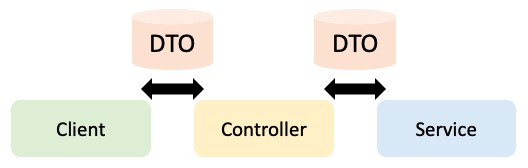
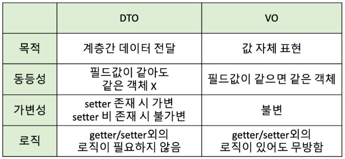

# Spring - DTO & VO

## 1. DTO

<p align="center"></p>

- 순수하게 데이터를 담아 계층 간으로 전달하는 객체
- 로직을 갖고 있지 않은 순수한 데이터 객체로, Getter & Setter Method만 갖음 (오로지 전달만을 목적으로 하기 때문)

```java
public class UserDTO {
    private String name;
    private String id;

    public String getName() {
        return name;
    }
    public void setName(String name) {
        this.name = name;
    }
    public String getId() {
        return id;
    }
    public void setId(String id) {
        this.id = id;
    }
}
```

- Setter를 통해 값을 담아 전달하고, Getter를 통해 값을 전달 받아 사용함

```java
public class UserDTO {
    private String name;
    private String id;

    public UserDTO(String name, String id) {
        this.name = name;
        this.id = id;
    }
    public String getName() {
        return name;
    }
    public String getId() {
        return id;
    }
}
```

- 위와 같이 생성자로 값을 넣어주게 하면, Setter에서의 값을 전달하는 과정에서 변조가 불가능하게 됨

## 2. VO

- 값 그 자체를 나타내는 객체
- DTO와는 달리 로직을 포함할 수 있고, 특정 값 자체를 표현하기 때문에 불변성의 보장을 위해 생성자를 사용해야 함
- 서로 다른 이름을 가지는 VO 인스턴스라도, 모든 속성 값이 같다면 두 인스턴스는 같은 객체임

```java
public class CarVO {
    private final String color;

    public CarVO(String color) {
        this.color = color;
    }
}

class CarVOTest {
    @Test
    void CarVOEqualTest() {
        final String color = "red";

        CarVO car1 = new CarVO(color);
        CarVO car2 = new CarVO(color);

        assertThat(car1).isEqualTo(car2);
        assertThat(car1).hasSameHashCodeAs(car2);
    }
}
```

- 위의 코드에서 car1과 car2는 같은 객체의 주소 값을 비교하게 되어 에러가 발생함
- 따라서 값만을 비교하기 위해서는 equals()와 hashCode()를 오버라이딩(재정의) 해주어야 함

```java
public class CarVO {
    private final String color;

    public CarVO(String color) {
        this.color = color;
    }

    @Override
    public boolean equals(Object o) {
        if (this == o) return true;
        if (o == null || getClass() != o.getClass()) return false;
        CarVO carVO = (CarVO) o;
        return Objects.equals(color, carVO.color);
    }

    @Override
    public int hashCode() {
        return Objects.hash(color);
    }
}
```

- 즉, VO는 값 그 자체를 나타내기 때문에 Setter와 같이 변조의 가능성이 있는 Method가 존재하면 안되고, 두 객체의 필드 값이 같다면 모두 같은 객체라는 것이 핵심

## 3. DTO vs VO

<p align="center"></p>