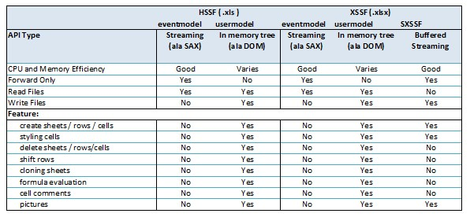
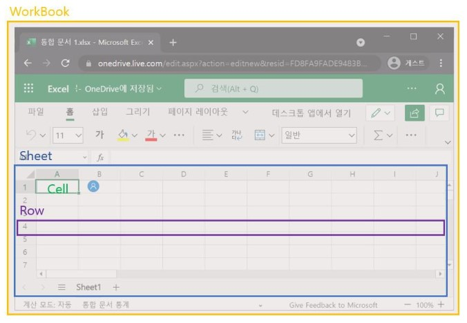

# Java - Excel Download (Apache POI)

## 1. Apache POI
- 아파치 소프트웨어 재단에서 만든 라이브러리로, 마이크로소프트 오피스 파일을 Java로 읽고 쓰는 기능을 제공함 (엑셀, 파워포인트 등 지원)
- Apache POI의 컴포넌트
   
    <p align="center"></p>

  - HSSF : 2007하위 버전인 .xls파일에서만 동작 가능
  - XSSF : 2007이상 버전인 .xlsx파일에서도 동작 가능
  - SXSSF : 대용량 엑셀 파일을 출력할 때 사용

## 2. Apache POI Library 다운 방법

### 2-1. 공식 홈페이지에서 다운로드
-  http://poi.apache.org/download.html#POI-4.1.1

### 2-2. pom.xml에 dependency 추가하여 원격 Repository에서 다운로드
```xml
<dependency>
    <groupId>org.apache.poi</groupId>
    <artifactId>poi</artifactId>
    <version>4.1.1</version>
</dependency>

<dependency>
    <groupId>org.apache.poi</groupId>
    <artifactId>poi-ooxml</artifactId>
    <version>4.1.1</version>
</dependency>
```

## 3. 엑셀의 구조
<p align="center"></p>

- WorkBook > Sheet > Row > Cell 

## 4. 코드 예시 (HSSF)

### 4-1. 셀에 값 설정하기
```java
//엑셀파일 생성
Workbook wb = new HSSFWorkbook();

//시트 생성 (이름은 "new sheet"라고 부여됨)
Sheet sheet = wb.createSheet("new sheet");

//0번째 행 생성
Row row = sheet.createRow(0);

//1번째 셀 생성
Cell cell = row.createCell(0);

//해당 셀에 값 지정
cell.setCellValue(1);
```

### 4-2. 셀에 스타일 지정하기
```java
public static void main(String[] args) throws Exception {
    Workbook wb = new XSSFWorkbook(); //or new HSSFWorkbook();
    Sheet sheet = wb.createSheet();
    Row row = sheet.createRow(2);
    row.setHeightInPoints(30);
    createCell(wb, row, 0, HorizontalAlignment.CENTER, VerticalAlignment.BOTTOM);
    createCell(wb, row, 1, HorizontalAlignment.CENTER_SELECTION, VerticalAlignment.BOTTOM);
    createCell(wb, row, 2, HorizontalAlignment.FILL, VerticalAlignment.CENTER);
    createCell(wb, row, 3, HorizontalAlignment.GENERAL, VerticalAlignment.CENTER);
    createCell(wb, row, 4, HorizontalAlignment.JUSTIFY, VerticalAlignment.JUSTIFY);
    createCell(wb, row, 5, HorizontalAlignment.LEFT, VerticalAlignment.TOP);
    createCell(wb, row, 6, HorizontalAlignment.RIGHT, VerticalAlignment.TOP);
    // Write the output to a file
    try (OutputStream fileOut = new FileOutputStream("xssf-align.xlsx")) {
        wb.write(fileOut);
    }
    wb.close();
}
/**
 * Creates a cell and aligns it a certain way.
 *
 * @param wb     the workbook
 * @param row    the row to create the cell in
 * @param column the column number to create the cell in
 * @param halign the horizontal alignment for the cell.
 * @param valign the vertical alignment for the cell.
 */
private static void createCell(Workbook wb, Row row, int column, HorizontalAlignment halign, VerticalAlignment valign) {
    Cell cell = row.createCell(column);
    cell.setCellValue("Align It");
    CellStyle cellStyle = wb.createCellStyle();
    cellStyle.setAlignment(halign);
    cellStyle.setVerticalAlignment(valign);
    cell.setCellStyle(cellStyle);
}
```

### 4-3. 엑셀파일 응답 보내기
```java
Workbook workbook = new XSSFWorkbook(); 
Sheet sheet = workbook.createSheet("데이터");

rowNum = 0;

createExcel(sheet, datas);

//엑셀파일로 다운받을 수 있도록 설정
String fileName = "fileName";
response.setContentType("application/vnd.ms-excel");
response.setHeader("Content-Disposition", String.format("attachment;filename=%s.xlsx", fileName));

workbook.write(response.getOutputStream());
workbook.close();
```

## 5. 코드 예시 (SXSSF) - 첫번째 방법

- 리스트를 한 번에 불러오지 않고, 10000개씩 끊어서 불러오며, SXSSF Workbook을 주기적으로 flush
- 엑셀 시트 당 최대 행의 갯수는 1,048,575개이므로, ExcelView.java에서 제한을 둠

### 5-1. ExcelController.java
```java
@Controller
public class ExcelController {
    
    private final ExcelService excelService;
        
    @Autowired
    public ExcelController(ExcelService excelService) {
        this.excelService = excelService;
    }
        
    @GetMapping(value = "/download/excel", produces = "application/vnd.ms-excel")
    public String downloadExcel(Model model, ExampleCriteria criteria) 
        throws UnsupportedEncodingException,ParseException {
        
        model.addAttribute("excelMap", excelService.getExcel(criteria));
                  
        return "excelView";
    }
}
```

### 5-2. ExcelService.java
```java
@Service
@RequiredArgsConstructor
public class ExcelService {
    private ExampleMapper exampleMapper;
        
    public Map<String, Object> getExcel(ExampleCriteria criteria) throws ParseException {
        
        // 엑셀에 저장할 row의 수를 불러옴
        long listSize = exampleMapper.getCount(criteria);
                  
        // 헤더 키 설정
        List<String> headerKeys = Arrays.asList("HEADER1", "HEADER2", "HEADER3", ...);
                  
        // 헤더 명 설정
        List<String> headers = Arrays.asList("헤더명1", "헤더명2", "헤더명3", ...)
        List<Map<String, Object>> list = new ArrayList<>();
                  
        // 헤더 키에 1:1 매칭
        for (ExampleDto example : exampleList) {
            Map<String, Object> tempMap = new HashMap<>();
            tempMap.put("HEADER1", example.get...);
            tempMap.put("HEADER2", example.get...);
            tempMap.put("HEADER3", example.get...);
            
            ...
                      
            list.add(tempMap);
        }
                  
        // 헤더당 셀 너비 설정
        List<String> widths = Arrays.asList("15", "20", "30", ...);
        
        /*
        * 셀 당 정렬 기준 설정
        * LEFT: 왼쪽 정렬
        * CENTER: 가운데 정렬
        * RIGHT: 오른쪽 정렬
        */

        List<String> aligns = Arrays.asList("LEFT", "CENTER", "RIGHT", ...);
                  
        // 파일명 설정
        String fileName = "EXAMPLE_EXCEL";
        Map<String, Object> excelMap = new HashMap<>();
        excelMap.put("headers", headers);
        excelMap.put("keys", headerKeys);
        excelMap.put("widths", widths);
        excelMap.put("aligns", aligns);
        excelMap.put("list", list);
        excelMap.put("fileName", fileName);
                  
        return excelMap;
    }
    
    public List<Map<String, Object>> getExcelList(ExampleCriteria criteria, int start, int size) {
          
        // start 인덱스부터 size개의 데이터를 지닌 리스트 반환
        return exampleMapper.getList(criteria, start, size);
    }        
}
```

### 5-3. ExcelView.java
```java
@Component("excelView")
@RequiredArgsConstructor
public class ExcelView extends AbstractXlsView {
    
    private static final int MAX_ROW = 1040000;  
    private static final int PAGING_SIZE = 10000;
    private final ExcelService excelService;
              
    @Override
    protected void buildExcelDocument(Map<String, Object> map, Workbook wb 
        , HttpServletRequest request, HttpServletResponse response) throws Exception {
        
        Map<String, Object> excelMap = (Map<String, Object>) map.get("excelMap");
        List<String> keys = (List<String>) excelMap.get("keys");
        List<String> headers = (List<String>) excelMap.get("headers");
        List<String> widths = (List<String>) excelMap.get("widths");
        List<String> aligns = (List<String>) excelMap.get("aligns");
        long listSize = (Long) excelMap.get("listSize");
        String fileName = (String) excelMap.get("fileName");
        String userAgent = request.getHeader("User-Agent");
        
        if (userAgent.contains("Trident") || (userAgent.indexOf("MSIE") > -1)) {
            
            fileName = URLEncoder.encode(fileName, "UTF-8").replaceAll("\\+", "%20");

        } else if (userAgent.contains("Chrome") || userAgent.contains("Opera") 
            || userAgent.contains("Firefox")) {
            
            fileName = new String(fileName.getBytes("UTF-8"), "ISO-8859-1");

        }
        
        SXSSFWorkbook sxssfWorkbook = null;
                  
        try {
            for (int start = 0; start < listSize; start += PAGING_SIZE) {
            List<Map<String, Object>> list = excelSize.getExcelList(start, PAGING_SIZE);
            
            sxssfWorkbook = getWorkbook(filename
                                        , headers
                                        , keys
                                        , widths
                                        , aligns
                                        , list
                                        , start
                                        , sxssfWorkbook);

            list.clear(); // 리스트 페이징 처리 및 메모리 
            }
            
            response.setContentType("application/vnd.ms-excel");
            response.setHeader("Content-Disposition", "attachment;filename=" + fileName + ".xlsx");
                      
            ServletOutputStream output = reponse.getOutputStream();
            
            output.flush();
            workbook.write(output);
            output.flush();
            output.close();
        } catch (Exception e) {
            log.error("[SxssfExcelView] error message: {}", e.getMessage());
        } finally {
            if (ObjectUtils.isNotEmpty(sxssfWorkbook)) {
                sxssfWorkbook.close();   
            }
        }
    }
    
    private SXSSFWorkbook getWorkbook(String fileName
                                      , List<String> headers
                                      , List<String> keys
                                      , List<String> widths
                                      , List<String> aligns, List<Map<String, Object>> list
                                      , int rowIdx
                                      , SXSSFWorkbook sxssfWorkbook) {
        
        // 최초 생성이면 manual flush를 위해 new SXSSFWorkbook(-1)
        // 이어서 작성일 경우 매개변수로 받은 sxssfWorkbook
        SXSSFWorkbook workbook = ObjectUtils.isNotEmpty(sxssfWorkbook) ? sxssfWorkbook : new SXSSFWorkbook(-1);
        
        // 최초 생성이면 SheetN 생성
        // 이어서 작성일 경우 SheetN에서 이어서
        String sheetName = "Sheet" + (rowIdx / MAX_ROW + 1); // 각 시트 당 1,040,000개씩
        boolean newSheet = ObjectUtils.isEmpty(workbook.getSheet(sheetName));
        Sheet sheet = ObjectUtils.isEmpty(workbook.getSheet(sheetName)) ? workbook.createSheet(sheetName) : workbook.getSheet(sheetName);
        CellStyle headerStyle = createHeaderStyle(workbook);
        CellStyle bodyStyleLeft = createBodyStyle(workbook, "LEFT");
        CellStyle bodyStyleRight = createBodyStyle(workbook, "RIGHT");
        CellStyle bodyStyleCenter = createBodyStyle(workbook, "CENTER");
                  
        // \r\n을 통해 셀 내 개행
        // 개행을 위해 setWrapText 설정
        bodyStyleLeft.setWrapText(true);
        bodyStyleRight.setWrapText(true);
        bodyStyleCenter.setWrapText(true);
                  
        int idx = 0;
        
        for (String width : widths) {
            sheet.setColumnWidth(idx++, Integer.parseInt(width) * 256);
        }
        
        Row row = null;
        Cell cell = null;
        
        // 매개변수로 받은 rowIdx % MAX_ROW 행부터 이어서 데이터 
        int rowNo = rowIdx % MAX_ROW;
        
        if (newSheet) {
            row = sheet.createRow(rowNo);
            idx = 0;
            
            for (String columnName : headers) {
                cell = row.createCell(idx++);
                cell.setCellStyle(headerStyle);
                cell.setCellValue(columnName);
            }
        }
        
        for (Map<String, Object> tempRow : list) {
            idx = 0;
            row = sheet.createRow(++rowNo);
            
            for (String key : keys) {
                if (StringUtils.isEmpty(key)) {
                    continue;
                }
                
                cell = row.createCell(idx);

                if (ObjectUtils.isEmpty(aligns)) {
                    // 디폴트 가운데 정렬
                    cell.setCellStyle(bodyStyleCenter);
                } else {
                    String hAlign = aligns.get(idx);
                    if ("LEFT".equals(hAlign)) {
                        cell.setCellStyle(bodyStyleLeft);
                    } else if ("RIGHT".equals(hAlign)) {
                        cell.setCellStyle(bodyStyleRight);
                    } else {
                        cell.setCellStyle(bodyStyleCenter);
                    }
                }
                
                Object value = tempRow.get(key);
                if (value instanceof BigDecimal) {
                    cell.setCellValue(((BigDecimal) value).toString());
                } else if (value instanceof Double) {
                    cell.setCellValue(((Double) value).toString());
                } else if (value instanceof Long) {
                    cell.setCellValue(((Long) value).toString());
                } else if (value instanceof Integer) {
                    cell.setCellValue(((Integer) value).toString());
                } else {
                    cell.setCellValue((String) value);
                }          
                
                idx++;
                
                // 주기적인 flush 진행
                if (rowNo % 100 == 0) {
                    ((SXSSFSheet) sheet).flushRows(100); 
                }
            }
        }
        
        return workbook;
    }
    
    private CellStyle createHeaderStyle(Workbook workbook) {
        CellStyle headerStyle = createBodyStyle(workbook);
        
        // 취향에 따라 설정 가능
        headerStyle.setFillForegroundColor(HSSFColorPredefined.LIGHT_YELLOW.getIndex());
        headerStyle.setFillPattern(FillPatternType.SOLID_FOREGROUND);
        
        // 가로 세로 정렬 기준
        headerStyle.setAlignment(HorizontalAlignment.CENTER);
        headerStyle.setVerticalAlignment(VerticalAlignment.CENTER);
        
        return headerStyle;
    }
              
    private CellStyle createBodyStyle(Workbook workbook, String align) {
        CellStyle bodyStyle = workbook.createCellStyle();
                  
        // 취향에 따라 설정 가능
        bodyStyle.setBorderTop(BorderStyle.THIN);
        bodyStyle.setBorderBottom(BorderStyle.THIN);
        bodyStyle.setBorderLeft(BorderStyle.THIN);
        bodyStyle.setBorderRight(BorderStyle.THIN);
        bodyStyle.setVerticalAlignment(VerticalAlignment.CENTER);
                  
        if (StringUtils.isEmpty(align) == false) {
            if ("LEFT".equals(align)) {
                bodyStyle.setAlignment(HorizontalAlignment.LEFT);
            } else if ("RIGHT".equals(align)) {
                bodyStyle.setAlignment(HorizontalAlignment.RIGHT);
            } else {
                bodyStyle.setAlignment(HorizontalAlignment.CENTER);
            }
        }
        
        return bodyStyle;
    }
}
```

## 6. 코드 예시 (SXSSF) - 두번째 방법

- MsOffice 2007 OOXML 형태로 된 파일(.xml)을 디스크(서버)에 생성, 데이터를 메모리에 계속 가지고 있지 않고 임시로 이 파일에 기록한 후, 메모리를 비워내는 방식으로 메모리를 적게 잡아먹도록 함
- 다운로드가 모두 완료된 뒤, 디스크 용량의 낭비가 없도록 임시로 저장된 파일 또한 삭제

### 6-0. 엑셀 템플릿 파일 생성 (꼭 하지 않아도 됨)

- 단순히 컬럼명만 적어놓은 템플릿 생성
- 템플릿이 없어도 빈 엑셀을 생성한 후, 동적으로 컬럼명을 생성할 수도 있음

### 6-1. SXSSF Workbook 생성

- 엑셀 템플릿 파일로부터 SXSSF Workbook을 생성하기 위해서는 XSSF를 이용하여 Workbook을 생성하고, SXSSF Workbook을 생성할 때 파라미터로 넣어줌
- 생성자의 두번째 매개변수는 디스크로 flush가 되기 전까지 메모리에 들고있는 행의 갯수를 뜻함

```java
public void initExcelTemplate(String templateFileName) throws IOException {
    InputStream templateFile = resourceLoader.getResource("classpath:template/excel/" + templateFileName).getInputStream();

    // 엑셀템플릿파일 지정 (지정안하고 빈 통합문서로도 가능)
    XSSFWorkbook xssfWorkbook = new XSSFWorkbook(templateFile);

    // 엑셀템플릿파일에 쓰여질 부분 검색
    Sheet originSheet = xssfWorkbook.getSheetAt(FIRST_SHEET_INDEX);
    rowNo = originSheet.getLastRowNum();

    // SXSSF 생성
    sxssfWorkbook = new SXSSFWorkbook(xssfWorkbook, ROW_ACCESS_WINDOW_SIZE);
    sheet = sxssfWorkbook.getSheetAt(FIRST_SHEET_INDEX);
}
```

### 6-2. 엑셀에 데이터 삽입 및 메모리 flush

- Apache POI 라이브러리는 row를 생성하고 하나하나 데이터를 넣어주어야 하기 때문에, flush를 해주는 것이 중요
- flushRows 메소드를 통해 메모리에 있는 데이터를 디스크(임시파일)로 옮기고 메모리를 비워냄

```java
public void addRowDataTest(List<ExcelDownloadModel> excelDataList) throws IOException {
    // 엑셀 row 생성
    for(ExcelDownloadModel model : excelDataList) {
        Row row = sheet.createRow(++rowNo);

        // 엑셀 cell 생성 및 값 주입
        Cell cell = row.createCell(0);
        cell.setCellValue(model.getModelSeqno());
        cell = row.createCell(1);
        cell.setCellValue(model.getModelTitle());
        cell = row.createCell(2);
        cell.setCellValue(model.getModelContents());
    }

    // 디스크로 flush
    ((SXSSFSheet)sheet).flushRows(excelDataList.size());
}
```

### 6-3. 엑셀파일 전송 및 임시파일 삭제

- dispose를 통해 디스크에 임시로 저장해 두었던 파일을 삭제

```java
public void writeResponse(String downloadFileName, HttpServletResponse response) throws IOException {
    response.setContentType("application/msexcel");
    response.setHeader("Content-Disposition", String.format("attachment; filename=\"%s\"", URLEncoder.encode(downloadFileName,"UTF-8")));
    sxssfWorkbook.write(response.getOutputStream());

    // 디스크에 임시파일로 저장한 파일 삭제
    sxssfWorkbook.dispose();
}
```

## 7. 참고
- https://jaimemin.tistory.com/1996 
- https://m.blog.naver.com/tmondev/221388780914