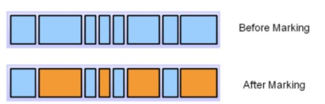
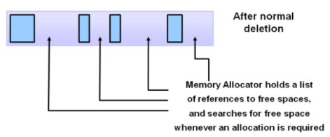
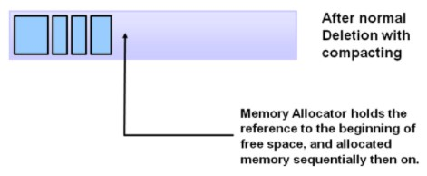
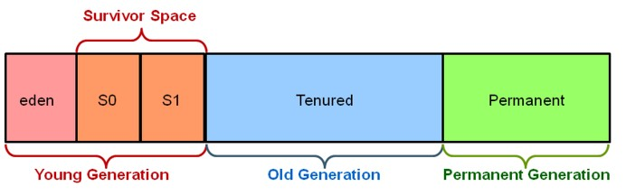

# Java - Garbage Collection

## 1. Garbage Collection?
- 더 이상 사용하지 않는 객체를 청소하여 공간을 확보하는 JVM의 기능 중 하나
- Java는 C나 C++과는 달리, 명시적으로 객체를 해제할 필요가 없음(JVM에서 GC 수행)
- GC의 대상
  - 객체가 Null인 경우
  - 블럭 실행 종료 후, 블럭 안에서 생성된 객체
  - 부모 객체가 Null인 경우, 포함하는 자식 객체
- GC 튜닝 : GC를 실행하기 위해 JVM이 어플리케이션 실행을 멈추게 되는데, 이러한 시간을 줄이도록 튜닝하는 것

 

## 2. Garbage Collection의 메모리 해제 과정
### 2-1. Marking

- 프로세스가 마킹을 호출하고, GC는 메모리가 사용되는지 아닌지를 찾아냄

### 2-2. Normal Deletion

- 참조되지 않는 객체를 제거하고, 메모리를 반환

### 2-3. Compacting

- 퍼포먼스를 향상시키기 위해, 참조되지 않는 객체를 제거하고, 참조되어지는 객체를 묶어 공간을 만들어 새로운 메모리 할당 시에 더 빠른 진행이 되도록 함

 

## 3. Generation Gabage Collection

### 3-1. Young 영역
- 새롭게 생성한 객체가 위치하는 영역
- 대부분의 객체가 금방 접근 불가능 상태가 되기 때문에 많은 객체가 Young 영역에 생성됐다가 사라지며, 이 것을 Minor GC가 발생한다 함

### 3-2. Old 영역
- 접근 불가능 상태로 되지 않아, Young 영역에서 살아남은 객체가 Old 영역으로 복사됨
- 대부분 Young 영역보다 크게 할당하며, 크기가 큰 만큼 Young 영역보다 GC는 적게 발생
- Old 영역에서 객체가 사라질 때 Major GC(Full GC)가 발생한다 함

### 3-3. Permanent 영역
- Method Area라고도 하며, JVM이 클래스들과 메소드들을 설명하기 위한 메타 데이터를 포함하고 있음
