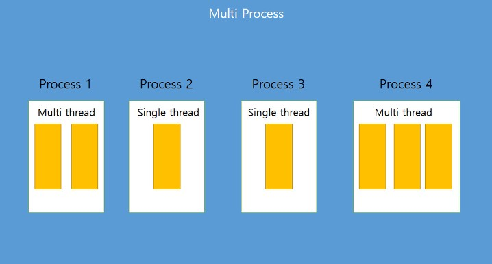
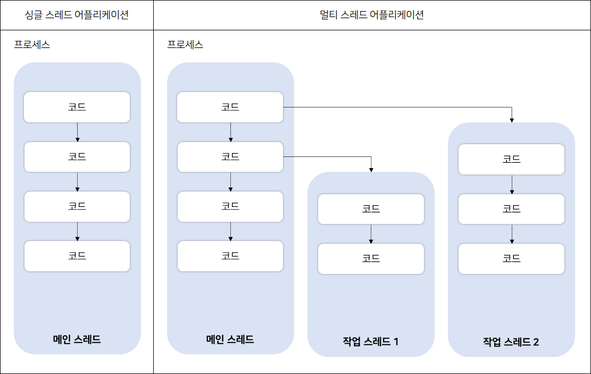
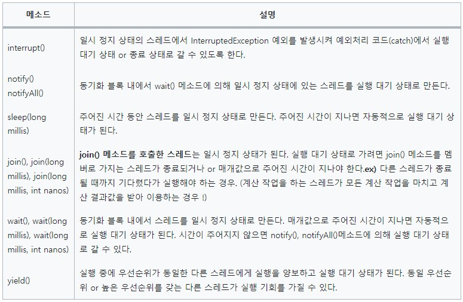

# Java - Multi Thread

## 1. 프로세스와 스레드

### 1-1. 프로세스
- OS에서 실행중인 하나의 어플리케이션
- 사용자가 어플리케이션을 실행하면 OS로부터 실행에 필요한 메모리를 할당받아 어플리케이션이 실행되는데, 이것을 프로세스라 함

### 1-2. 스레드
- 프로세스 내에 하나의 코드 실행 흐름

### 1-3. 멀티 프로세스와 멀티 스레드

<p align="center"></p>

- 멀티 프로세스는 어플리케이션 단위의 멀티 태스킹으로, OS에서 할당받은 각각의 메모리를 가지고 실행되기 때문에, 서로 독립적이며 하나의 프로세스에서 오류가 발생하더라도 다른 프로세스에 영향을 미치지 않음
- 멀티 스레드는 한 어플리케이션 내부의 멀티 태스킹으로, 하나의 프로세스 내부에 생성되기 때문에 한 스레드가 예외를 발생시키면 다른 스레드에도 영향을 미침

## 2. 스레드의 종류

<p align="center"></p>

### 2-1. 메인 스레드
- 모든 Java 어플리케이션은 메인 스레드가 main() 메소드를 실행하며 시작되며, main() 메소드부터 순차적으로 실행한 뒤 마지막 코드가 실행되거나 return 문을 만나면 실행이 종료됨
- 메인 스레드는 필요에 따라 작업 스레드를 만들어서 병렬로 코드를 실행할 수 있음

### 2-2. 작업 스레드
- 멀티 스레드로 실행하는 어플리케이션을 개발하려면 몇개의 작업을 병렬로 실행할지 결정하고, 각 작업별로 스레드를 생성해야함
- 어떤 Java 어플리케이션이든 메인 스레드는 반드시 존재하므로, 메인 작업 외의 추가적인 작업의 수만큼 스레드를 생성
- Java에서는 작업 스레드도 객체로 생성되기 때문에 클래스가 필요하며 작업 스레드를 생성하는 방법은 2가지가 있음

## 3. 작업 스레드 생성 방법

### 3-1. java.lang.Thread 클래스를 직접 객체화하여 생성
- Step 1) Runnable 인터페이스 타입의 매개값을 갖는 생성자 호출

  ```java
  Thread thread = new Thread(Runnable target);
  ```

  - Runnable은 작업 스레드가 실행할 수 있는 코드를 가지고 있는 객체이자 인터페이스 타입이기 때문에 구현 클래스를 만들어 대입해야함
  - 구현 클래스에서 Runnable의 run() 메소드를 재정의하고, 작업 스레드가 실행할 코드를 작성함

  ```java
  public class Task implements Runnable {
	public void run() {
	  // 스레드가 실행할 코드 
    }
  }
  ```

  - Runnable은 작업 내용을 가지고 있는 객체이지 실제 스레드는 아니기 때문에 Runnable 구현 객체를 생성한 후, 이것을 매개값으로 하여 Thread 생성자를 호출해야함

  ```java
  public class MultiThread {
	Runnable task = new Task();
    // 구현 객체를 매개값으로 해서 Thread 생성자를 호출 -> 작업 스레드 생성
	Thread thread = new Thread(task); 
  }
  ```

  - 위와 같은 방법도 있지만, Runnable 익명 객체를 매개 값으로 사용하는 방법도 있으며, 코드가 짧기 때문에 아래의 방법을 더 많이 사용함

  ```java
  public class RunnableAnony {
	Thread thread = new Thread(new Runnable() {
		@Override
		public void run() {
			// 스레드가 실행할 코드 
		}
	});
  }
  ```
  
- Step 2) start() 메소드 호출
  - 위와 같이 작업 스레드 생성을 완료한 후, start() 메소드를 호출하여 해당 작업 스레드를 실행

  ```java
  // 매개값으로 받은 Runnable의 run()메소드 실행
  thread.start();
  ```
  
- 예제) 0.5초 간격으로 비프음을 발생시키면서 동시에 프린팅하는 작업

  ```java
  // 작업을 정의하는 Runnable 구현 클래스
  public class BeepTask implements Runnable {

	@Override
	public void run() {
		// 스레드 실행 내용
		Toolkit toolkit = Toolkit.getDefaultToolkit();
		for (int i=0; i<5; i++) {
			toolkit.beep();
			try {
				Thread.sleep(500);
			} catch (Exception e) {}
		}
	}
  }
  ```

  ```java
  // 메인 스레드와 작업 스레드를 동시에 실행 1
  public class BeepPrintExample1 {
	public static void main(String[] args) {
	  // BeepTask 클래스 이용해서 Runnable 구현 객체를 생성
      Runnable beepTask = new BeepTask();
      // Thread 생성자 호출시 BeepTask 객체를 매개값으로 이용, 작업 스레드 생성
	  Thread thread = new Thread(beepTask); 
      // 작업 스레드에 의해 BeepTask 객체의 run() 메소드 실행되어 비프음이 발생
	  thread.start(); 
		
	  // 메인 스레드가 for 문을 실행해서 0.5초 간격으로 "띵!"을 프린트
      for(int i=0; i<5; i++) {
        System.out.println("띵!");
        try {
          Thread.sleep(500);
        } catch (Exception e) {}
      }
    }
  }
  ```

  ```java
  // 메인 스레드와 작업 스레드를 동시에 실행 2
  public class BeepPrintExample2 {
	public static void main(String[] args) {
		// 위와의 차이점 : BeepTask 라는 클래스를 따로 만든 뒤 이를 이용해서 구현 객체를 만드는게 아님 !
		// 익명 구현 객체를 이용해서 바로 생성한다.
		Thread thread = new Thread(new Runnable() {
			@Override
			public void run() {
				// 작업 스레드의 실행내용을 여기에 쓰는거 !
				Toolkit toolkit = Toolkit.getDefaultToolkit();
				for (int i=0; i<5; i++) {
					toolkit.beep();
					try {
						Thread.sleep(500);
					} catch (Exception e) {}
				}
			} // run ()
		});
	}
  }
  ```

### 3-2. Thread 클래스를 상속, 하위 클래스를 만들어 생성
- 작업 스레드가 실행할 작업을 Runnable로 만들지 않고, Thread의 하위 클래스로 작업 클래스를 정의하여 작업 내용을 포함시킬 수 있음
- 즉, Thread 클래스를 상속한 후, run() 메소드를 재정의 하는 방법

```java
public class WorkerThread extends Thread{
	@Override
    	public void run() {
        // 스레드가 실행할 코드
        }
}

Thread thread = new WorkerThread();
```

```java
// 방법 1과 같이 익명 구현 객체를 통해 코드를 절약할 수도 있음
Thread thread = new Thread(){
	public void run(){
    	// 스레드가 실행할 코드.
    }
}
```
- 이렇게 생성된 작업 스레드에서 start() 메소드를 호출하면, 작업 스레드는 자신의 run() 메소드를 실행함
- 예제) 0.5초 간격으로 비프음을 발생시키면서 동시에 프린팅하는 작업
  
```java
public class BeepPrintExample3 {
	public static void main(String[] args) {
		Thread thread = new Thread() {
			@Override
			public void run() {
				// 작업 스레드의 실행내용
				Toolkit toolkit = Toolkit.getDefaultToolkit();
				for (int i=0; i<5; i++) {
					toolkit.beep();
					try {
						Thread.sleep(500);
					} catch (Exception e) {}
				}
			} // run ()
		};
		thread.start();
		
		for(int i=0; i<5; i++) {
			System.out.println("띵!");
			try {
				Thread.sleep(500);
			} catch (Exception e) {}
		}
	}
}
```

## 4. 스레드의 우선 순위
- 멀티스레드는 동시성 아니면 병렬성으로 실행됨
  - 동시성 : 싱글 코어에서 멀티 스레드가 번갈아가며 실행 (빠르게 번갈아서 실행되기 때문에 병렬 처리가 되는 것 처럼 보임)
  - 병렬성 : 멀티 코어에서 개별 스레드를 동시 실행
- 만약 스레드의 갯수가 코어 수보다 많을 경우, 스레드를 어떤 순서에 의해 동시성으로 실행할지를 결정해야 하는데, 이를 스레드 스케줄링이라 하며, 우선순위 방식과 순환 할당 방식이 있음
  - 우선순위 방식 : 우선순위가 높은 스레드가 실행 상태를 더 많이 가지도록 스케줄링하며, 스레드 객체에 우선 순위 번호를 부여할 수 있으므로 개발자가 코드로 제어 가능함
  - 순환 할당 방식 : 시간 할당량을 정해 하나의 스레드를 정해진 시간만큼 실행하고 다시 다른 스레드를 실행하는 방식으로, JVM에 의해 정해지기 때문에 개발자가 코드로 제어가 불가능함

## 5. 동기화 메소드와 동기화 블록
- 멀티 스레드 프로그램은 스레드들이 객체를 공유해서 작업해야 하는 경우가 있는데, 이런 경우 스레드 A를 사용하던 객체가 스레드 B에 의해 상태가 변경될 수 있기 때문에 의도한 것과 다른 결과가 나올 수 있음
- 따라서, 한 스레드가 사용중인 객체를 다른 스레드가 변경할 수 없도록 하려면 스레드 작업이 끝날 때까지 객체를 잠궈 다른 스레드가 사용할 수 없도록 해야함
- 이러한 경우, 단 하나의 스레드만 실행할 수 있는 코드영역(임계영역)을 지정하기 위해 동기화 메소드와 동기화 블록을 사용하고, 이 영역 안에서는 즉시 객체에 잠금을 걸어 다른 스레드가 임계영역 코드를 실행하지 못하도록 함
  
```java
public void method(){
	// 여러 스레드가 실행 가능한 영역
    
    	synchronized(공유객체){
            // 임계 영역 (단 하나의 스레드만 실행)
        }

        // 여러 스레드가 실행 가능한 영역
}
```

## 6. 스레드의 상태
- 위에서 정리한대로 스레드를 실행하기 위해서는 start() 메소드를 호출해야 하는데, 사실 start() 메소드를 호출한 뒤 스레드의 상태는 바로 실행되는 것이 아닌 실행 대기 상태에 있음
- 이렇게 실행 대기 상태에 있는 스레드 중, 스레드 스케줄링으로 선택된 스레드가 CPU를 점유하고 run() 메소드를 실행하여 해당 스레드의 상태를 실행 상태로 해줌
- 또한, 스레드 스케줄링에 의해 실행 상태인 스레드일지라도 다시 실행 대기 상태로 돌아갈 수 있으며, 이러한 경우 스레드는 실행 대기 상태와 실행 상태를 번갈아가며 run() 메소드를 조금씩 실행하고, 실행 상태에서 run() 메소드가 종료되면 해당 스레드의 실행은 멈추게 되고 종료 상태가 됨

## 7. 스레드 상태 제어
- 동영상을 시청하다 일시정지를 하거나 종료시키는 것 처럼, 스레드 또한 상태를 제어할 수가 있는데, 스레드의 상태를 제어하는 메소드는 여러개가 존재함

### 7-1. 주어진 시간동안 일시 정지 (sleep())
- 스레드를 일정 시간 멈추게 하고 싶을 때 사용
- Thread.sleep() 메소드를 호출한 스레드는 주어진 시간동안 일시 정지 상태가 되고, 시간이 지나면 다시 실행 대기 상태로 돌아감

### 7-2. 다른 스레드에게 실행 양보 (yield())
- 스레드가 처리하는 작업은 반복적인 실행을 위해 for or while 문을 포함하는 경우가 많은데, 반복문들이 무의미한 반복을 하는 경우 다른 스레드에게 실행을 양보하고 자신은 실행 대기 상태로 가는 것이 전체 프로그램 성능에 도움이 될 때가 있음
-  이런 기능을 위해 스레드는 yeild() 메소드를 제공하며, yeild() 메소드를 호출한 스레드는 실행 대기 상태로 돌아가고, 동일 우선순위 or 높은 우선순위를 갖는 다른 스레드가 실행 기회를 가질 수 있도록 해줌

### 7-3. 다른 스레드의 종료를 기다림 (join())
- 스레드는 다른 스레드와 독립적으로 실행하는 것이 기본이지만, 다른 스레드가 종료될 때 까지 기다렸다가 실행해야 하는 경우가 발생할 수도 있는데, 이러한 경우 사용하는 메소드

### 7-4. 스레드 간 협업 (wait(), notify(), notifyAll())
- 경우에 따라서는 두개의 스레드를 교대로 번갈아가며 실행해야 할 경우가 있는데, 자신의 작업이 끝나면 상대방 스레드를 일시 정지 상태에서 풀어주고, 자신은 일시 정지 상태로 만드는 것
- 공유 객체는 두 스레드가 작업할 내용을 동기화 메소드로 각각 구분해 놓는데, 한 스레드가 작업을 완료하면 notify() 메소드를 호출하여 일시 정지 상태에 있는 다른 스레드를 실행 대기 상태로 만들고, 자신은 두번 작업을 하지 않도록 wait() 메소드를 호출하여 일시 정지 상태로 만듬
- notify() : wait()에 의해 일시 정지된 스레드 중 한개를 실행 대기 상태로 만듬
- notifyAll() : wait()에 의해 일시 정지된 모든 스레드를 실행 대기 상태로 만듬

### 7-5. 스레드의 안전한 종료 (interrupt())
- 스레드는 자신의 run() 메소드가 모두 실행되면 자동적으로 종료되지만, 경우에 따라서 실행 중인 스레드를 즉시 종료할 필요가 있는 경우 사용하는 메소드

<p align="center"></p>