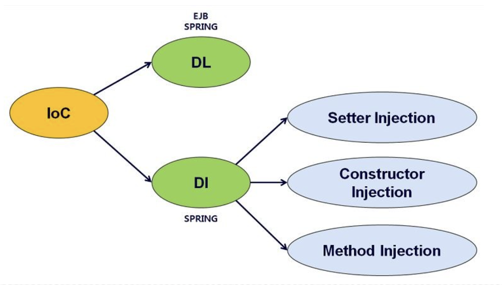

# Spring - IOC, DI, DL, AOP

## 1. Spring Framework
- Framework : 소프트웨어를 설계, 구현, 운영하기 위한 기반을 제공하여 비즈니스에 집중 할 수 있도록 하는 것

### 1-1. Spring
- POJO(Plain Old Java Object)
    - 오래된 방식의 간단한 Java Object라는 뜻으로, 특정 기술에 의존하지 않고 Java의 특징은 객체지향형 설계를 유지하는 것으로, Spring의 주요 개념이자 지향점
    - 즉, 순수하게 getter, setter로 이루어진 가장 단순한 Java Object
- Spring은 POJO의 개념을 가지고, 프로젝트를 진행하며 중복코드의 사용을 줄이고, 비즈니스 로직을 더 간단하게 하며, 오픈소스를 좀 더 효율적으로 쓰기 좋게 Java를 사용할 수 있도록 하는 Framework

## 2. IOC (Inversion of Control)

<p align="center"></p>

- 제어의 역행이라는 의미로, 어플리케이션 안에서 객체가 생성, 해제 및 참조하는 작업을 전적으로 Framework가 관리하는 형태
- 즉, 인스턴스의 생성부터 소멸까지의 객체 생명주기 관리를 new 연산자나 인터페이스 호출 등으로 개발자가 직접하지 않고 Spring Container가 대신 해주는 것
- 프로젝트의 규모가 커질수록 객체와 자원을 이용하는 방법이 더 복잡해지기 때문에, Spring IOC가 객체 생명주기를 관리해주어 계층간 의존관계의 결합도를 낮춤
- IOC 적용을 위한 기법으로는 의존 대상(사용할 객체)을 주입을 통해 받는 방식인 DI, 의존 대상(사용할 객체)을 검색을 통해 반환받는 방식인 DL이 있음

## 3. DI (Dependency Injection)
- 의존성 주입이라는 의미로, 구성요소 간의 의존 관계가 소스코드 내부가 아닌 외부의 설정파일(XML과 같은 Spring 설정 파일, VO, DTO 등)을 통해 정의하는 것
- 이러한 외부의 설정파일은 Spring Container가 읽어 Application에서 필요한 기능들을 제공함
- 즉, 설계 시점에서 알 수 없는 런타임 시점에 객체간의 의존 관계를 Spring Container가 결정하고 객체 레퍼런스를 제공해주는 것

## 4. DL (Dependency Lookup)
- 의존성 검색이라는 의미로, 의존 관계가 있는 객체를 외부에서 주입받는 것이 아닌 의존 관계가 필요한 객체에서 직접 검색하는 것

## 5. AOP (Aspect Oriented Programming)
- 관점 지향 프로그래밍이란 뜻으로, 어떠한 로직을 기준으로 핵심적인 관점과 부가적인 관점으로 나누어서 보고 그 관점을 기준으로 각각 모듈화하는 것
- Crosscutting Concerns(흩어진 관심사, 다른 부분에 계속 반복해서 쓰는 코드)를 한 관점으로 모듈화하고, 핵심적인 비즈니스 로직에서 분리하여 재사용하는 것
- 즉, AOP는 여러 객체에 공통으로 적용할 수 있는 기능을 구분함으로써 재사용성을 높여주는 프로그래밍 기법

### 5-1. AOP의 주요 개념
- Aspect : 흩어진 관심사를 모듈화 한 것으로, 주로 부가기능을 모듈화함
- Target : Aspect를 적용하는 곳 (클래스, 메서드 등)
- Advice : 실질적으로 어떤 일을 해야할 지에 대한 것으로, 실질적인 부가기능을 담은 구현체
- JointPoint : Advice가 적용될 위치, 끼어들 수 있는 지점, 메서드 진입 지점, 생성자 호출 시점, 필드에서 값을 꺼내올 때 등 다양한 시점에 적용 가능
- PointCut : JointPoint의 상세한 스펙을 정의한 것으로, 'A란 메서드의 진입 시점에 호출할 것'과 같이 더욱 구체적으로 Advice가 실행될 지점을 정할 수 있음

### 5-2. Spring AOP
- Spring에서 @AOP를 사용하기 위해서는 아래와 같이 의존성을 추가해야 함

```xml
<dependency>
    <groupId>org.springframework.boot</groupId>
    <artifactId>spring-boot-starter-aop</artifactId>
</dependency>
```

- 그 다음, 아래와 같이 @Aspect 어노테이션을 붙여 해당 클래스가 Aspect를 나타내는 클래스라는 것을 명시하고, @Component를 붙여 Spring Bean으로 등록
- @Around는 타겟 메소드를 감싸서 특정 Advice를 실행하는 것으로, 아래의 해당 부분을 해석하면 com.jsh 아래의 패키지 경로에서 EventService 객체의 모든 메소드에 이 Aspect를 적용하겠다는 의미

```java
@Component
@Aspect
public class PerfAspect {
    @Around("execution(* com.jsh..*.EventService.*(..))")
    public Object logPerf(ProceedingJoinPoint pjp) throws Throwable {
        long begin = System.currentTimeMillis(); 
        Object retVal = pjp.proceed(); // 메서드 호출 자체를 감쌈 
        System.out.println(System.currentTimeMillis() - begin); 
        return retVal; 
    }
}
```

- 경로를 지정하는 방법 말고, 아래와 같이 특정 어노테이션이 붙은 포인트에 해당 Aspect를 실행할 수도 있음
- @PerLogging 어노테이션이 있는 메소드에 해당 Aspect가 적용됨

```java
@Component
@Aspect
public class PerfAspect {
    @Around("@annotation(PerLogging)")
    public Object logPerf(ProceedingJoinPoint pjp) throws Throwable {
        long begin = System.currentTimeMillis(); 
        Object retVal = pjp.proceed(); // 메서드 호출 자체를 감쌈 
        System.out.println(System.currentTimeMillis() - begin); 
        return retVal; 
    }
}
```

