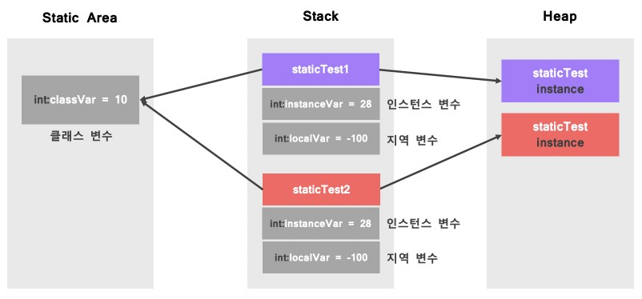

# Java - Static & Instance

## 1. Static
- Static은 변수를 선언하거나 메소드를 생성할 때 같이 붙여주며, 프로그램이 실행될 때(JVM이 실행될 때) Java 메모리 영역에 할당되고, 프로그램이 종료될 때 해제된다.
- Class가 여러 번 생성되어도 Static 변수는 처음 딱 한 번만 생성되고, 동일한 Class의 모든 객체들에 의해 공유된다.

## 2. Instance
- Class내에 선언된 변수로, 객체 생성시마다 매번 새로운 변수가 생성된다.
- Static과는 달리, 공유되어지지 않는다.

```java
public static class StaticTest {
  static int staticInt = 10;
  int instanceInt = 20;
}

public static void main(String[] args) {
  StaticTest staticTest1 = new StaticTest();
  StaticTest staticTest2 = new StaticTest();

  // 1) 10, 20 출력
  System.out.println("1) " + staticTest1.staticInt + ", " + staticTest1.instanceInt);
  // 2) 10, 20 출력
  System.out.println("2) " + staticTest2.staticInt + ", " + staticTest2.instanceInt);

  staticTest1.staticInt = 30;
  staticTest1.instanceInt = 40;

  // 1) 30, 40 출력
  System.out.println("1) " + staticTest1.staticInt + ", " + staticTest1.instanceInt);
  // 2) 30, 20 출력
  System.out.println("2) " + staticTest2.staticInt + ", " + staticTest2.instanceInt);
}
```

## 3.스태틱 변수, 인스턴스 변수, 지역 변수가 메모리에 적재되는 위치

```java
public static class StaticTest {
  static int staticInt = 10; // 클래스(static) 변수
  int instanceInt = 20; // 인스턴스(instance) 변수
}

public static void main(String[] args) {
  int localInt = 30; // 지역(local) 변수 
}
```
- 여기서 지역 변수는 해당 method 블록 내에서만 사용되고, method 호출 시점부터 method 종료 시점까지만 유지된다.
- new() 연산자로 생성된 객체는 Heap 영역에 할당되고, 각 객체를 가리키는 변수가 Stack 영역에 할당된다.
- 인스턴스 변수나 지역 변수는 객체가 생성될 때마다 Stack 영역에 새로 생성되지만, 스태틱 변수는 Static Area에 한 개만 생성되고, 하나의 영역을 공유한다.

<p align="center"></p>

## 4. Static 변수의 사용법
- 실제 Static 변수의 생성 시점은 JVM마다 다르지만, 보통은 JVM이 시작되는 시점에 Static 변수가 생성된다.
- Static Method는 오직 Static 멤버만 접근 가능하다.
- this는 사용할 수 없다. 
  - this는 호출 당시 실행중인 객체를 가리키는데, static Method는 객체가 생성되지 않은 상황에도 호출이 가능하기 때문이다.
- Java는 캡슐화 원칙에 따라 어떤 변수나 함수도 Class 바깥에 존재할 수 없기 때문에, 전역 변수나 전역 메소드로 사용해야할 경우 Static을 사용한다.