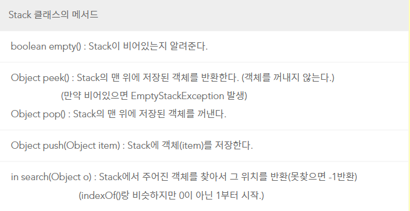
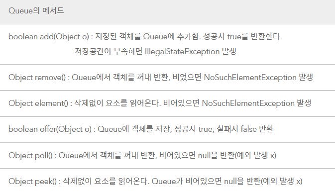
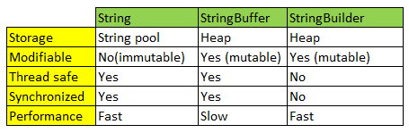
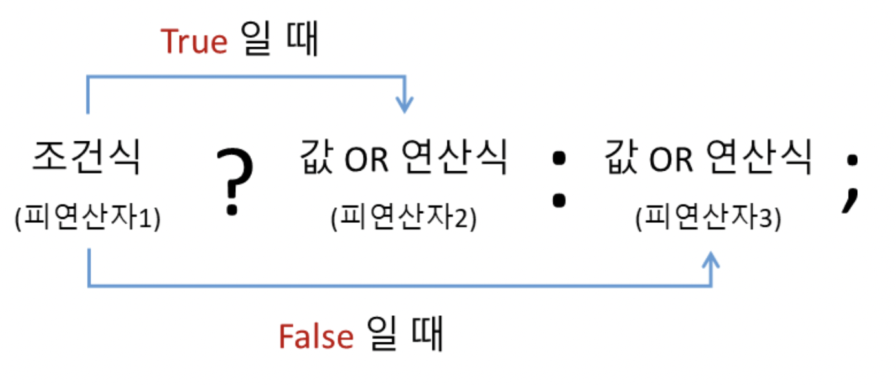

# Java Tips

## 공통 Tips

1. Import : 대부분의 라이브러리 함수, 콜렉션 함수를 사용할 수 있도록 선언하고 시작하자.

```java
import java.util.*;
```

2. 형변환

```java
// String -> int
Integer.parseInt(s);

// int -> String
Integer.toString(i);

// long -> int
Long.valueOf(i).intValue();

// 변수 타입 확인
System.out.println(map.get("list").getClass().getName());
```

3. for 문 형식

```java
// idx를 이용한 for 문
for(int i = 1; i <= 10; i++) {
	System.out.println(i);
}

// list 요소를 이용한 for 문
for(Integer i : list) { 
	System.out.println(i);
}

// 2차원 배열 for 문
for(int[] temp : score) {
    for(int i : temp) {
        sum += i;
    }
}

// Map for 문
// 방법1)
for (String key : map.keySet()) {
    System.out.println("key : " + key +" / value : " + map.get(key));
}
 
// 방법2)
for (Map.Entry<String, String> entry : map.entrySet()) {
    System.out.println("key : " + entry.getKey() +" / value : " + entry.getKey());
}
 
// 방법3)
Iterator<String> keys = map.keySet().iterator();
while (keys.hasNext()) {
    String key = keys.next();
    System.out.println("key : " + key +" / value : " + map.get(key));
}   
```

4. Math

```java
// max
answer = Math.max(answer,100);

// min
answer = Math.min(answer,100);

// 절대값
answer = Math.abs(-10); // 10

// 제곱
answer = (int)Math.pow(5, 2); // 25

// random 1
answer = (int)(Math.random() * 100);

// random 2
Random random = new Random();
answer = random.nextInt(100)

// random 3
answer = ((int)(Math.random() * 6) + 3); // 3 ~ 8
```

## 1차원 Array

```java
// Array 선언
String[] array = {"a", "b", "c"};
int[] array = {1, 2, 3};

// Array 채우기(Array의 모든 값을 같은 값으로 초기화 함)
int[] array = new int[10];
Arrays.fill(array, 0);
System.out.println(Arrays.toString(array));

// 1차원 String Array 정렬
String[] strArr = {'c', 'b', 'a'};
// 오름차순
Arrays.sort(strArr);
// 내림차순
Arrays.sort(strArr, Collections.reverseOrder());

// 1차원 Int Array 정렬
// 오름차순
int[] intArr = {3,5,1,2,4};
Arrays.sort(intArr); 
// 내림차순 (int -> integer로 변환해주어야 함)
Integer[] integerArr = Arrays.stream(intArr).boxed().toArray(Integer[]::new);
Arrays.sort(integerArr, Collections.reverseOrder());
// 참고 : interger array -> int array
int[] intArr = Arrays.stream(integerArr).mapToInt(Integer::intValue).toArray(); 

// 정렬 시작 위치와 끝 위치 지정하여 정렬하기
Arrays.sort(arr, 1, 3);
Arrays.sort(arr, 1, 3, Collections.reverseOrder());

// 1부터 10까지 Array 만들기
int[] array = new int[10];
for(int i = 1; i <= 10; i++) {
	array[i-1] = i;
}

// Array에서 특정 수 찾기 (있으면 해당 idx 반환, 없으면 -1 반환) - 꼭 정렬 후 사용
Arrays.sort(array);
Arrays.binarySearch(array, 5);

// Array 복사
String[] copyArray = Arrays.copyOfRange(array, 시작 idx, 끝 idx+1);

// Array to List
Arrays.asList(array);

// List to Array
import java.util.*;
import java.util.stream.Collectors;

int[] array = list.stream().mapToInt(i->i).toArray();
 
// Array to List
import java.util.*;
import java.util.stream.Collectors;

List<Integer> list = Arrays.stream(array).boxed().collect(Collectors.toList());
```

## 2차원 Array

```java
// 2차원 Array 채우기(Array의 모든 값을 같은 값으로 초기화 함)
String[][] array = new String[10][10];
for(int i = 0; i < array.length; i++) {
	Arrays.fill(array[i], "True");
}

// 2차원 String Array 정렬 방법
Arrays.sort(tickets, new Comparator<String[]>() {
	@Override
	public int compare(String[] o1, String[] o2) {
		if(o1[0].toString().contentEquals(o2[0].toString()))
			return o1[1].toString().compareTo(o2[1].toString());
		else
			return o1[0].toString().compareTo(o2[0].toString());
	}			
});

// 2차원 int Array 정렬 방법 1
Arrays.sort(arr, new Comparator<int[]>() {
    @Override
    public int compare(int[] o1, int[] o2) {
        // 첫번째 숫자 기준 오름차순 {1,30}{2,10}{3,50}{4,20}{5,40}
        return o1[0]-o2[0]; 
        // 첫번째 숫자 기준 내림차순 {5,40}{4,20}{3,50}{2,10}{1,30}
        return o2[0]-o1[0]; 
        // 두번째 숫자 기준 오름차순 {2,10}{4,20}{1,30}{5,40}{3,50}
        return o1[1]-o2[1]; 
        // 두번째 숫자 기준 내림차순 {3,50}{5,40}{1,30}{4,20}{2,10}
        return o2[1]-o1[1]; 
    }
});

// 2차원 int Array 정렬 방법 2(오름차순)
Arrays.sort(arr, Comparator.comparingInt(o1 -> o1[0]));

// 2차원 Array 정렬 방법 2(오름차순) - 두번째 요소도 고려하여 정렬
Arrays.sort(arr, (o1, o2) -> {
    if(o1[0] == o2[0]){
        return Integer.compare(o1[1], o2[1]);
    } else {
        return Integer.compare(o1[0], o2[0]);
    }
});

// 2차원 Array 출력 1
for(int i = 0; i < array.length; i++) {
	System.out.println(Arrays.toString(array[i]));
}

// 2차원 Array 출력 2 (다차원 출력 모두 가능)
System.out.println(Arrays.deepToString(arr));
```

## ArrayList

```java
// ArrayList 선언
ArrayList<String> stringList = new ArrayList<>();
ArrayList<Integer> intList = new ArrayList<>();

// ArrayList 선언(크기 지정)
ArrayList<String> list = new ArrayList<>(10);

// ArrayList 선언(선언 시 value 추가)
ArrayList<Integer> list = new ArrayList<>(Arrays.asList(1,2,3));

// 오름차순 정렬
Collections.sort(stringList);

// 내림차순 정렬
Collections.reverse(stringList);

// 값 추가
list.add("a"); 

// null 추가
list.add(null);  

// 0번째 index에 b 추가
list.add(0, "b"); 

// list 전체 복사
list.addAll(copyList); 

// 해당 index의 값 제거
list.remove(0);

// ArrayList 값 모두 제거
list.clear(); 

// ArrayList length
list.size(); 

// 0번째 index 값 리턴
list.get(0); 

// ArrayList에 해당 값이 존재하면 true, 없으면 false
list.contains("a"); 

// ArrayList에 해당 값이 존재하면 index, 없으면 -1
list.indexOf("a"); 

// Array를 ArrayList로 변환하여 특정 값 search
Arrays.asList(array).indexOf("a");

// for 문으로 ArrayList 출력
for(Integer i : list) { 
	System.out.println(i);
}

// iterator로 ArrayList 출력
Iterator iter = list.iterator(); 
while(iter.hasNext()){
	System.out.println(iter.next()); 
}
```

## 비교 정렬 (Array나 List에 사용 가능)
- compareTo() : 문자열의 사전순 값을 비교하여 그에 해당하는 int값 리턴
    - A > B 라고 가정했을 때,
        - A == A => 0 리턴 (동일한 경우)
        - A > B => 1 리턴 (좌측 값이 더 큰 경우)
        - B > A => -1 리턴 (좌측 값이 작은 경우)
```java
public void test(){ 
    String str1 = "AA"; 
    String str2 = "AA"; 
    String str3 = "BB"; 
 
    System.out.println(str1.compareTo(str2));  // 결과  0 
    System.out.println(str2.compareTo(str3));  // 결과 -1 
    System.out.println(str3.compareTo(str2));  // 결과  1 
} 
```
- compare() : Comparator 인터페이스를 구현할 때 사용되는 메소드로, 2개의 인자를 넘겨 내부 구현에 따라 int 값을 리턴
```java
@Override
public int compare(인자1, 인자2){
    if(인자1 > 인자2){
      return 1;
    }else if(인자1 < 인자2){
      return -1;
    }else{
      return 0;
    }
}
```
- Comparator
    - Comparator<클래스타입> 클래스명 = new Comparator<클래스타입>(); 으로 정의하며, 일반적으로 compare 메소드를 오버라이드해서 사용함
    - 클래스타입 비교대상 2개를 지역변수 o1, o2로 선언하고 return 값으로 음수, 0, 양수를 반환하면서 정렬할 수 있음
```java
// int 정렬
int[] numbers = {3, 30, 34, 5, 9};
// int Array => Integer Array
Integer[] integerArr = Arrays.stream(numbers).boxed().toArray(Integer[]::new);
Arrays.sort(integerArr, new Comparator<Integer>() {
    @Override
    public int compare(Integer o1, Integer o2) {
        // 비교할 조건에 맞는 식을 넣음
        // 오름차순 (ASC)
        return Integer.compare(o1, o2);
        // 내림차순 (DESC)
        // return Integer.compare(o2, o1);
    }
});

// String 정렬
String[] strs = {"AA", "CB", "AB", "CA", "AC", "BA", "BB", "BC", "CC"};
Arrays.sort(strs, new Comparator<String>() {
    @Override
    public int compare(String o1, String o2) {
        // 비교할 조건에 맞는 식을 넣음
        // ASC
        return (o1).compareTo(o2);
        // DESC
        // return (o2).compareTo(o1);
    }
});

// 참고 : Lambda를 이용한 String 정렬
Arrays.sort(strs, (a,b)->{
    return (a).compareTo(b);
});
```

## HashMap

```java
// Map 선언
HashMap<String, Object> hashmap = new HashMap<>();

// Map 복사
HashMap<String, Object> copiedHashmap = new HashMap<>(hashmap);

// key, value 추가
hashmap.put("Java", 1);

// key 해당하는 value 제거
hashmap.remove("Java"); 

// 모든 값 제거
hashmap.clear();

// key에 해당하는 value 변경
hashmap.replace("Java", 10);

// key에 해당하는 value 리턴
hashmap.get("Java");

// 모든 key 리턴
hashmap.keySet(); 

// 모든 value 리턴
hashmap.values();

// key 존재 여부 확인 (있으면 true, 없으면 false)
hashmap.containsKey("Java");

// value 존재 여부 확인 (있으면, true, 없으면 false)
hashmap.containsValue(1);

// hashmap empty 여부 확인 (empty면 true, 아니면 false)
hashmap.isEmpty();

// key에 해당하는 값("Java")이 없으면 defaultValue(-1) 반환
hashmap.getOrDefault("Java", -1); 
```

## ArrayList in ArrayList (2차원 list)

```java
// 2차원 list 1
List<ArrayList<String>> listInlist = new ArrayList<>();

ArrayList<String> list1 = new ArrayList<>();
list1.add("java");
list1.add("python");

ArrayList<String> list2 = new ArrayList<>();
list2.add("mysql");
list2.add("oracle");

listInlist.add(list1);
listInlist.add(list2);
        
System.out.println(listInlist); // [[java, python], [mysql, oracle]]

// 2차원 list 2
int N = 10;
ArrayList<ArrayList<Integer>> list = new ArrayList<>();
for(int i = 0; i < N+1; i++) {
	list.add(new ArrayList<Integer>());
}

System.out.println(list); // [[], [], [], [], [], [], [], [], [], [], []]
```

## ArrayList in HashMap

```java
// 선언
List<Map<String, Object>> listMap = new ArrayList<>();

HashMap<String, Object> map1 = new HashMap<>();
map1.put("Java", "A");

HashMap<String, Object> map2 = new HashMap<>(map1);

HashMap<String, Object> map3 = new HashMap<>();
map3.put("Python", "B");

listMap.add(map1);
listMap.add(map2);

System.out.println(listMap); // [{Java=A}, {Java=A}, {Python=B}]

// 접근
HashMap<String, Object> getMap = new HashMap<>(listMap.get(0));

System.out.println(getMap); // {Java=A}
System.out.println(getMap.get("Java")); // A
```

## HashMap in ArrayList

```java
// 선언
HashMap<String, Object> map = new HashMap<>();

ArrayList<Integer> list = new ArrayList<>();
for (int i = 1; i <= 10; i++) {
   list.add(i);
}

map.put("list", list);

System.out.println(map); // {list=[1, 2, 3, 4, 5, 6, 7, 8, 9, 10]}

// 접근
ArrayList<Integer> newList = (ArrayList<Integer>) map.get("list");

System.out.println(newList); // [1, 2, 3, 4, 5, 6, 7, 8, 9, 10]
```

## ArrayList to HashMap

```java
// ArrayList 요소에 idx 붙이기
ArrayList<String> list = new ArrayList<>();

list.add("a");
list.add("b");
list.add("c");

HashMap<Integer, String> map = new HashMap<>();

for (int i = 1; i <= list.size(); i++) {
	map.put(i, list.get(i-1));
}

System.out.println(map); // {1=a, 2=b, 3=c}

// ArrayList 요소의 갯수 세기
List<String> list = new ArrayList<>();
list.add("a");
list.add("b");
list.add("c");
list.add("c");
list.add("a");

Map<String, Long> map = new HashMap<>();

for(String target : list){
	Long num = map.get(target); // Long은 null 선언이 가능하기 때문에, int가 아닌 Long 사용
	if(num == null){
		map.put(target, 1L); // 숫자 뒤에 L을 붙여 해당 데이터 타입이 Long임을 선언
	} else {
		map.put(target, num+1);
	}
}

System.out.println(map); // {a=2, b=1, c=2} 
```

## HashMap to ArrayList

```java
HashMap<Integer, String> map = new HashMap<>();
map.put(1, "Apple");
map.put(2, "Banana");
map.put(3, "Orange");
        
Collection<String> values = map.values();
Collection<Integer> keys = map.keySet();

// Map to Array
String[] valueArray = values.toArray(new String[0]);

// Map to ArrayList
ArrayList<Integer> keyList = new ArrayList<>(keys);

System.out.println(Arrays.toString(valueArray)); // [Apple, Banana, Orange]
System.out.println(keyList); // [1, 2, 3]
```

## HashSet - 중복 허용 X, 자동 정렬 O

```java
HashSet<String> set = new HashSet<>();

set.add("a");
set.add("c");
set.add("b");
set.add("d");
set.add("b");

System.out.println(set); // [a, b, c, d]

// HashSet은 get으로 인덱스를 통해 요소를 뽑아 오지 못함!
// 따라서 아래의 방식으로 접근해야함
Iterator<String> iter = set.iterator();
while(iter.hasNext()) {
	System.out.println(iter.next()); // a b c d
}
```

## 문자열

```java
// split1 - 정규식으로 문자열 구분, 결과값 배열
String str = "hi im suhyun";

String[] sAnswer = str.split(" "); // string으로 split       
char[] cAnswer = str.toCharArray(); // char로 split

System.out.println(Arrays.toString(sAnswer)); // [hi, im, suhyun]
System.out.println(Arrays.toString(cAnswer)); // [h, i,  , i, m,  , s, u, h, y, u, n]

// split2
String str = "hi-iam-suhyun.i-love-you.";

String[] answer1 = str.split("-"); // (-)로 split  
String[] answer2 = str.split("\\."); // (.)이나 (+)와 같은 경우는 \\를 붙여 쓴다.
String[] answer3 = str.split("-|\\."); // 여러개로 split

System.out.println(Arrays.toString(answer1)); // [hi, iam, suhyun.i, love, you.]
System.out.println(Arrays.toString(answer2)); // [hi-iam-suhyun, i-love-you]
System.out.println(Arrays.toString(answer3)); // [hi, iam, suhyun, i, love, you]

// StringTokenizer - 문자 또는 문자열로 문자열 구분, 결과값 문자열
String str1 = "hi im syhyun";
StringTokenizer st1 = new StringTokenizer(str1, " "); // token 제외

while(st1.hasMoreTokens()) {
	System.out.println(st1.nextToken());
}

String str2 = "hi-im-syhyun";
StringTokenizer st2 = new StringTokenizer(str2, "-", true); // token까지 포함

while(st2.hasMoreTokens()) {
	System.out.println(st2.nextToken());
}

String str3 = "hi im syhyun";
StringTokenizer st3 = new StringTokenizer(str3, " "); // token 제외
ArrayList<String> strList = new ArrayList<>();

while(st3.hasMoreTokens()) {
	strList.add(st3.nextToken());
}

System.out.println(strList); // [hi, im, suhyun]

// 문자열 다루기
String str = "hi-iam-suhyun.i-love-you.";

// 문자열 슬라이싱
System.out.println(str.substring(0, 5)); // hi-ia

// 특정 문자로 시작하는지 true or false
System.out.println(str.startsWith("h")); // ture

// 특정 문자로 끝나는지 true or false
System.out.println(str.endsWith("h")); // false

// 같은 문자열인지 true or false
System.out.println(str.substring(0, 2).equals("hi")); // true

// 문자열 포함 여부
System.out.println(str.contains("h")); // true
System.out.println(str.indexOf("h")); // 0 (해당 문자열 존재하면 index return, 없으면 -1 return)

// 특정 문자열의 idx 리턴
System.out.println(str.indexOf("h")); // 0

// 문자열 각 요소 print
String[] strArray = str.split("");
for (String s : strArray) {
	System.out.println(s); 
}

// 문자열 뒤집기
String reverseStr = "";
for(int i = strArray.length-1; i >= 0; i--) {
	reverseStr += strArray[i];
}
System.out.println(reverseStr);

// 문자열 각 요소 빠른 접근 방법 1
String S = "abcdefgh";
for (char c : S.toCharArray()) {
    System.out.println(c);
}

// 문자열 각 요소 빠른 접근 방법 2
String test = "helloworld";
for (int i=0; i<test.length(); i++) {
    System.out.println(test.charAt(i));
}

// 문자열 반복 (Java11 이상에서 사용 가능)
String S = "0".repeat(10);
System.out.println(S); // 0000000000
```

## LinkedList - 데이터의 추가/삭제가 많은 경우 사용

```java
LinkedList<Integer> list = new LinkedList<>(Arrays.asList(1,2,3,4,5));
System.out.println(list.size()); // 5
System.out.println(list); // [1, 2, 3, 4, 5]

//가장 앞의 데이터 제거        
list.removeFirst(); 
System.out.println(list); // [2, 3, 4, 5]

//가장 뒤의 데이터 제거        
list.removeLast(); 
System.out.println(list); // [2, 3, 4]

//생략시 0번째 index제거        
list.remove(); 
System.out.println(list); // [3, 4]

//index 1 제거        
list.remove(1); 
System.out.println(list); // [3]

//모든 값 제거        
list.clear(); 
System.out.println(list); // []

// 0번째 idx 출력
System.out.println(list.get(0));

// LinkedList 모든 요소 출력 1
for(int i : list) {
	System.out.println(i);
}

// LinkedList 모든 요소 출력 2
Iterator<Integer> iter = list.iterator(); 
while(iter.hasNext()) {
	System.out.println(iter.next()); 
}
```

## Stack & Queue
```java
Stack st = new Stack();
Queue q = new LinkedList();	//Queue의 인터페이스 구현체인 LinkedList를 사용

// Stack add
st.push("0");
st.push("1");
st.push("2");

// Queue add	
q.offer("0"); 
q.offer("1");
q.offer("2");
		
System.out.println("=== Stack ===");
while(!st.isEmpty()) {
	// Stack pop
	System.out.println(st.pop()); // 2 -> 1 -> 0
}
		
System.out.println("=== Queue ===");
while(!q.isEmpty()) {
	// Queue pop
	System.out.println(q.poll()); // 0 -> 1 -> 2
}

// .size() : Stack이나 Queue의 사이즈 반환
// .peek() : pop할 대상을 pop하지 않고 조회만 함
```

<p align="center"></p>
<p align="center"></p>

## DFS

```java
// 1차원 DFS
class Main {
    public static void main(String[] args) {
        int[] array = {1, 2, 3, 4, 5};
        boolean[] visit = {false, false, false, false, false};

        dfs(0, array, visit);
    } 

    public static void dfs(int start, int[] array, boolean[] visit) {
        visit[start] = true;

        for(int i = 0; i < array.length; i++) {
            if(!visit[i]) {
                System.out.println(array[i]);
                dfs(i, array, visit);
            } 
        }
    }
}

// 2차원 DFS
public static void main(String[] args) {
	String[][] array = {
		{"00", "10", "20", "30", "40"},
        {"01", "11", "21", "31", "41"},
        {"02", "12", "22", "32", "42"},
        {"03", "13", "23", "33", "43"},
        {"04", "14", "24", "34", "44"}
  };

	boolean[][] visit = {
		{false, false, false, false, false},
		{false, false, false, false, false},
		{false, false, false, false, false},
		{false, false, false, false, false},
		{false, false, false, false, false}
	};
	
	System.out.println(array[0][0]);
	dfs(0, 0, array, visit);
} 

public static void dfs(int x, int y, String[][] array, boolean[][] visit) {
	visit[x][y] = true;

	for(int i = 0; i < array.length; i++) {
		for(int j = 0; j < array[0].length; j++) {
			if(!visit[i][j]) {
				System.out.println(array[i][j]); // dfs로 순회하며 모든 요소 출력
				dfs(i, j, array, visit);
			} 
		}
	}
}
```

## BFS

```java
// 1차원 BFS
class Main {
    public static void main(String[] args) {
        int[] array = {1, 2, 3, 4, 5};
        boolean[] visit = {false, false, false, false, false};

        bfs(0, array, visit);
    } 

    public static void bfs(int start, int[] array, boolean[] visit) {
        Queue<Integer> queue = new LinkedList<>();
        queue.offer(start);

		System.out.println(array[start]);
        visit[start] = true;

        while(!queue.isEmpty()) {
            int next = queue.poll();

            for(int i = 0; i < array.length; i++) {
                if(!visit[i]) {
                    queue.offer(i);
                    System.out.println(array[i]);
                    visit[i] = true;
                } 
            }
        }
    }
}

// 2차원 BFS
class Pos {
    int xPos;
    int yPos;
    public Pos(int x, int y) {
        this.xPos = x;
        this.yPos = y;
    }
}

class Main {
    public static void main(String[] args) {
        String[][] array = {
            {"00", "10", "20", "30", "40"},
            {"01", "11", "21", "31", "41"},
            {"02", "12", "22", "32", "42"},
            {"03", "13", "23", "33", "43"},
            {"04", "14", "24", "34", "44"}
        };

        boolean[][] visit = {
            {false, false, false, false, false},
            {false, false, false, false, false},
            {false, false, false, false, false},
            {false, false, false, false, false},
            {false, false, false, false, false}
        };

        bfs(0, 0, array, visit);
    } 

    public static void bfs(int x, int y, String[][] array, boolean[][] visit) {
        Queue<Pos> queue = new LinkedList<>();
        queue.add(new Pos(x, y));
				
        System.out.println(array[x][y]);
        visit[x][y] = true;

        while(!queue.isEmpty()) {
            Pos next = queue.poll();
            for(int i = 0; i < array.length; i++) {
                for(int j = 0; j < array[0].length; j++) {
                    if(!visit[i][j]) {
                        queue.add(new Pos(i, j));
                        System.out.println(array[i][j]);
                        visit[i][j] = true;
                    } 
                }
            }
        }
    }
}
```

## 동서남북 방향 이동

```java
// target 주변 동서남북 출력
int[] dx = {0, 0, 1, -1};
int[] dy = {1, -1, 0, 0};

String[][] array = {
	{".", ".", ".", ".", "."},
	{".", ".", "N", ".", "."},
	{".", "W", "target", "E", "."},
	{".", ".", "S", ".", "."},
	{".", ".", ".", ".", "."}
};

for(int i = 0; i < array.length; i++) {
	for(int j = 0; j < array[0].length; j++) {
		if(array[i][j].equals("target")) {
			for(int w = 0; w < 4; w++) {
				int xx = i + dx[w];
				int yy = j + dy[w];
				System.out.println(array[xx][yy]); // E W S N
			}
		} 
	}
}
```

## 조합(Combination)
```java
import java.util.*;

class Main {
    public static void main(String[] args) {
        int n = 4;
        int[] arr = {1, 2, 3, 4};
        boolean[] visited = new boolean[n];

        for(int i = 1; i <= n; i++) {
            combination(arr, visited, 0, n, i);
        }
    } 

    static void combination(int[] arr, boolean[] visited, int start, int n, int r) {
        if (r == 0) {
            print(arr, visited, n);
            return;
        }
        for (int i = start; i < n; i++) {
            visited[i] = true;
            combination(arr, visited, i+1, n, r-1);
            visited[i] = false;
        }
    }

    static void print(int[] arr, boolean[] visited, int n) {
        for (int i = 0; i < n; i++) {
            if (visited[i]) {
                System.out.print(arr[i] + " "); // 모든 조합 출력
            }
        }
        System.out.println();
    }
}
```

## StringBuffer & StringBuilder

<p align="center"></p>

- String VS StringBuffer VS StringBuilder
    - String : 문자열 연산이 적고 멀티스레드 환경인 경우 사용
    - StringBuffer : 문자열 연산이 많고 멀티스레드 환경인 경우 사용
    - StringBuilder : 문자열 연산이 많고 단일스레드이거나 동기화를 고려하지 않아도 되는 경우 사용

```java
// StringBuffer
String example1 = "abcdefg";
StringBuffer sbf = new StringBuffer(example1); // String -> StringBuffer
         
System.out.println(sbf); //처음상태
System.out.println(sbf.toString()); //String 변환
System.out.println(sbf.substring(2,4)); //문자열 추출
System.out.println(sbf.insert(2,"추가")); //문자열 추가
System.out.println(sbf.delete(2,4)); //문자열 삭제
System.out.println(sbf.append("hijk")); //문자열 붙이기
System.out.println(sbf.length()); //문자열 길이
System.out.println(sbf.capacity()); //용량 크기
System.out.println(sbf.reverse()); //문자열 뒤집기
System.out.println(sbf); //마지막상태
sbf.setLength(0); // 초기화

// StringBuilder
String example2 = "abcdefg";
StringBuilder sbb = new StringBuilder(example2); // String -> StringBuilder
		
System.out.println(sbb); //처음상태
System.out.println(sbb.toString()); //String 변환
System.out.println(sbb.substring(2,4)); //문자열 추출
System.out.println(sbb.insert(2,"추가")); //문자열 추가
System.out.println(sbb.delete(2,4)); //문자열 삭제
System.out.println(sbb.append("hijk")); //문자열 붙이기
System.out.println(sbb.length()); //문자열 길이
System.out.println(sbb.capacity()); //용량 크기
System.out.println(sbb.reverse()); //문자열 뒤집기
System.out.println(sbb); //마지막상태
sbb.setLength(0); // 초기화
```

## 삼항연산자
- 3개의 피연산자를 필요로 하는 연산자로, 단순한 if-else 구문인 경우 true/false를 판단하여 결과 값이나 원하는 연산 수행
- 기존 if-else 구문보다 코드 생산성을 높여주나, 성능 면에서는 영향은 없음

<p align="center"></p>

```java
// 기존 if-else 문
int A = 0;
if (1 > 3) {
    A = 10;
} else {
    A = 30;
}
System.out.println(A); // 30

// 3항연산자
int B = (1 > 3) ? 10 : 30
System.out.println(B); // 30
```
