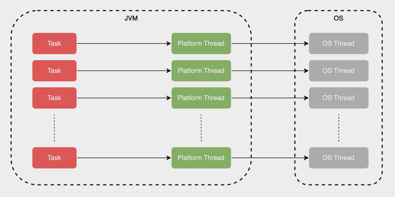
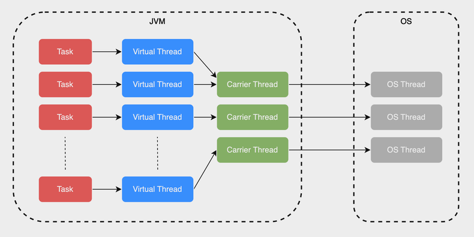
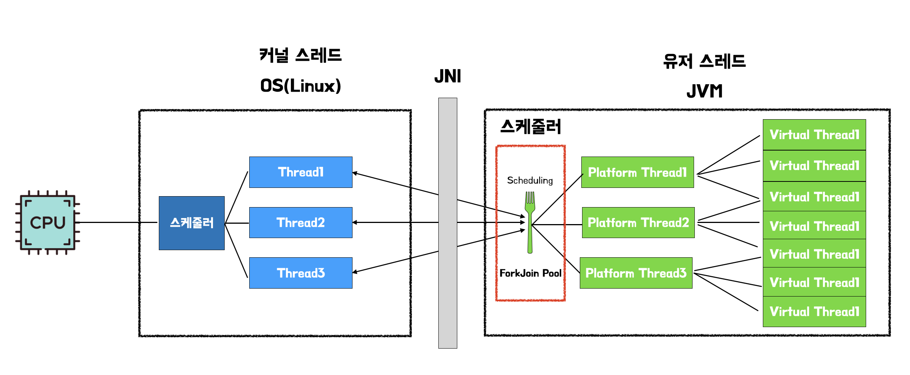
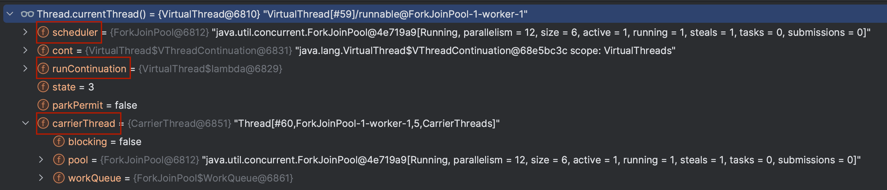
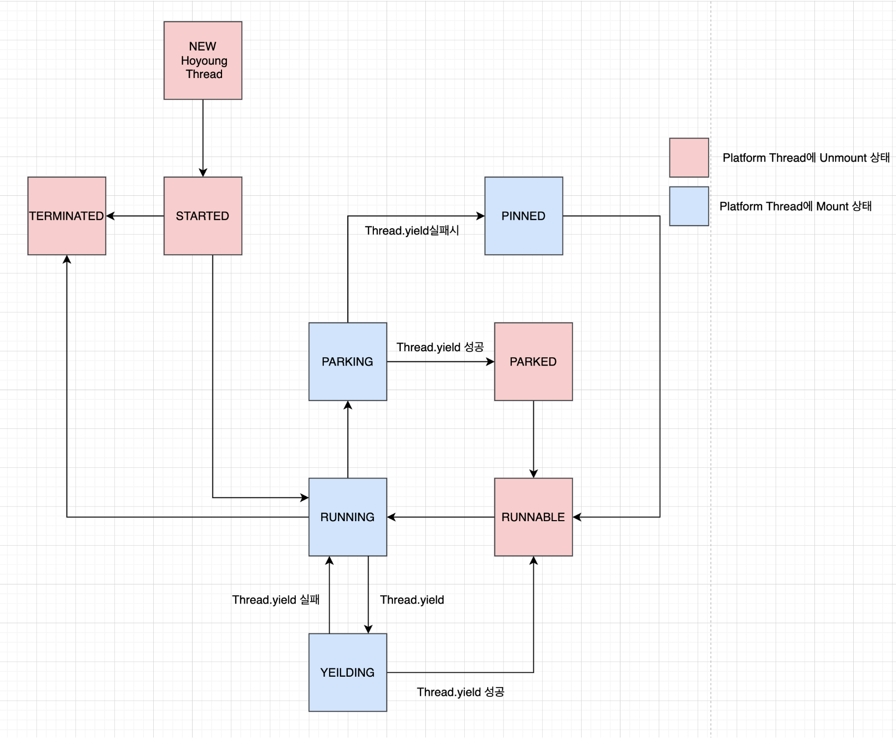
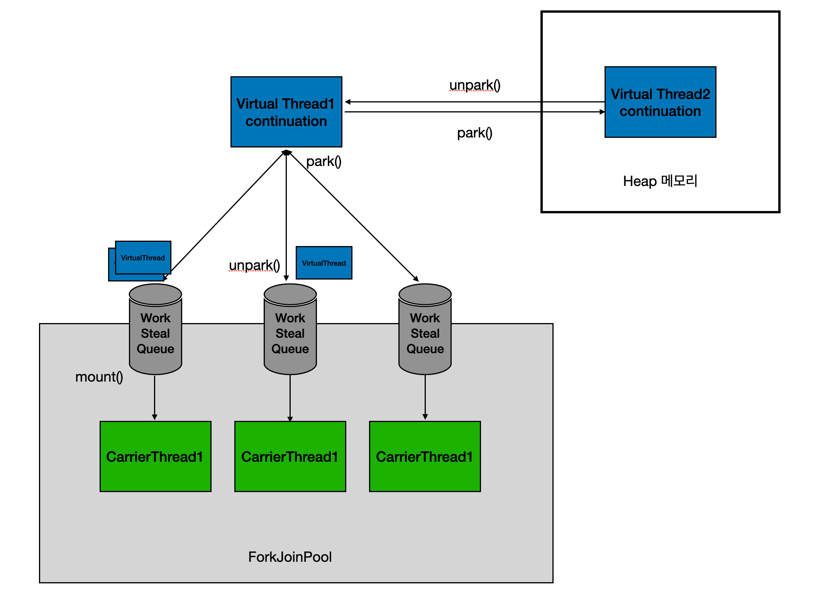
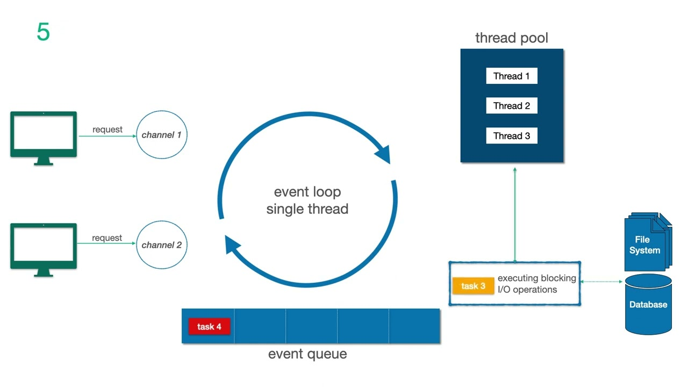

# Java - Virtual Thread

## 1. Virtual Thread?

### 전통적인 Java Thread

<p align="center"></p>

- JVM 내에서 Platform Thread를 생성 할 때, JNI(Java Native Interface)를 사용해 Kernel(OS)에 직접 매핑되도록 설계되었으며, Context Switching을 통해 OS 자체의 리소스를 점유함
    - 즉, Thread의 최대 가용 갯수는 OS에서 생성할 수 있는 최대 Thread 갯수를 초과할 수 없다는 의미
- KLT(Kernel Level Thread)와 ULT(User Level Thread) 간 1 : 1 구조
- 전통적인 Java Thread 모델의 한계
    - 새로운 Thread를 생성하거나, Thread 간 Context Switching 시 큰 오버헤드 발생
    - 각 Thread의 대량 메모리 차지
    - Spring MVC와 같은 Thread-per-request 구조에서 최대 요청 수용량 제한
- 이에 따라 Goroutine(Go), Coroutine(Kotlin)과 같은 Kernel Level이 아닌, Runtime Level에서 Task Scheduling, Context Switching을 수행하는 경량 Thread가 트렌드로 자리 잡고 있음

### Virtual Thread

<p align="center"></p>

- Task 단위로 KLT를 생성하는 것이 아닌, JVM 내부에서 관리되는 Virtual Thread를 생성하고, Carrier Thread로의 스케줄링을 통해 오버헤드를 크게 절감함
- KLT와 ULT와 Virtual Thread 간 1 : 1 : N 구조
    - Platform Thread는 User Level Thread로, Platform Thread가 Virtual Thread를 실행하고 관리하고 있다면 이를 Carrier Thread라고 함
- Thread의 크기와 Context Switching 비용이 많이 감소한 경량 Thread 모델

### 비교

| | 기존 Thread | Virtual Thread |
|---|---|---|
| Overhead | Thread 생성 및 Context switch 간 큰 오버헤드 | 소요시간 약 10배 절감 |
| Memory | 각 Thread 당 수 MB에 달하는 메모리 차지 | 소요 메모리 약 200배 절감 |
| Capacity | 최대 가용 Thread는 OS 최대 Thread 수로 제한 | JVM Heap이 허용하는 한 제한 없이 가용 |

## 2. Virtual Thread 상세

### Virtual Thread 구성

<p align="center"></p>

- ForkJoinPool : Platform Thread의 기본 스케줄러로, Platform Thread Pool을 관리하고 Virtual Thread의 작업 분배 역할을 함

<p align="center"></p>

- carrierThread : 실제로 작업을 수행시키는 Platform Thread, workQueue를 가지고 있음
- scheduler : ForkJoinPool을 의미하며, Carrier Thread의 Pool 역할을 하고 작업 스케줄링을 담당
- runContinuation : 실제 작업 내용 (runnable)

### Virtual Thread Status
```java
    /*
     * Virtual thread state and transitions:
     *
     *      NEW -> STARTED         // Thread.start
     *  STARTED -> TERMINATED      // failed to start
     *  STARTED -> RUNNING         // first run
     *
     *  RUNNING -> PARKING         // Thread attempts to park
     *  PARKING -> PARKED          // cont.yield successful, thread is parked
     *  PARKING -> PINNED          // cont.yield failed, thread is pinned
     *
     *   PARKED -> RUNNABLE        // unpark or interrupted
     *   PINNED -> RUNNABLE        // unpark or interrupted
     *
     * RUNNABLE -> RUNNING         // continue execution
     *
     *  RUNNING -> YIELDING        // Thread.yield
     * YIELDING -> RUNNABLE        // yield successful
     * YIELDING -> RUNNING         // yield failed
     *
     *  RUNNING -> TERMINATED      // done
     */
    private static final int NEW      = 0;
    private static final int STARTED  = 1;
    private static final int RUNNABLE = 2;     // runnable-unmounted
    private static final int RUNNING  = 3;     // runnable-mounted
    private static final int PARKING  = 4;
    private static final int PARKED   = 5;     // unmounted
    private static final int PINNED   = 6;     // mounted
    private static final int YIELDING = 7;     // Thread.yield
    private static final int TERMINATED = 99;  // final state
```

<p align="center"></p>

### Virtual Thread 동작 방식

<p align="center"></p>

1. 실행될 Virtual Thread의 작업인 runContinuation을 Carrier Thread의 workQueue에 push
2. workQueue 있는 runContinuation들은 forkJoinPool에 의해 work stealing 방식으로 Carrier Thread에 의해 처리
3. 처리되던 runContinuation들은 I/O, Sleep으로 인한 interrupt나 작업 완료 시, workQueue에서 pop되어 park과정에 의해 다시 Heap 메모리로 되돌아 감

### park, unpark
- unpark
    - VirtualThread.unpark() 메소드에서는 unpark 될 수 있는 Virtual Thread 중, submitRunContinuation() 메소드를 통해 scheduler로 runContinuation을 execute 함
    - execute 된 runContinuation은 Carrier Thread의 workQueue에 스케줄링 됨
- park
    - NIOsocketImpl.park() 메소드에서 Virtual Thread 판단 로직을 추가, Virtual Thread인 경우 Poller.poll()을 통해 내부적으로 park를 수행하여 Virtual Thread의 Context Switching을 수행

## 3. Virtual Thread 유의 사항
### No pooling
- Virtual Thread의 생성 비용은 매우 작기 때문에 Thread Pool을 만드는 행위 자체가 낭비
- 필요할 때마다 생성하고 GC(Garbage Collector)에 의해 소멸되도록 하는 것이 좋음
### CPU bound 작업엔 비효율
- I/O 작업 없이 CPU 작업만 수행하는 것은 Platform Thread를 사용하는 것보다 성능이 떨어짐
- Context Switching이 빈번하지 않다면, 기존 Thread 모델을 사용하는 것이 좋음
### Pinned issue
- Virtual Thread 내에서 synchronized나 parallelStream 혹은 Native Method를 쓰면 Virtual Thread가 Carrier Thread에 park 될 수 없는 상태가 되어버리는데, 이를 Pinned(고정된) 상태라고 하며, Virtual Thread의 성능저하를 유발할 수 있음 
- synchronized 과정 중 수백 밀리초가 걸리는 연산이 존재하는 경우엔, ReentrantLock으로 대체할 수 있을지 고려해봐야 함
    - MySQL Connector/J 9.0 버전부터 Synchronized를 ReentrantLock으로 대체
### Thread local
- Virtual Thread는 수시로 생성/소멸, 스위칭되며 백만개의 Thread를 운용할 수 있도록 설계되었기 때문에, Thread Local의 크기를 항상 작게 유지하는게 좋음
- 차라리 Thread Local은 관리가 힘들기 때문에 사용을 지양하는 것이 좋음
    - 범위가 지정된 값을 사용하는 Scope Value가 적합
    - 또한 Thread Local은 다른 Thread가 소유한 데이터에 접근이 가능하며 언제든 데이터 변경이 가능하기 때문에 변경 추적이 어려운 반면, Scope Value는 변경이 불가능한 데이터를 안전하고 효율적으로 공유할 수 있음


## 4. Virtual Thread 적용

### applcation.yml
```yaml
spring.threads.virtual.enabled=true
```

### Configuration
```java
@Configuration
@Async
public class VirtualThreadConfig {

    @Bean
    public Executor virtualThreadExecutor() {
        return new Executors.newVirtualThreadPerTaskExecutor();

        // 위 방법 말고 아래의 두 방법도 존재
        // .startVirtualThread() 사용
        Thread.startVirtualThread(runnable);

        // Builder 사용
        Thread.ofVirtual()
				.name("Virtual thread") // 생략 가능
				.start(runnable);
    }
}
```
- 모든 셋팅 후, @Async를 사용한 메소드는 Virtual Thread가 적용됨

## 5. Virtual Thread vs WebFlux

### WebFlux의 구조

<p align="center"></p>

- WebFlux는 Reactive 프로그래밍 모델로, Netty의 Event Loop를 기반으로 동작함
- Event Loop가 중심에서 모든 요청을 처리하며, 요청 처리 구간을 callback으로 등록해놓고 worker thread pool이 작업을 처리하는 형태
- 작업을 처리하는 과정에서 I/O가 발생하면, park되며 Context Switching이 발생

### WebFlux의 단점과 Virtual Thread의 대안책
- Reactive 프로그래밍은 if문이나 try-catch 구문들이 메소드 단위로 분리되어 코드의 흐름을 이해하기 힘들며, park/unpark 되는 부분마다 Reactive가 적용되어야 하는 단점이 존재
- 또한, Context Switching 시 실제 Thread를 Switching하기 때문에 경량 Thread에 비해 성능 낭비가 존재하며, Stack Trace도 유실된다는 단점이 있음
- Virtual Thread는 기존 Thread 모델과 완전 호완되며, Thread Context를 온전히 유지할 수 있고, WebFlux의 러닝커브에 비해 적용이 더 쉽다는 장점이 있음

### 참고
- https://d2.naver.com/helloworld/1203723
- https://tech.kakaopay.com/post/ro-spring-virtual-thread/
- https://techblog.woowahan.com/15398/
- https://0soo.tistory.com/259
- https://0soo.tistory.com/260