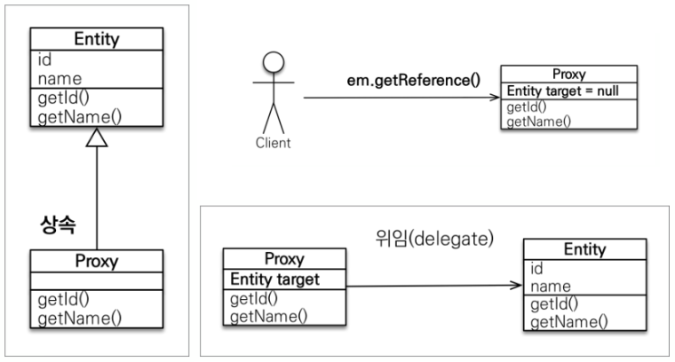
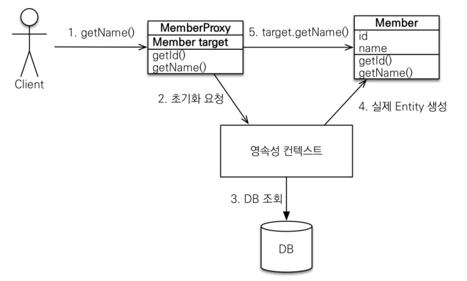

# JPA 관련 개념 정리 - JPA, Hibernate, JPQL, QueryDSL, SpringData JPA, 지연로딩 & 즉시로딩

## 1. JPA(Java Persistence API)
- Java 어플리케이션에서 관계형 데이터베이스를 사용하는 방식을 정의한 인터페이스
- 특정 기능을 하는 라이브러리가 아니며, 관계형 데이터베이스를 사용하는 방법
- JPA는 인터페이스이기 때문에 구현체가 필요함

## 2. Hibernate
- JPA의 구현체는 Hibernate로, EntityManager와 같은 인터페이스를 직접 구현한 라이브러리
- JPA와 Hibernate는 자바의 인터페이스와 해당 인터페이스를 구현한 class와 같은 관계

## 3. JPQL (정적 쿼리)
- JPA는 JQPL, QueryDSL, JDBC, SpringJDBC 등을 지원함
- 이 중, JPQL은 Java Persistence Query Language의 약자로 엔티티 객체를 대상으로 쿼리함 (반대로, SQL은 데이터베이스 테이블을 대상으로 쿼리함)

## 4. QueryDSL (동적 쿼리)
- JPQL을 자바 코드로 작성할 수 있도록 도와주는 Builder API
- 즉, QueryDSL로 작성한 코드는 JPQL을 실행시킴
- QueryDSL은 문자가 아닌 코드로 컴파일 시점에 문법 오류를 발견할 수 있다는 큰 장점이 있음
- 실무에서는 SpringBoot + JPA + QueryDSL의 조합으로 많이 사용됨

### ※ JPQL vs QueryDSL
```java
import static com.example.inflearnquerydsl.entity.QMember.member;

@SpringBootTest
@Transactional
public class QuerydslBasicTest {

    @PersistenceContext
    EntityManager em;

    JPAQueryFactory queryFactory; // 동시성 문제?
    // 스프링 프레임워크는 여러 쓰레드에서 동시에 같은 EntityManager에 접근해도, 
    // 트랜잭션 마다 별도의 영속성 컨텍스트를 제공하기 때문에, 동시성 문제는 걱정하지 않아도 된다.

    @BeforeEach
    public void before() {
        queryFactory = new JPAQueryFactory(em);

        Team teamA = new Team("teamA");
        Team teamB = new Team("teamB");
        em.persist(teamA);
        em.persist(teamB);

        Member member1 = new Member("member1", 10, teamA);
        Member member2 = new Member("member2", 20, teamA);
        Member member3 = new Member("member3", 30, teamB);
        Member member4 = new Member("member4", 40, teamB);
        em.persist(member1);
        em.persist(member2);
        em.persist(member3);
        em.persist(member4);
    }

    @Test
    public void startJPQL() {
        String qlString =
                "select m from Member m " +
                        "where m.username = :username";

        Member findMember = em.createQuery(qlString, Member.class)
                .setParameter("username", "member1")
                .getSingleResult();

        assertThat(findMember.getUsername()).isEqualTo("member1");
    }


    @Test
    public void startQuerydsl() {
        Member findMember = queryFactory
                .select(member)
                .from(member)
                .where(member.username.eq("member1")) //파라미터 바인딩 처리
                .fetchOne();

        assertThat(findMember.getUsername()).isEqualTo("member1");
    }
}
```

## 5. SpringData JPA
- 스프링에서 JPA 더 쉽고 편하게 사용할 수 있도록 도와주는 역할
- JPA를 더욱 추상화시킨 Repository라는 인터페이스를 제공
- Repository 인터페이스에 정해진 규칙대로 메소드를 입력하면 스프링이 자동으로 메소드 이름에 적합한 쿼리를 날리는 구현체를 만들어 Bean으로 등록해줌
- "SpringDataJPA가 JPA를 추상화하다." = "SpringDataJPA의 Repository의 구현에서 JPA를 사용하고 있다."

## 6. 지연로딩 & 즉시로딩

### 6-1. 프록시
- 프록시의 특징
  - 실제 클래스를 상속 받아서 만들어졌다.
  - 실제 클래스와 겉모양이 같다.
  - 사용하는 입장에서는 진짜 객체와 프록시 객체를 구분하지 않고 사용하면 된다.
  - 프록시 객체는 실제 객체의 참조(target)를 보관
  - 프록시 객체를 통해 메소드를 호출하면 프록시 객체는 실제 객체의 메소드 호출 

<p align="center"></p>

```java
em.find() // DB를 통해 실제 엔티티 객체 조회
em.getReference() // 가짜 엔티티(프록시) 객체 조회
```

<p align="center"></p>

- 프록시 객체의 초기화
  - 프록시 객체는 처음 사용할 때 한 번만 초기화
  - 프록시 객체를 초기화 할 때, 프록시 객체가 실제 엔티티로 바뀌는 것은 아니며, 초기화되면 프록시 객체를 통해서 실제 엔티티에 접근 가능
  - 프록시 객체는 원본 엔티티를 상속받기 때문에, 타입 체크시 주의해야함 ("==" 대신 "instance of" 사용)
  - 영속성 컨텍스트에 찾는 엔티티가 이미 있으면 em.getReference()를 호출해도 실제 엔티티 반환
  - 영속성 컨텍스트의 도움을 받을 수 없는 준영속 상태일 때, 프록시를 초기화하면 문제 발생

### 6-2. 지연로딩 & 즉시로딩
- 예제 코드
```java
Team team = new Team();
team.setName("teamA");
em.persist(team);

Member member = new Member();
member.setUsername("member1");
member.setTeam(team);
em.persist(member);

em.flush();
em.clear();

Member findMember = em.find(Member.class, member.getId());
```
- 지연로딩(LAZY) 로그
```log
Hibernate: 
    select
        member0_.MEMBER_ID as MEMBER_I1_0_0_,
        member0_.TEAM_ID as TEAM_ID3_0_0_,
        member0_.USERNAME as USERNAME2_0_0_ 
    from
        Member member0_ 
    where
        member0_.MEMBER_ID=?
```
- 즉시로딩(EAGER) 로그
```log
Hibernate: 
    select
        member0_.MEMBER_ID as MEMBER_I1_0_0_,
        member0_.TEAM_ID as TEAM_ID3_0_0_,
        member0_.USERNAME as USERNAME2_0_0_,
        team1_.TEAM_ID as TEAM_ID1_1_1_,
        team1_.name as name2_1_1_ 
    from
        Member member0_ 
    left outer join
        Team team1_ 
            on member0_.TEAM_ID=team1_.TEAM_ID 
    where
        member0_.MEMBER_ID=?
```
- 위의 예제와 같이 지연로딩은 Member만 조회하고 연관 관계에 있는 나머지 데이터 조회를 미루며, 즉시로딩은 Member를 조회하면서 연관 관계에 있는 Team까지 함께 조회함
- Member를 사용하는 곳 대부분에서 Team 데이터가 필요하지 않다면 FetchType을 LAZY(지연로딩)로 설정하고, Team 데이터가 필요할 때에만 Team에 대한 쿼리를 한 번 더 날리는 것이 적합
- 반면, 비지니스 로직 상 Member 데이터가 필요한 곳에 대부분 Team의 데이터를 함께 사용한다면, FetchType을 EAGER로 설정하여 항상 Member와 Team을 같이 조회해오는 것이 더 적합
- 실무에서는 효율 문제로 즉시로딩은 지양하고 지연로딩을 사용하는 것이 권장됨

### 6-3. 정리 : 프록시와 지연로딩
- 프록시는 실제 엔티티 객체 대신에 사용되는 객체로, 실제 엔티티 클래스와 상속 관계 및 위임 관계에 있음
- 프록시를 얻으려면 em.getReference() 메소드를 호출하면 되는데, 이때는 SELECT 쿼리를 수행하지 않으며, 프록시 객체만 얻음 (반면, em.find()를 사용하면 SELECT 쿼리가 수행됨)
- 즉, 프록시의 핵심은 엔티티가 사용될 때까지 조회하지 않고 있다가 필요할 때만 조회하는 방식
- 만약, 프록시 객체가 참조하는 실제 엔티티가 영속성 컨텍스트에 생성되어 있지 않다면 DB에 접근하여 실제 엔티티를 생성해야 하는데 이러한 과정을 프록시 초기화라고 함
- 즉, 이러한 지연로딩 방식은 엔티티가 실제로 사용되는 시점까지 기다리다 필요할 때에 엔티티가 조회되기 때문에 기존의 방식에 비해 성능을 더욱 최적화할 수 있음

---
참고

https://velog.io/@dbsrud11/JPA-Hibernate-SpringData-JPA-%EC%B0%A8%EC%9D%B4%EC%A0%90

https://doing7.tistory.com/123

https://ict-nroo.tistory.com/132

https://velog.io/@jin0849/JPA-%ED%94%84%EB%A1%9D%EC%8B%9CProxy

https://velog.io/@jin0849/JPA-%EC%A6%89%EC%8B%9C%EB%A1%9C%EB%94%A9EAGER%EA%B3%BC-%EC%A7%80%EC%97%B0%EB%A1%9C%EB%94%A9LAZY

https://victorydntmd.tistory.com/210