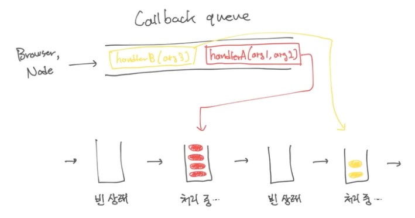

# JavaScript - 실행 모델 (Event Loop, Call Stack, Run-to-completion, Callback Queue, Offloading)

## 1. Event Loop

Event Loop는 여러 쓰레드를 사용하는데, 그 중 JavaScript 코드가 실행되는 쓰레드를 메인 쓰레드라고 한다.

한 프로세스에서 메인 쓰레드는 하나이며, 한 순간에 한 줄씩만 실행한다.

하지만, 그 외의 일(file I/O, network 등)을 하는 워커 쓰레드는 여러 개가 존재할 수 있다.

<br/>

## 2. Call Stack

Call Stack이란, 지금의 시점까지 Call 된 함수들의 스택으로, 함수가 호출될 때 쌓이고, 리턴할 때 빠지게된다.

```JavaScript
function f3() {}

function f2() { f3() }

function f1() { f2() }

f1()
```

위와 같은 코드에서는 f1 => f2 => f3 순으로 함수가 쌓이고, 리턴될 때마다 f3 => f2 => f1 순으로 빠진다.

<br/>

## 3. Run-to-completion

<p align="center"></p>

Event Loop가 다음 Callback을 처리하려면, 지금 처리하고 있는 Callback의 실행이 완전히 끝나야하며, 이 말은 Call Stack이 완전히 빌 때까지 처리한다는 것과 동일하다.

<br/>

## 4. Callback Queue

<p align="center"></p>

Callback Queue는 앞으로 실행할 Callback(함수와 그 인자)들을 쌓아두는 큐로, Callback은 Node가 어떠한 이벤트(파일처리 완료, 네트워크 작업 완료, 타이머 호출 등)가 발생하면 메인 쓰레드에 이를 알려주기위해(Callback 하기위해) 사용된다.

Callback Queue는 Call Stack이 빈 상태가 될 때까지 대기하다가, 빈 상태가 되면 Callback Queue에서 하나씩 꺼내서 처리한다.

※ 위의 개념들을 종합해서, 아래의 코드가 어느 순서로 출력될 지 예측할 수 있다.

```JavaScript
console.log('1')

setTimeout(() => {
    console.log('2')
}, 0)

console.log('3')
```

console.log('1')을 먼저 실행하고, 그 다음 setTimeout을 실행하고, 그 다음 console.log('3')을 실행하게 되는데, '1'과 '3'을 먼저 출력하면서 Call Stack이 비워지게되고, Call Stack이 비워졌기 때문에 Callback Queue에 있는 console.log('2')를 Call Stack에 넣어 처리하여 '2'를 출력하게 된다. 즉, '1', '3', '2' 순으로 출력하게 된다.

```JavaScript
setInterval(() => {
    console.log('Hello')
    while(true) {}
}, 1000)
```

위와 같은 코드에서 5초동안 'Hello'는 몇 번 출력이 될까?

정답은 1번인데, while loop가 도는 동안 Call Stack이 절대 비지 않기 때문이다.

이 동안은 Callback Queue에서 Callback을 꺼낼 수가 없고, setInterval이 아무리 Callback을 쌓아도, 메인 쓰레드에서 실행 될 수 없다(이러한 경우를 event loop가 block 되었다고 한다.).

위의 코드를 통해 JavaScript는 앞선 Call Stack이 비워져야 다음 작업을 진행할 수 있음을 알 수 있다.

## 5. Non-Blocking I/O & Offloading

```JavaScript
fs.readFile(fileName, (err, data) => { })

someTask()
```

위의 코드는 다음과 같은 동작을 한다.

(1) readFile을 통해 Node에게 파일을 읽어달라고 요청하고, 워크 쓰레드에서 파일을 읽기 시작한다.

(2) readFile의 호출이 끝난 직후 someTask 함수를 실행하게 된다. 이는 여전히 같은 Callback을 처리하는 중이기 때문이다.

(3) Node가 파일을 다 읽고 나면, Callback Queue에 readFile 함수의 err, data 인자를 채워서 넣고, Call Stack이 비워져 Callaback Queue에서 꺼내질 때, readFile 함수 안의 부분이 실행된다.

<br/>

브라우저나 Node.js, Web API 혹은 Node API의 동작이 끝나면 Callback Queue에 등록한다.

브라우저나 Node가 요청 받은 일을 하고 있는 동안(워크 쓰레드) 메인 쓰레드와 이벤트 루프는 영향을 받지 않고 계속 실행된다.

이를 Offloading이라 하며, Node.js 서버의 메인 쓰레드가 하나임에도 불구하고 빠르게 동작할 수 있는 이유이다(메인 쓰레드는 오래 걸리는 일을 기다리지 않기 때문).

## 6. 정리

<p align="center"></p>

(1) Callback Queue에서 Callback을 꺼내고

(2) 그 Callback의 처리가 끝날 때까지 실행하고

(3) 위의 두 과정을 반복한다!

(이 사이에 브라우저나 Node가 요청 받은 일은 워크 쓰레드에서 진행한다)