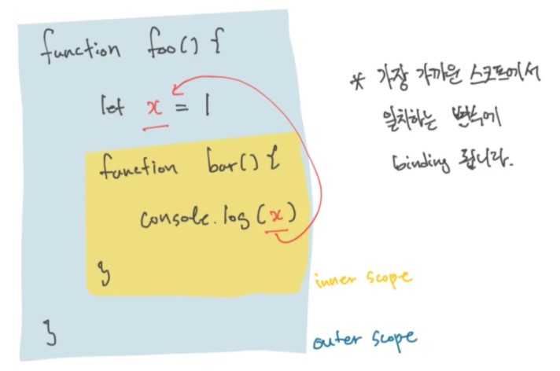

# JavaScript - Hoisting, Scope, Closure

## 1. Hoisting

Hoisting이란, 변수의 선언을 해당 스코프의 맨 위로 올리는 것을 뜻한다.

```JavaScript
// 예시 1 => 출력결과 undefined로 나옴
console.log(x)
var x = 1

// 예시 2 => 출력결과 1로 나옴
var x = 1
console.log(x)

// 예시 3 (Hoisting) => 출력결과 예시 1과 동일
var x
console.log(x)
x = 1

// 예시 4 => ReferenceError(var가 없으면 변수의 선언 자체가 이루어지지 않으므로)
console.log(x)
x = 1
```

var(변수) 뿐만 아니라, function도 Hoisting의 대상이다.

```JavaScript
// 예시 1 => 출력결과 foo 출력
function foo() {
  return 'foo'
}
console.log(foo())

// 예시 2 => 예시 1과 동일
console.log(foo())
function foo() {
  return 'foo'
}
```

변수(var)는 선언하고, 초기화하는 부분이 별개지만, 함수(function)는 선언만 존재하기 때문에 위와 같은 결과가 나온다.

## 2. Scope

<p align="center"></p>

코드의 어떤 식별자가 실제로 어떤 값을 가리키는지 결정하는 것을 binding이라 하는데, JavaScript의 binding은 Lexical Scope를 통해 이루어진다.

Lexical Scope란, 안쪽(inner scope)에서 바깥쪽(outer scope)의 변수에 접근할 수 있다는 뜻이다.

```JavaScript
function foo() {
  var x = 'foo'
  console.log(x) // foo 출력
}

console.log(x) // ReferenceError
```

하지만, 위의 코드처럼 Lexical Scope는 밖에서 안쪽을 참조할 수 없다.

```JavaScript
var x = 'foo'

function foo() {
  console.log(x) // foo 출력
}

console.log(x) // foo 출력
```

위의 코드는 두 x가 모두 문자열 객체를 가리키고 있기 때문에, 동일한 출력을 하게 된다.

```JavaScript
var x = 1
if (true) {
  var x = 2
}

console.log(x) // 2 출력
```

위의 코드에서는 1이 아닌 2를 출력하게 되는데, var는 Block Scoping의 대상이 아니기 때문이다.

※ 이와 달리, let과 const는 Block Scoping 대상이다.

## 3. Closure

### "Closure = Function + Environment"

Closure는 function이 하나 생길 때마다 하나씩 생기게 되며, environment는 function 자신을 둘러 싼 접근할 수 있는 모든 Scope를 뜻한다.

```JavaScript
function and(x) {
  return function print(y) {
    return x + ' and ' + y
  }
}

const saltAnd = and('salt')
console.log(saltAnd('pepper')) // salt and pepper 출력
console.log(saltAnd('sugar')) // salt and sugar 출력
```

위의 코드에서 and 함수로 만들어진 saltAnd의 Closure는 function인 print와 environment인 x => 'salt'로 구성된다.

위와 같이 Closure는 and 함수처럼 Higher-order function을 만드는 데 도움을 준다.

```JavaScript
function and(x) {
  return function print(y) {
    return x + ' and ' + y
  }
}

const saltAnd = and('salt')
console.log(saltAnd('pepper')) // salt and pepper 출력
console.log(saltAnd('sugar')) // salt and sugar 출력

const waterAnd = and('water')
console.log(waterAnd('juice') // water and juice 출력
```

위와 같은 코드에서는 saltAnd와 waterAnd 각각 2개의 서로 다른 Closure를 형성하고 있으며, 둘 다 function은 print 함수이지만, 각각 주어진 변수가 다르기 때문에(saltAnd는 x가 'salt', waterAnd는 x가 'water') 위와 같은 출력 결과를 가져온다.

```JavaScript
function foo() {
  function bar() {
  }
  function baz() {
  }
}

foo()
```

다른 예시를 들어보자면, 위의 코드에서 Closure는 총 몇 개 일까?

정답은 foo 1개, bar 1개, baz 1개로 총 3개이다.

```JavaScript
function foo() {
  function bar() {
  }
  function baz() {
  }
}

foo()
foo()
```

위의 코드에서는 foo 함수를 두 번 호출하게 되는데, 이러한 경우에는 foo 1개, bar 2개, baz 2개로 총 5개의 Closure가 생긴다.

```JavaScript
// 예시 1
function getCounter() {
  var result = {
    count: count,
    total: 0
  }
  function count() {
    result.total += 1
  }
  return result
}

var counter = getCounter()
counter.count()
counter.count()

console.log(counter.total) // 2 출력

// 예시 2
function getCounter() {
  var result = { count: count, total: 0 }
  function count() {result.total += 1}
  return result
}

var counterA = getCounter()
counterA.count()
counterA.count()

var counterB = getCounter()
counterB.count()

console.log(counterA.total, counterB.total) // 2 1 출력
```

위의 코드에서 예시 1은 당연히 2가 출력됨을 유추할 수 있다.

하지만, 예시 2의 경우는 고민을 하게된다. 2 1을 출력할지, 2 3을 출력할지..

정답은 2 1을 출력하게 되는데, 이유는 counterA는 첫 번째 실행 때 만들어진 total과 count로 이루어진 객체이며, counterB는 두 번째 실행 때 만들어진 total과 count로 이루어진 객체로, 서로 별개이기 때문이다. (서로 다른 Closuer이기 때문)

```JavaScript
var numCounters = 0

function getCounter() {
  numcounters += 1

  var result = { count: count, total: 0 }
  function count() {result.total += 1}
  return result
}

var counterA = getCounter()
counterA.count()
counterA.count()

var counterB = getCounter()
counterB.count()

console.log(counterA.total, counterB.total, numCounters) // 2 1 2 출력
```

반면, 위의 코드의 경우는 numCounters는 2가 출력이 되는데, 그 이유는 모든 함수는 각각의 Closure를 가지고 있어 getCounter 함수와 numCounters 변수가 서로 binding 되어 있기 때문에 getCounter 함수가 실행된 만큼의 횟수를 출력하게 된다.

