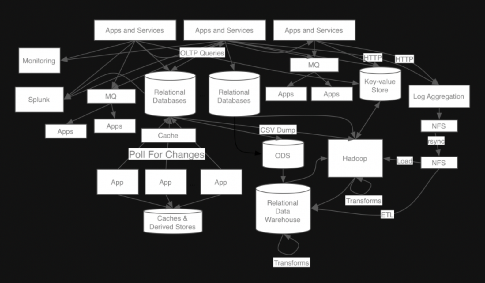
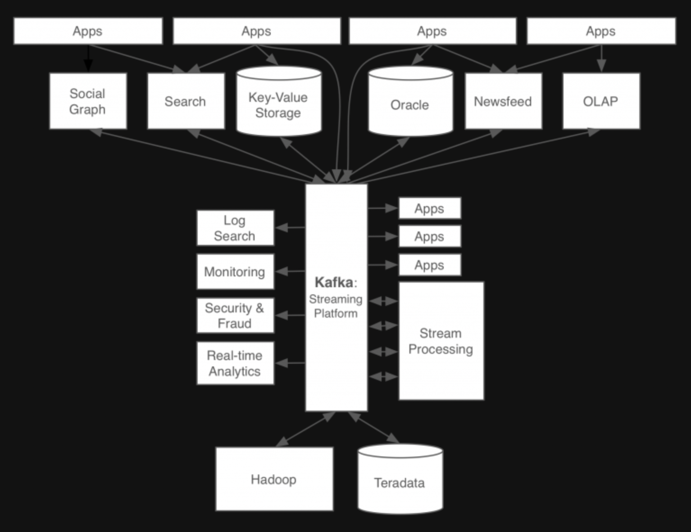
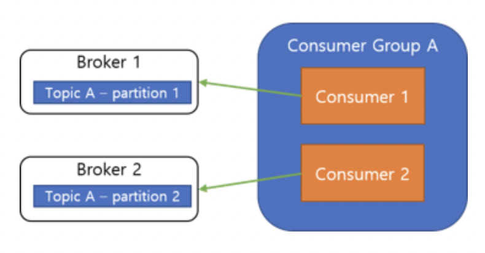
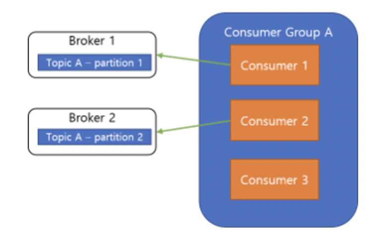
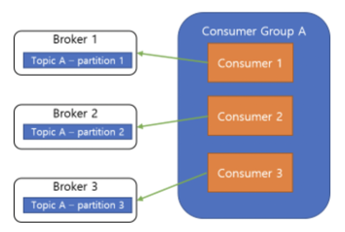

# Kafka

## 1. Kafka의 등장 배경

### 1-1. 링크드인 AS-IS

- 기존 링크드인의 시스템은 각 파이프라인이 파편화되고 시스템 복잡도가 높아 새로운 시스템을 확장하기 어려운 상황이었음
- 기존 메시징 큐 시스템인 ActiveMQ를 사용했지만, 링크드인의 수많은 트래픽과 데이터를 처리하기에는 한계가 있었고, 새로운 시스템의 개발 필요성이 높아짐

### 1-2. 링크드인 TO-BE

- 새로운 시스템(Kafka)의 개발 목표
    - 프로듀서와 컨슈머의 분리
    - 메시징 시스템과 같이 영구 메시지 데이터를 여러 컨슈머에게 허용
    - 높은 처리량을 위한 메시지 최적화
    - 데이터가 증가함에 따라 Scale-Out이 가능한 시스템

- Kafka의 개발 후 영향
    - 모든 이벤트와 데이터의 흐름을 중앙에서 관리할 수 있게 됨
    - 서비스 아키텍쳐가 기존에 비해 관리하기 심플해짐

## 2. Kafka의 구성 요소

### 2-1. Event
- Kafka에서 Producer와 Consumer가 데이터를 주고 받는 단위이며, Message라고도 불림

### 2-2. Producer
- Kafak에서 Event를 게시하는 클라이언트 어플리케이션을 의미

### 2-3. Consumer
- Topic을 구독하고 이로부터 얻어낸 Event를 처리하는 클라이언트 어플리케이션

### 2-4. Topic
- Event가 쓰이는 곳으로, Producer는 Topic에 Event를 게시함
- Consumer는 Topic으로부터 Event를 가져와 처리함
- Topic은 파일시스템에서 폴더와 유사하며, Event는 폴더 안의 파일과 유사함
- Topic에 저장된 Event는 필요한만큼 다시 읽을 수 있음

### 2-5. Partition
- Topic은 여러 Broker에 분산되어 저장되며, 이렇게 분산된 Topic을 Partition이라고 함
- 어떤 Event가 어떤 Partition에 저장될지는 Event의 Key에 의해 정해지며, 같은 Key를 가지는 Event는 항상 같은 Partition에 저장됨
- Kafka는 Partition에 저장된 Consumer가 항상 동일한 순서로 Partition의 Event를 읽을 것을 보장함

## 3. Kafka의 주요 개념

### 3-1. Producer와 Consumer의 분리
- Kafka의 Producer와 Consumer는 별개로 동작하기 때문에, Producer는 Broker의 Topic에 메시지 게시만 하면 되며, Consumer는 Broker의 특정 Topic에서 메시지를 가져와 처리만 하면 됨
- 이러한 분리 때문에 Kafka는 높은 확장성을 가지며, Scale-In이나 Scale-Out하기 용이함

### 3-2. Push와 Pull 모델
- Kafak의 Consumer는 Pull 모델을 기반으로 메시지 처리를 진행함
- 즉, Broker가 consumer에게 메시지를 전달하는 것이 아니라 Consumer가 필요할 때 Broker로 부터 메시지를 가져와 처리하는 형태
- Push 모델의 경우 Broker가 데이터 전송 속도를 제어하기 때문에 다양한 메시지 스트림의 소비자를 다루기 어렵지만, Pull 모델은 Consumer가 처리 가능한 때에 메시지를 가져와 처리하기 때문에 다양한 소비자를 다루기 쉬움
- Push 모델은 요청을 즉시 보내거나 더 많은 메시지를 처리하도록 Buffering을 할 수 있지만, 이러한 경우 Consumer가 현재 메시지를 처리할 수 있음에도 대기를 해야하기 때문에 비효율적인 반면, Pull 모델은 마지막으로 처리된 메시지 이후의 메시지를 Consumer가 처리 가능한 때에 모두 가져오기 때문에 불필요한 지연없이 일괄처리를 할 수 있음

### 3-3. 소비된 메시지 추적(Commit과 Offset)
- Offset 
    - 메시지는 지정된 Topic에 전달되거나 Topic은 다시 여러 Partition으로 나뉠 수 있는데, 이러한 메시지는 로그에 순차적으로 append되며, 이 메시지의 상대적인 위치를 Offset이라 함
- 메시징 시스템은 Broker에서 소비된 메시지에 대한 메타데이터를 유지하는데, 메시지가 Consumer에게 전달되면 Broker는 이를 로컬에 기록하거나 소비자의 승인을 기다림
- Commit과 Offset
    - Consumer의 poll()은 이전에 Commit한 Offset이 존재하면, 해당 Offset 이후의 메시지를 읽어오게 되며, 또한 마지막 Offset을 Commit함고 이어서 poll()이 실행되면 방금전 Commit한 Offset 이후의 메시지를 읽어와 처리하게 됨
- 소비된 메시지 기록시점
    - Broker가 메시지를 네트워크를 통해 Consumer에게 전달할 때, 즉시 소비된 것으로 기록하면 Consumer가 메시지 처리를 실패한 경우 해당 메시지가 손상되게 됨
    - 이러한 이유로 Broker는 메시지가 소비되었음을 기록하기위해 Consumer의 승인을 기다리는데, 이런 방법으로 메시지를 처리하면 중복 메시지 전송과 멱등성의 문제가 발생함
- 중복 메시지 전송과 멱등성
    - Consumer가 메시지를 성공적으로 처리하여 승인을 보내려고 할 때, 승인을 보내기 전 Broker가 실패했다고 판단하여 다시 메시지를 보내면 Consumer는 같은 메시지를 두 번 처리하게 됨
    - 따라서, Consumer는 멱등성을 고려해야 하며, 같은 메시지를 특수한 상황에 의해 여러 번 받아서 처리하더라도 한 번 처리한 것과 같은 결과를 내도록 설계해야 함

### 3-4. Consumer Group
- Consumer Group은 하나의 Topic을 구독하는 여러 Consumer들의 모음으로, Consumer를 그룹화하여 가용성을 증가시키기 위해 사용
- Consumer Group의 각각의 Consumer들은 하나의 Topic의 각기 다른 Partition의 내용만을 처리할 수 있으며, 이로서 메시지 처리 순서를 보장하게 됨
- Rebalace
    - 특정 Partition을 처리하던 Consumer가 처리 불가 상태가 된다면 해당 Partition의 메시지를 처리할 수 없는 상태가 되어버리기 때문에, 이를 보조하기 위하여 남은 Consumer Group 내의 Consumer들이 Partition을 적절하게 나누어 처리함
    - Consumer Group 내에서 Consumer들 간 Offset 정보를 공유하고 있기 때문에, 특정 Consumer가 처리불가 상태가 되었을 때, 해당 Consumer가 처리한 마지막 Offset 이후부터 처리를 이어서 할 수 있음
- Consumer Group 내의 Consumer들은 메시지 처리 순서를 보장하기 위해 각기 다른 Partition에 연결되어야만 함

- Consumer 확장
    - Consumer의 성능이 부족하여 Consumer를 확장할 때, Consumer Group 내의 Consumer는 무조건 각기 다른 Partition에만 연결할 수 있기 때문에 Partition도 같이 늘려주어야 함
    

    

### 4-5. 메시지 전달 방식
- At most once (최대 한 번) : 메시지가 손실될 수 있지만, 재전달은 하지 않음
- At least once (최소 한 번) : 메시지가 손실될 수 있지만, 재전달을 수행 함
- Exactly once (정확히 한 번) : 메시지 전달이 정확히 한 번 일어남

