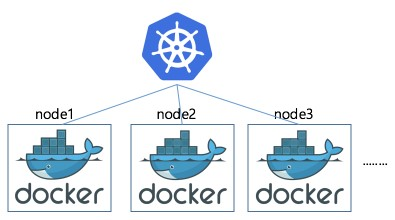

# Kubernates (vs Docker)

## 1. Docker와 Kubernates
### Docker 
  - 하나의 이미지를 컨테이너에 띄우고 실행한다!
  - 즉, Docker는 이미지를 컨테이너에 띄우고 실행하는 기술!

### Kubernates
  - Docker를 기반으로 컨테이너를 관리한다!
  - 즉, Kubernates는 Docker를 관리하는 툴!

### => 즉, Docker는 하나의 컨테이너를 관리하고, Kubernates는 여러 개의 컨테이너를 서비스 단위로 관리한다!

 

## 2. Docker

- 컨테이너 기반의 오픈소스 가상화 플랫폼
  - 컨테이너 : 개별 SW 실행에 필요한 실행 환경을 독립적으로 운용할 수 있도록 함으로서, 다른 실행 환경과의 간섭을 막고 실행의 독립성을 확보해줌 (하나의 Host OS에서 각각 독립된 실행)
- 어플리케이션을 분리하고, Container로 추상화하여 프로그램의 배포 및 관리를 단순하게 해줌

## 3. Kubernates

### 3-1. Orchestration
- Kubernates는 컨테이너 Orchestration Rule
  - Orchestration : 컨테이너의 수가 많아지면 관리와 운영에 어려움이 생기는데, 이러한 다수의 컨테이너 실행을 관리하고 조율하는 시스템이 Orchestration
- Orchestration 엔진을 통해 컨테이너의 생성, 소멸, 시작 및 중단 시점 제어, 스케줄링, 로드밸런싱, 클러스터링 등 컨테이너로 어플리케이션을 구성하는 모든 과정을 관리할 수 있음

### 3-2. Kubernates의 특징
- Self-Healing (자동화된 욕구)
  - 컨테이너들을 모니터링하면서 컨테이너 중 하나라도 중지되면 Kubernates는 그것을 빠르게 재시작 함
- Load Balancing (로드 밸런싱)
  - 트래픽이 증가됨에 따라서 Kubernates는 트래픽을 견딜 수 있도록 자동으로 새로운 컨테이너를 생성하며, 다시 트래픽이 줄어들면 컨테이너의 숫자를 지정해둔 최소 숫자로 자동으로 조절함
- Fault Tolerance Service (무중단 서비스)
  - 서버 업데이트를 하기 위해서는 새벽시간이나 긴급 점검의 형태로 서비스를 일시 중단해야 했었지만, Kubernates는 점진적 업데이트를 제공하기 때문에 서비스를 중단하지 않고도 업데이트가 가능함
- Vendor Lock In (호환성) 해결
  - A사의 클라우드를 사용하다 B사 클라우드로 환경을 이전하면서 생기는 호환성 문제를 Vendor Lock In이라 하는데, Kubernates는 Docker를 기반으로 하는 오픈소스이기 때문에 특정 업체에 종속되지 않고 클라우드 환경을 이전할 수 있음
