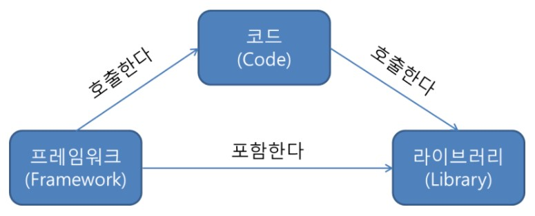

# 라이브러리, 프레임워크, 플랫폼, API(+ RESTful API)

## 1. 라이브러리
- 단순 활용이 가능한 도구들의 집합 (즉, 도구!)
- 미리 작성된 코드, 변수, 함수, 클래스 등이 여기에 해당
- jQuery, React, NumPy, Pandas 등

## 2. 프레임워크
- 원하는 기능 구현에만 집중하여 빠르게 개발 할 수 있도록 필요한 기본적인 기능을 갖추고 있는 것 (즉, 뼈대!)
- Spring, Django, Flask 등

 

## 3. 아키텍처, 플랫폼
- 아키텍처 : 프로그램의 기술적 주요 구조 설계 (즉, 도면!)
- 플랫폼 : 프로그램 실행 환경 (ex. Windows, Linux, 앱스토어, java 등)

 

## 4. API
- 프로그램과 또 다른 프로그램을 연결해주는 역할을 하는 것
- 카카오맵 API, 소셜 로그인 API 등