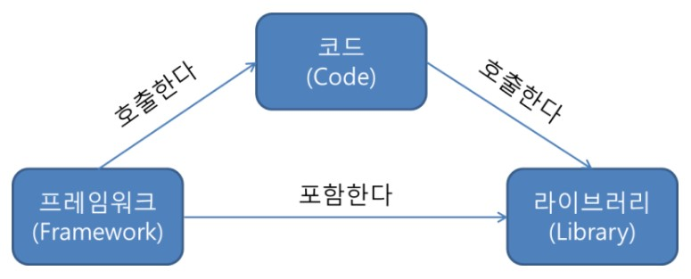

# 라이브러리, 프레임워크, 플랫폼, API(+ RESTful API)

## 1. 라이브러리
- 단순 활용이 가능한 도구들의 집합 (즉, 도구!)
- 미리 작성된 코드, 변수, 함수, 클래스 등이 여기에 해당
- jQuery, React, NumPy, Pandas 등

## 2. 프레임워크
- 원하는 기능 구현에만 집중하여 빠르게 개발 할 수 있도록 필요한 기본적인 기능을 갖추고 있는 것 (즉, 뼈대!)
- Spring, Django, Flask 등

 

## 3. 아키텍처, 플랫폼
- 아키텍처 : 프로그램의 기술적 주요 구조 설계 (즉, 도면!)
- 플랫폼 : 프로그램 실행 환경 (ex. Windows, Linux, 앱스토어, java 등)

 

## 4. API
- 프로그램과 또 다른 프로그램을 연결해주는 역할을 하는 것
- 카카오맵 API, 소셜 로그인 API 등

 

## 5. RESTful API

### 5-1. REST
- 어떤 자원에 대한 CRUD(Create, Read, Update, Delete) 연산을 수행하기 위해 URI(자원)로 요청을 보내는 것
- REST의 구성 요소
  - 자원(Resource) : HTTP URI
  - 자원의 대한 행위 : HTTP Method
  - 자원에 대한 행위의 내용 : HTTP Message Pay Load
- REST의 특징
  - Server-Client 구조
  - Stateless (무상태)
  - Cacheable (캐시 처리 기능)
  - Layered System (계층화)
  - Uniform Interface (인터페이스 일관성)
- REST의 장점
  - HTTP 프로토콜의 인프라를 그래도 사용하므로, REST API 사용을 위한 별도의 인프라를 구축할 필요가 없음
  - HTTP 프로토콜 표준을 사용하므로, HTTP 프로토콜 표준을 따르는 모든 플랫폼에서 사용 가능
- REST의 단점
  - 표준 자체가 존재하지 않아 따로 정의가 필요함
  - 사용할 수 있는 메소드가 4가지 밖에 없음
  - 구형 브라우저에서는 호환이 되지 않아 지원되지 않는 동작이 있음 (ex. 익스플로러)

### 5-2. URI & URL
- URI : 인터넷 상 자원의 위치 (즉, 어떠한 파일의 위치)
- URL : 인터넷 상의 자원을 식별하기 위한 문자열의 구성
- 즉, URL ⊂ URI !!!

### 5-3. REST API
- REST의 원리를 따르는 API
- REST API 설계 예시
  - URI는 동사보다는 명사, 대문자보다는 소문자 사용
  - 마지막에 슬래시(/)를 포함하지 않음
  - 언더바(_) 대신 하이픈(-)을 사용
  - 파일 확장자는 URI에 포함하지 않음 (ex. jpg, pdf 등)
  - 행위를 포함하지 않음 (delete-post (X), post (O))