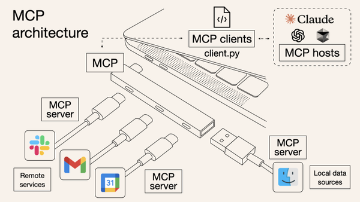
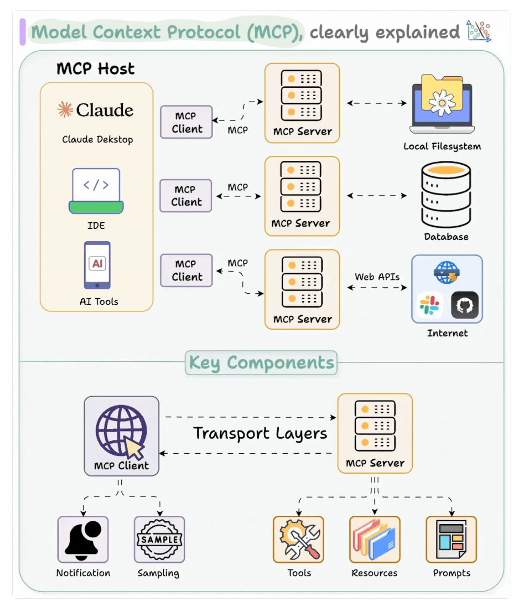
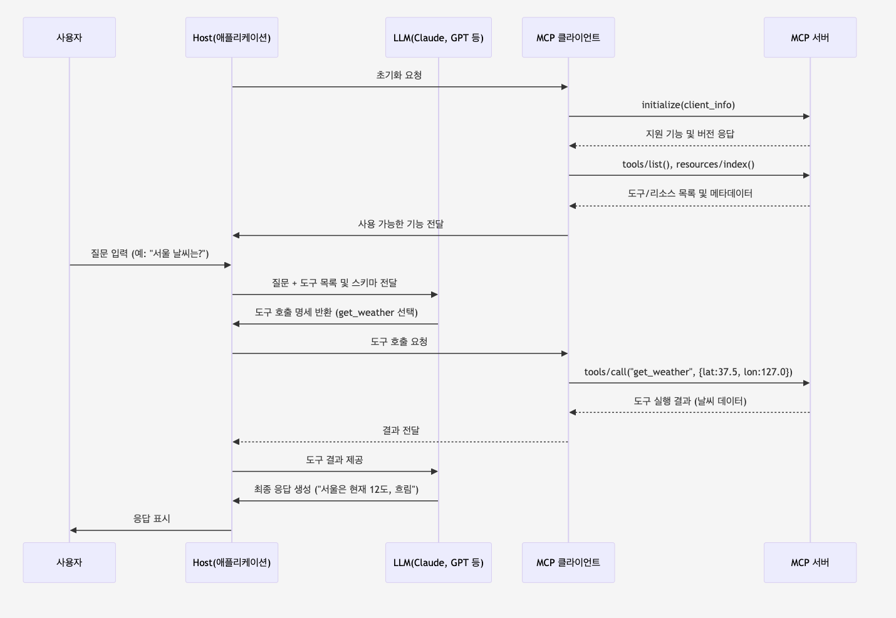

# MCP

## 1. MCP(Model Context Protocol)란?

<p align="center"></p>

- LLM(Large Language Model)과 외부 데이터 소스 및 도구 간의 안전하고 표준화된 통신을 위한 개방형 프로토콜
- MCP는 LLM 모델이 외부 데이터와 도구에 접근할 수 있게 해주는 표준 프로토콜
- MCP는 AI 어플리케이션과 다양한 데이터 소스를 연결하는 표준화된 인터페이스를 제공

## 2. MCP의 핵심 구성 요소

<p align="center"></p>

### 2-1. Host (어플리케이션)
- Claude Desktop, Cursor AI와 같은 인터페이스 어플리케이션
- LLM을 관리하고 사용자와 AI 모델 간 상호작용 제공
- 내부에 MCP Client를 포함하여 외부 도구와 연결

### 2-2. Client (통신 중계자)
- Host 내부에 존재하는 통신 컴포넌트
- MCP Server와의 연결 및 통신 처리 담당
- Server가 제공하는 Tool과 Resource 목록을 탐색하고 호출

### 2-3. Server (도구 제공자)
- 외부 시스템 기능을 MCP로 노출하는 독립 서비스
- Google, Slack, 데이터베이스 등 다양한 시스템에 접근 제공
- 하나의 Host가 여러 Server에 동시 연결하여 다양한 기능을 통합할 수 있음
- MCP Server는 3가지 유형의 Context 요소를 Host를 통해 LLM에 제공하며, Context 요소들이 LLM에게 외부 시스템과 상호 작용을 할 수 있도록 함

### 2-4. Context 요소
- Resources
  - 모델이 참고할 수 있는 읽기 전용 데이터
  - URI 형식으로 식별되는 데이터 접근점
  - ex) 파일 내용, API 응답, 데이터베이스 조회 결과
  - @mcp.resource("file://{path}") 형태로 정의
- Tools
  - LLM이 실제 작업을 수행하고 시스템에 변화를 줄 수 있는 실행 가능한 함수
  - 계산 수행, 데이터 검색, 외부 API 호출 등의 기능 제공
  - 입력 파라미터와 출력 형식이 명확히 정의됨
  - @mcp.tool() 데코레이터로 정의
- Prompts
  - LLM에게 특정 작업 수행 방법을 알려주는 재사용 가능한 템플릿
  - ex) 코드 검토, 텍스트 요약, 데이터 분석 등의 정형화된 작업
  - @mcp.prompt() 데코레이터로 정의

## 3. MCP의 동작 방식

### 3-1. MCP의 동작 흐름 (Host - Client - Server 간 통신)
- 초기화 및 연결 : Host가 MCP Client를 통해 Server와 연결을 설정
- 기능 탐색 : Client가 Server에서 제공하는 Tools와 Resources 목록을 조회
- 사용자 입력 처리 : 사용자의 질문이 LLM에 전달되며, LLM은 필요한 도구를 선택
- 도구 호출 : Client가 Server에 Tools 호출 요청을 보내고 결과를 받아옴
- 응답 생성 : LLM이 Tools의 결과를 활용해 최종 답변을 생성하고 사용자에게 전달

### 3-2. 상세 흐름 다이어그램

<p align="center"></p>

### 3-3. 단계별 상세 설명
- 초기화 및 연결
  - Claude Desktop이나 Cursor 등 Host가 처음 실행 될 때, 내부의 MCP Client는 Server와 연결을 시도함
  - Client는 initialize 메서드를 호출하여 Client 정보와 함께 지원 가능한 기능을 알람
  - Server는 자신의 버전과 지원하는 기능을 응답하여 호환성을 확인
  ```json
  // Client → Server : 초기화 요청
  {
    "jsonrpc": "2.0",
    "id": 1,
    "method": "initialize",
    "params": { "clientInfo": { "name": "claude-desktop", "version": "1.0.0" } }
  }
  ```
- 기능 탐색 및 등록
  - 연결이 설정되면, Client는 Server가 제공하는 Tools와 Resources 목록을 요청
  - Server는 각 도구의 이름, 설명, 입력 방식(스키마)을 포함한 메타 데이터를 반환함
  - ex) 날씨 정보 제공
    ```json
    // Server -> Client : Tools 목록 응답
    {
      "jsonrpc": "2.0",
      "id": 2,
      "result": {
        "tools": [
          {
            "name": "get_weather",
            "description": "특정 위치의 현재 날씨 정보를 제공합니다",
            "inputSchema": {
              "type": "object",
              "properties": {
                "latitude": { "type": "number" },
                "longitude": { "type": "number" }
              },
              "required": ["latitude", "longitude"]
            }
          }
        ]
      }
    }    
    ```
  - Client는 이 정보를 내부 레지스트리에 저장하고, 이후 LLM에게 사용 가능한 Tools로 제공함
- 사용자 요청 처리
  - 사용자가 질문을 입력하면, Host는 이 질문을 LLM에 전달하는데, 이 때 질문과 함께 Tools 목록과 스키마도 함께 전달함
- LLM의 도구 선택
  - LLM은 사용자 질문을 분석하고, 답변에 필요한 정보를 얻기 위해 적절한 Tool을 선택함
  - LLM 자체는 실제로 Tool을 호출하지 않고, 어떤 Tool을 호출할지에 대한 명세만 생성
  ```json
  // LLM → Host : 도구 호출 요청 (tool_call)
  {
    "tool_calls": [
      {
        "name": "get_weather",
        "arguments": {
          "latitude": 37.5665,
          "longitude": 126.9780
        }
      }
    ]
  }
  ```
- 도구 호출 실행
  - Host는 LLM이 선택한 도구 호출 명세를 감지하고, 이를 MCP Client에 전달
  - Client는 이 정보를 바탕으로 MCP Server에 tools/call 요청을 보냄
  ```json
  // Client → Server : 도구 호출 요청
  {
    "jsonrpc": "2.0",
    "id": 3,
    "method": "tools/call",
    "params": {
      "name": "get_weather",
      "arguments": {
        "latitude": 37.5665,
        "longitude": 126.9780
      }
    }
  }
  ```
- 결과 및 반환 처리
  - Server는 Tool 실행 결과를 JSON 형태로 Client에 반환, Client는 결과를 Host에 전달하고, Host는 LLM Context에 추가함
  ```json
  // Server → Client : Tool 실행 결과
  {
    "jsonrpc": "2.0",
    "id": 3,
    "result": {
      "content": [
        {
          "type": "text",
          "text": "{\"temperature\": 12, \"conditions\": \"cloudy\", \"humidity\": 85}",
          "annotations": { "audience": ["assistant"] }
        }
      ]
    }
  }
  ``` 
- 최종 응답 생성
  - LLM은 원래 질문과 Tool 실행 결과를 바탕으로 최종 응답을 생성

## 4. MCP의 중요한 특징

### 4-1. 표준화된 통신
- MCP는 표준화된 JSON-gRPC 프로토콜을 기반으로 통신함
- HTTP가 Web Server와 Browser간 통신을 표준화한 것처럼, MCP는 LLM과의 외부 시스템 및 API 간 통신을 표준화

### 4-2. 도구 호출 제어
- LLM이 직접 도구를 실행하는 것이 아니라, Host/Client가 이를 중개하며, 이 과정에서 사용자 승인이나 보안 정책을 적용할 수 있음

### 4-3. 동적 발견
- Client는 Server의 기능을 실시간으로 발견하고 활용할 수 있으며, 새 Tool이 추가되면 자동으로 LLM에게 제공됨

### 4-4. 언어/플랫폼 독립성
- MCP는 다양한 프로그래밍 언어와 플랫폼에서 구현 가능하며, 서로 다른 구현체 간에도 원활한 통신이 가능함

## 5. MCP 사용 시 장점과 고려 사항

### 5-1. 장점
- Tool을 한 번 MCP Server로 구현하면 Claude, Cursor, 자체 개발 앱 등 모든 MCP 호환 환경에서 사용 가능
- Tool 로직을 독립적인 Server로 분리하여 AI 앱 코드의 복잡도 감소, Tool과 App이 분리되니 각각 독립적으로 작업 가능
- 표준 프로토콜 사용으로 특정 언어나 프레임워크에 종속되지 않음
- Tool의 권한 범위를 명확히 정의하고 중앙에서 관리할 수 있음
- Client가 Server의 기능을 자동으로 탐색하여 통합 코드를 간소화 할 수 있음

### 5-2. 고려 사항
- MCP Server 배포 및 관리에 따른 인프라 복잡성 증가
- 네트워크 의존성 추가로 잠재적 지연 발생 가능
- 아직 초기 단계로 생태계가 발전 중인 상태

### 참고
- https://velog.io/@k-svelte-master/what-is-mcp
- https://velog.io/@byu0hyun/whatismcp
- https://velog.io/@sleekydevzero86/spring-boot-ai-integration