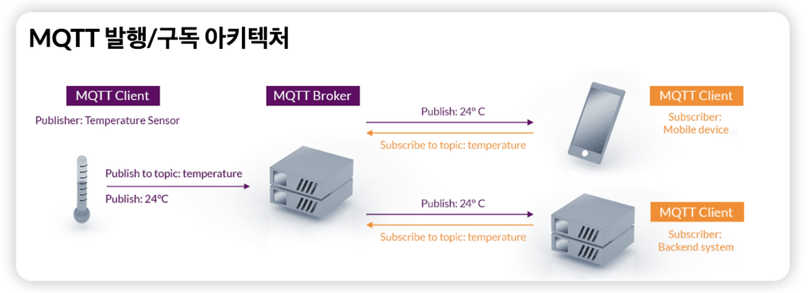
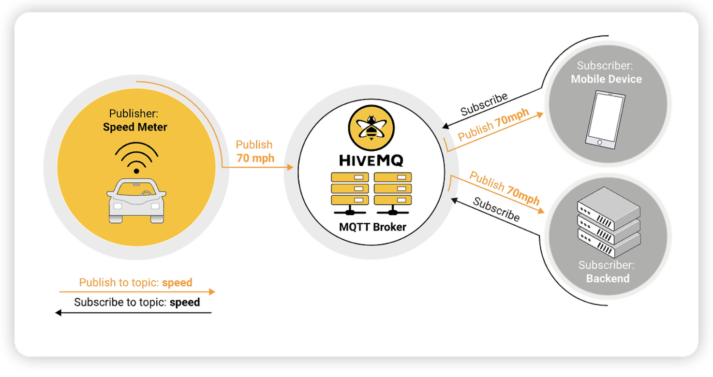

# MQTT & EMQX

## 1. MQTT (Message Queuin Telemerty Transport)

### MQTT란?

- 메시지 큐잉 텔레메트리 전송 프로토콜로, IoT 디바이스 간의 높은 지연 시간, 데이터 통과율 및 전력 사용량에 대한 문제를 해결하기 위해 설계됨
- 기본적으로 MQTT는 IoT 장치가 인터넷을 통해 데이터를 게시하고 구독하는 방법을 정의하는 일련의 규칙을 말함
- MQTT 프로토콜은 이벤트 기반이고 Pub/Sub 패턴을 사용하여 장치를 연결, 발신자와 수신자는 Topic을 통해 통신하며 서로 분리됨
- MQTT는 개방적이고 단순하게 구현되도록 설계되어, 네트워크 대역폭이 중요한 M2M(Machine to Machine) 및 IoT 컨텍스트와 같은 제한된 환경에 사용되기 이상적임

### MQTT의 Pub/Sub 분리 기능

- 기존 클라이언트-서버의 요청-응답 방식에서 생기는 병목현상을 Pub/Sub 아키텍처로 메시지 게시자와 구독자를 나누어 중간의 브로커를 통해 연결을 처리하여 더 빠르고 효율적인 통신 프로세스를 구성해줌
- 즉, 향상된 확장성으로 브로커가 모든 메시지의 중앙 허브 역할을 하여 성능 저하 없이 많은 클라이언트를 처리할 수 있게됨 (낮은 대역폭이나 긴 대기 시간 등의 네트워크 문제 해결)
- 또한, 클라이언트와 연결이 끊어졌어도 브로커가 클라이언트가 다시 연결될 때까지 메시지를 저장하여 메시지가 손실되지 않도록 할 수 있음

## 2. EMQX
- EMQX는 MQTT 브로커 플랫폼으로 높은 처리량, 낮은 지연 시간을 제공해줌
- EMQX는 오픈 소스로, HTTP나 WebSocket등의 다양한 프로토콜을 지원
- TLS/SSL 및 다양한 인증 매커니즘을 통해 MQTT와 안전한 양방향 통신을 제공하여 IoT 장치 및 어플리케이션을 위한 안정적이고 효율적인 통신 인프라를 보장해줌
- EMQX는 단일 클러스터에서 동시 1억개까지 MQTT 연결 확장이 가능하고, 초당 수백만개의 MQTT 메시지를 처리하고 낮은 대기시간을 제공하여 즉각적 통신 수신이 가능함

---
### 참고
- https://titlejjk.tistory.com/322