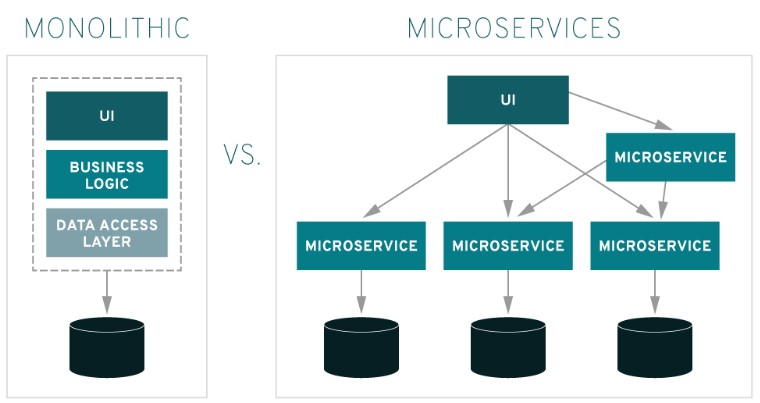
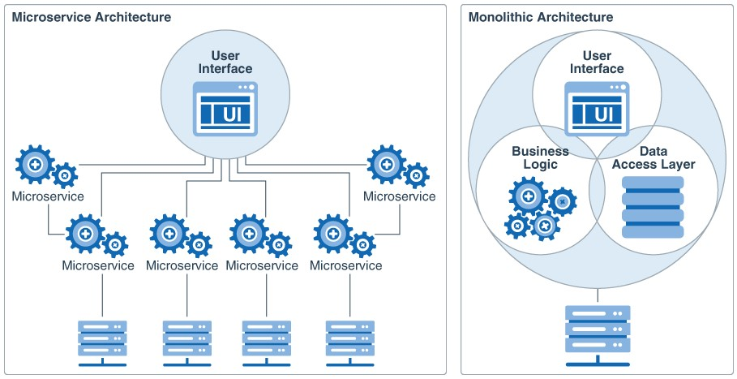

# MSA (Micro Service Architecture)

## 1. MSA란?

- Micro Service Architecture의 줄임말로, 작고 독립적으로 배포 가능하며, 각각의 기능을 수행하는 서비스들로 구성된 프레임워크
- 완전히 독립적으로 배포가 가능하며 다른 기술 스택(개발 언어, 데이터베이스 등)이 사용 가능한 단일 사업 영역에 초점
- 경량화되고 독립적인 여러 개의 서비스를 조합하여 구현하는 방식이며, 자체 데이터베이스를 가지고 동작하기 때문에 개발, 빌드, 배포까지 효율적으로 수행할 수 있음

 

## 2. MSA의 등장 배경

- 초기 사용되던 Monolithic 방식은 전체 소스 코드를 WAR와 같이 하나의 유닛으로 배포하기 때문에 사소한 변경사항이 있더라도 전체 시스템을 중단하고 오류를 해결해야 했음
- 이러한 문제를 해결하기 위해, 어플리케이션의 핵심 서비스를 분할하는 MSA 방식이 등장하였고, 각 서비스들을 독립적으로 구축하고 배포할 수 있게 됨

 

## 3. Monolithic
- 소프트웨어의 모든 구성요소가 한 프로젝트에 통합되어 있는 형태로, 모듈별로 개발한 뒤 하나의 결과물로 패키징하여 배포되는 형태

### 3-1. Monolithic의 장점
- 단순한 아키텍처 구조로 개발이 용이함

### 3-2. Monolithic의 단점
- 서비스 규모가 커지면 전체 시스템의 구조 파악과 유지보수가 힘듬
- 부분 장애가 전체 서비스의 장애로 확대될 수 있음
- 배포 시간이 오래 걸림
- 한 Framework와 언어에 종속적
- 부분적인 Scale-out(여러 서버로 일을 나누어서 처리하는 방식)이 어려움

 

## 4. MSA

### 4-1. MSA의 장점
- 분산형 개발을 통해 개발 주기가 단축되며, 유연한 배포가 가능 (빠른 출시 기간)
- 서비스가 독립적이기 때문에 다른 서비스에 영향을 주지 않음 (뛰어난 복구 능력)
- 서비스별 기술 도입 및 확장이 자유로움 (높은 확장성)
- 기존 Monolithic 방식에 비해 어플리케이션이 작게 모듈화되어 있어 우려 사항이 줄어듬 (손쉬운 배포)
- 다중 언어 지원(Polyglot) API를 사용 (향상된 개방성)
- 하나의 어플리케이션을 여러 부분으로 분할하기 때문에 각 서비스 업데이트 및 개선이 용이 (편리한 액세스)

### 4-2. MSA의 단점
- 각 서비스들이 API를 통해 통신하기 때문에, 네트워크 통신에 의한 오버헤드가 발생할 수 있음
- 서비스별로 로그가 생성되기 때문에, 중앙 로그 모니터링이 존재하지 않음
- 하나의 프로젝트 안에 여러 서비스가 존재하므로 모든 서비스를 모니터링하는데 오버헤드가 증가
- 하나의 서비스에서 여러 서비스를 호출하므로 장애발생 시 경로나 장애 추적이 힘듬
- 서비스가 분산되어 있기 때문에, Monolithic에 비해 상대적으로 복잡함