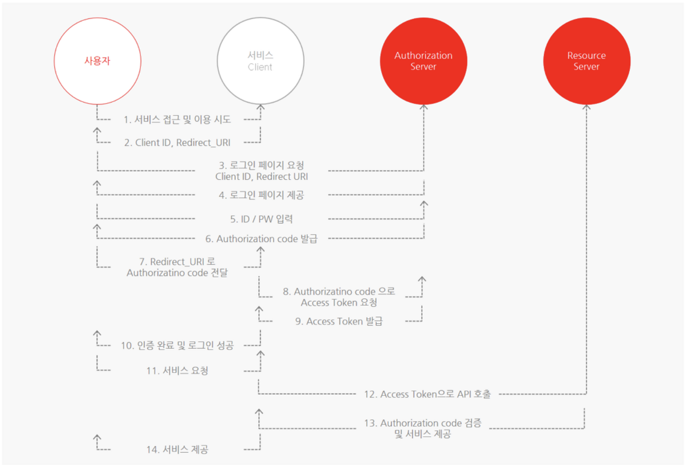
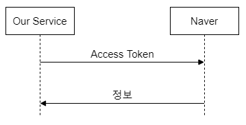
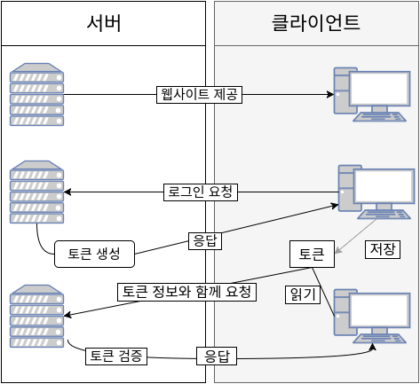

# OAuth 2.0 (+ JWT)

## 1. OAuth의 정의
- OAuth는 인터넷 사용자들이 비밀번호를 제공하지 않고, 다른 웹 사이트 상의 자신들의 정보에 대해 웹사이트나 어플리케이션의 접근 권한을 부여할 수 있는 공통적인 수단 및 접근 위임을 위한 개방형 표준
- OAuth 2.0은 OAuth 1.0의 보안 문제를 개선한 버전
- OAuth 1.0과 OAuth 2.0의 차이
  - OAuth 1.0의 보안 취약점인 Session 고정 공격 개선
  - 기존 서비스 제공자(Service Provider)를 자원 및 권한 서버로 분리하여 다수의 서비스 제공자(서버)로 구성 웹 서비스에서 발생 가능한 권한 동기화 문제 개선
  - 오픈 API 요청 시 Client 인증 방법으로 HTTPS와 JWT Bearer Token 인증 방식을 사용(OAuth 1.0은 서명 방식 사용)하여 서버 및 Client 개발 편의성 개선
  - 다양한 유형의 Client와 이를 고려한 권한 승인 방법을 정의하여 유형별 Client들에 대한 일관된 구현 가능
  - 접근 토큰 재발급을 위한 재발급 토큰(Refresh Token)을 도입함으로써 접근 토큰의 유효 기간 단축 및 보안성 개선

## 2. OAuth 2.0 주요 용어
- Resource Owner : 액세스 상태인 리소스의 유저
- Client : Resource Owner를 대신하여 보호된 리소스에 액세스 하는 응용프로그램
- Resource Server : Client의 요청을 수락하고 응답하는 서버
- Authorization Server : Resource Server에게 액세스 토큰을 발급해주는 서버
- Authorization Grant : Client가 액세스 토큰을 얻을 때 사용하는 자격 증명
- Authorization Code : Access Token을 발급받기 전에 필요한 코드
- Access Token : 보호된 리소스에 액세스하는데 사용되는 Credential
- Scope : 토큰의 권한을 정의하며, 주어진 액세스 토큰을 사용하여 액세스 할 수 있는 리소스의 범위

## 3. OAuth 2.0의 동작 방법

- 유저가 Client에 접근, Authorization Server에 로그인 요청
- Authorization Server는 유저에게 로그인 페이지 제공
- 유저가 ID와 PW를 입력하고, Authorization Server에 Access 권한 요청을 승인
- Authorization Server가 Authorization Code 발급
- Authorization Code를 받은 Client는 Authorization Code를 통해 Access Token 교환 요청
- 정상적으로 통신이 이루어지면, Authorization Server가 Access Token을 발급
- Access Token이 Resource Server에 전달되면 유저가 원하는 서비스 요청
- 서비스 요청을 Access Token을 통해 API를 호출하여 유저가 원하는 서비스를 제공

## 4. Access Token & Refresh Token

### 4-1. Access Token

- OAuth의 핵심으로, 임의의 문자열 값이며, 이 문자열은 Token을 발급해준 서비스만 알 수 있음
- Access Token을 이용하여 이 Token 값과 관련된 고객의 정보를 해당 서비스에 요청할 수 있으며, 해당 서비스는 이 Token을 검증하고 발급된게 맞다면 해당 고객의 정보를 넘겨줌
- 즉, Access Token은 고객이 정보를 넘겨주는 것을 동의한다는 증표
- Access Token을 넘겨받는 방법
  - 핸드폰 인증 형식 : 네이버나 카카오에 로그인을 하면 Token 값을 화면에 출력한 뒤, 고객이 이 토큰을 복사해서 서비스의 Token을 입력하는 페이지에 접속한 뒤 Token을 붙여넣기 함
  - Redirect : 서버에서 클라이언트에게 어떠한 곳으로 페이지를 이동하라고 지정해주는 방법으로, 보통 Redirect 방법을 많이 사용함

### 4-2. Refresh Token
- 보안상의 이유로 만료기간이 짧은 Access Token을 보완하기 위해 사용되는 Token
- Refresh Token은 Access Token에 비해 비교적 긴 만료 기간을 가짐
- Access Token만 사용한다면 만료 기간이 짧기 때문에 사용자가 다시 로그인 시도를 더 자주해야되는 불편함이 있는데, Refresh Token을 통해 Access Token을 재발급받아 사용자가 다시 로그인하는 불편함을 해소할 수 있음

### 4-3. Refresh Token의 탈취
- Refresh Token은 짧은 만료기간을 가진 Access Token을 보완해주는 장점이 있지만, 만일 Refresh Token이 탈취당한다면 공격자는 Refresh Token이 유효한 기간동안 다시 Access Token을 생성할 수 있다는 문제가 있음
- 즉, Access Token만으로 구현한 경우가 Token을 재발급할 수 없기 때문에 보안 측면에서 더 안전할 수 있다는 말
- 오히려 Refresh Token이 없이 Access Token만으로 구현한 경우 공격자는 다시 Token을 받을 수 없기 때문에 보안 측면에서 더 안전할 수 있음
- Refresh Token 탈취 문제를 예방하는 방법
  1. DB에 각 사용자에 1대1로 맵핑되는 Access Token, Refresh Token 쌍을 저장 (Refresh Token도 Access Token과 같은 유효 기간을 가지도록 하고, 사용자가 한 번 Refresh Token으로 Access Token을 발급받았으면 Refresh Token도 다시 발급받도록 하는 것을 권장함)
  2. 정상적인 사용자는 기존의 Access Token으로 접근하고, Server측에서는 DB에 저장된 Access Token과 비교하여 검증
  3. 공격자가 탈취한 Refresh Token으로 새로 Access Token을 생성한 후 Server측에 전송하면 Server는 DB에 저장된 Access Token과 공격자에게 받은 Access Token이 다른 것을 확인함
  4. 만약 DB에 저장된 Access Token이 아직 만료되지 않은 경우, 즉 굳이 Access Token을 새로 생성할 이유가 없는 경우, Server는 Refresh Token이 탈취당했다고 가정하고 두 Token을 모두 만료시킴
  5. 이러한 경우, 정상적인 사용자는 자신의 Token도 만료됐으니 다시 로그인해야 하지만, 공격자의 Token 역시 만료됐기 때문에 공격자는 정상적인 사용자의 리소스에 접근할 수 없음
- 만일 Access Token, Refresh Token 모두 탈취당한다면, 이 때는 프론트엔드나 백엔드 로직을 강화하여 Token이 유출되지 않도록 하는 방법밖에 없음

### 4-4. Token의 저장 장소
- Server에서는 NoSQL이나 기타 DB에 저장
- Client에서는 Cookie, Local Storage 등 다양한 곳이 있지만 http-only 속성이 부여된 Cookie에 저장하는 것을 권장
- http-only 속성이 부여된 Cookie는 JavaScript 환경에서 접근할 수 없기 때문이며, 일반 Cookie나 브라우저의 Local Storage는 JavaScript로 자유롭게 접근이 가능하기 때문에 권장되지 않음

## 5. OAuth 2.0의 장점과 보안 위협

### 5-1. OAuth 2.0 도입에 따른 이점
- 자원 소유자가 Client에 비밀번호를 제공할 필요가 없으며, 피싱같은 위험이 감소함
- Client 개발자는 자원 소유자의 비밀번호에 대한 안전한 저장 및 노출을 고려하지 않아도 됨
- 자원 소유자의 모든 권한이 아닌, Client에게 반드시 필요한 권한만 제한적으로 제공이 가능
- 자원에 대한 Client의 접근을 각 Client별로 차단 및 권한 취소가 가능하며, 권한의 범위 제어가 가능
- Client 별 API 호출 가능 횟수 제한, 일부 자원에 대한 접근만 허용하는 권한 범위 제어가 가능

### 5-2. OAuth 2.0의 보안 이슈
- 은닉 리다이렉트 : Authorization Code나 Authorization Token의 유출로 이어질 수 있는 보안 이슈
  - 공격 방법
    - 공격자가 Client와 Authorization Server 간의 권한 승인요청을 가로채서 redirect_uri 값을 공격자의 Server로 변조하고, Authorization Code 및 Authorization Token을 탈취
  - 원인
    - URI 값은 최초 Client 등록 시 Authorization Server에 등록되지만, 최초 등록된 URI와 요청 시 전달된 URI의 미검증 및 정상 Client의 여부 미검증
  - 권장 조치
    - 최초 등록된 URI와 요청 시 전달되는 URI 비교, Client의 IP 주소 확인, 기타 시스템 정보 비교를 통한 Client 검증 절차 준수 필요
- 이외에도 OAuth 2.0의 보안 이슈는 DoS, 불법 권한 획득, 신분/세션 도용 등이 있음

## 6. JWT
- JSON Web Token의 약자로, 사용자 인증을 위해 사용하는 암호화된 Token
- 어플리케이션이 실행될 때, JWT를 Static 변수와 Local 스토리지에 저장하고, HTTP 헤더에 JWT를 담아 Authorization Server와 통신함

### 6-1. JWT의 구조
- Header : Token의 타입과 해시 암호화 알고리즘에 대한 정보
- Payload : 토큰에 담을 정보 (registered claim + public claim + private claim)
- Signature(서명) : 서명은 헤더 + 페이로드 + secret key를 사용해서 JWT Backend에서 발행되며, 각 요청 시 서명이 확인되고 Header 또는 Payload의 정보가 Client 의해 변경된 경우 서명이 무효화 됨

### 6-2. JWT의 장점
- 무상태(Stateless) & 확장성
  

  - 기존 Server에 Session을 저장하는 방식은 Server 여러 대를 사용하여 요청을 분산한 경우, 어떤 유저가 로그인했을 때 그 유저는 처음 로그인한 Server에만 요청을 내보내도록 설정해야 하는 문제가 있음
  - 하지만, Token 기반 시스템은 유저의 인증 정보를 Server나 Session에 담아두지 않기 때문에 Token 값만 알고 있다면 어떤 Server로 요청이 들어가던 상관이 없음
- Cookie 미사용
  - 보안상 Cookie를 전달하지 않아도 되기 때문에, Cookie를 사용하면서 생기는 취약점이 사라짐
- 호환성
  - 어플리케이션의 규모가 커지면 여러 디바이스를 호환시키고 더 많은 종류의 서비스를 제공하게 되는데, Token을 사용한다면 어떤 디바이스에서도 도메인이 어떻든 Token만 유효하다면 요청이 정상적으로 처리됨

### 6-3. JWT의 단점
- 길이
  - claim에 넣는 데이터가 많아질수록 JWT 토큰이 길어지며, 길이가 길어지면 네트워크 대역폭 낭비가 심해짐
- 보안
  - JWT는 Payload에 대한 정보를 암호화하지 않아서 중간에 패킷을 가로채면 데이터를 볼 수 있게 되는데, 이를 방지하기 위해 JWE(JSON Web Encryption)을 통해 암호화하거나, 중요 데이터를 Payload에 넣는 것을 지양해야 함

### 6-4. JWT의 사용
- 회원 인증
  - 사용자 로그인
     => Server는 사용자의 정보를 기반으로 Token을 발급 
     => 사용자가 Server에 요청을 할 때마다 JWT를 포함하여 전달 
     => Server는 Client에서 요청을 받을 때마다 해당 Token이 유효하고 인증이 되었는지 검증 및 권한 확인 
     => 정상적인 Token임이 확인되면 서비스 제공
  - Server가 사용자가 로그인이 되어있는지 신경 쓸 필요 없이, 사용자가 요청했을 때 Token만 확인하면 되기 때문에 Session 관리가 필요 없어 Server의 자원과 비용 절감이 가능

### 6-5. OAuth VS JWT?
- OAuth는 프레임워크이기 때문에 비교하는 것은 맞지 않지만, OAuth에 사용되는 Token과 JWT는 차이점이 있음
- OAuth Token
  - 사용자 정보와 같은 중요한 정보를 가지고 있는 Token이 아니며, OAuth Token을 사용하는 사용자는 이 Token의 정보를 알 수가 없는 모호한 토큰
  - 하나의 플랫폼의 권한(아무 의미없는 무작위 문자열 Token)으로 다양한 플랫폼에서 권한을 행사할 수 있게 해줌으로써 리소스 접근이 가능하게 하는데 목적
- JWT
  - OAuth Token과 달리 명확한 정보를 가지고 있는 Token
  - Cookie, Session을 대신한 의미있는 문자열 Token으로써 권한을 행사할 수 있는 Token의 한 형식
- OAuth 2.0 에서 의미없는 정보를 가지는 Token이 의미있는 정보를 가져야한다면 두 기술을 혼합하여 Access Token 을 JWT 형식으로 구현할 수도 있음

참고 1 : https://velog.io/@devsh/OAuth-2.0-%EC%97%90-%EB%8C%80%ED%95%98%EC%97%AC

참고 2 : https://velog.io/@park2348190/JWT%EC%97%90%EC%84%9C-Refresh-Token%EC%9D%80-%EC%99%9C-%ED%95%84%EC%9A%94%ED%95%9C%EA%B0%80

참고 3 : https://velog.io/@dewgang/JWT-OAuth
