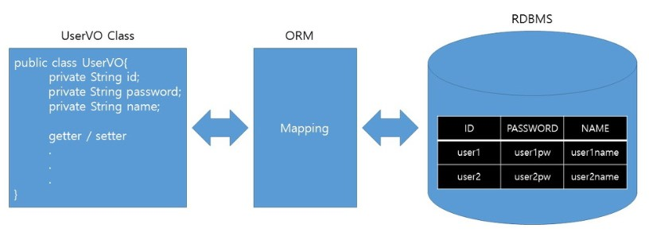

# ORM

## 1. 영속성(Persistence)
- 데이터를 생성한 프로그램이 종료되더라도 사라지지 않는 데이터 속성
- 영속성이 없는 데이터는 단지 메모리에만 존재하므로, 프로그램 종료시 모두 잃어버림
- 영구적인 객체(Object Persistence) : 메모리 상의 데이터를 File이나 DB를 활용하여 영속성을 부여한 것
- 자바에서 데이터를 저장하는 방법
  - JDBC
  - Spring JDBC
  - Persistence Framework (Hibernate, MyBatis 등) : JDBC 프로그래밍의 복잡함이나 번거로움 없이 간단한 작업만으로 DB와 연동되어 빠른 개발이 가능하도록 함
    - SQL Mapper : [SQL <-> SQL Mapper <-> Object 필드] 구조로, SQL을 직접 작성하여 데이터를 다루는 특징이 있으며, 종류로는 MyBatis, JdbcTemplates(Spring) 등이 있음
    - ORM : [DB Data <-> ORM <-> Object 필드] 구조로, 객체를 통해 DB 데이터와 맵핑하여 간접적으로 데이터를 다루는 특징이 있으며, 종류로는 JPA, Hibernate 등이 있음
  - Persistence Layer : DB에서 데이터를 읽어 객체화하거나, DB에 데이터를 저장, 수정, 삭제하는 역할

## 2. ORM의 정의

- ORM(Object Relational Mapping)은 객체(클래스)와 관계(RDB, Relational Database)와의 설정을 의미함
- 객체지향 프로그래밍은 클래스를 사용하고, 관계형 데이터베이스는 테이블을 사용하는데, 이 때 ORM은 객체 모델과 관계형 모델간의 불일치를 객체간의 관계를 바탕으로 SQL을 자동으로 생성하여 불일치를 해결함 

## 3. ORM의 장단점

### 3-1. ORM 장점
- 객체지향적 코드를 사용함으로서 직관적이고, 비지니스 로직에 집중할 수 있도록 도와줌
- CRUD를 위한 SQL문을 작성할 필요는 없으며(쿼리 작성은 필요), 각 객체(Model) 별로 코드를 작성하므로 가독성이 높아지고, 재사용 및 유지 보수의 편리성이 증가함
- ORM은 독립적으로 작성이 되어 있어 해당 객체들은 재사용이 가능함
- DBMS에 대한 종속성이 줄어듬

### 3-2. ORM 단점
- ORM만으로는 완벽하게 구현하기가 어려움
- 사용하기는 편하지만 설계를 신중하게 해야함
- 프로젝트의 복잡성이 높아질 경우 개발 난이도가 높아지며, 잘못 구현하는 경우 속도 저하 및 데이터 일관성이 무너질 수도 있음
- 프로시저가 많은 시스템에서는 ORM의 객체 지향적인 장점을 활용하기가 어려움