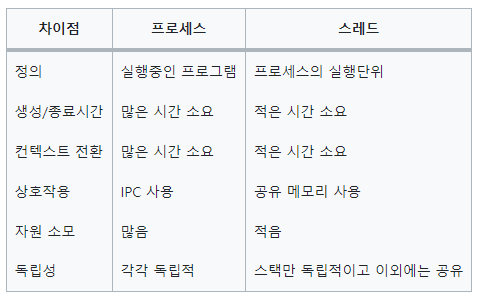
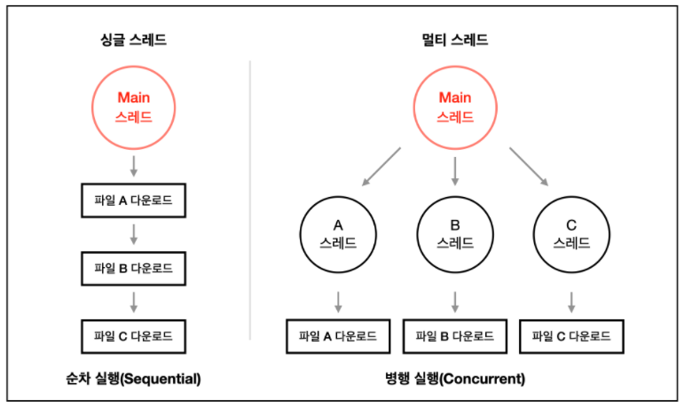

# 프로그램 vs 프로세스 vs 스레드

## 1) 프로그램, 프로세스, 스레드

1. 프로그램
    - 컴퓨터에서 어떤 작업을 실행할 수 있는 ‘정적인 상태’의 파일 (ex. windows의 exe 파일)
2. 프로세스
    - 프로그램이 실행되어 돌아가고 있는 상태, 연속적으로 실행되고 있는 ‘동적인 상태’의 프로그램
    - 즉, 프로그램을 실행하고, 운영체제로 부터 실행에 필요한 자원을 할당받아 프로세스가 되는 것
    - 프로세스는 독립된 메모리 영역을 할당 받기 때문에 다른 프로세스의 변수나 자료구조에 접근할 수 없음
    - 프로세스는 최소 하나 이상의 스레드를 포함함
    - 동시성 : 프로세서는 하나의 프로세스만 실행할 수 있으나, Context Switching을 통해 여러 프로그램을 돌아가며 일부분씩 작업을 수행하는 것
    - 병렬성 : 프로세서 하나에 여러 코어가 달려서 각각 동시에 작업을 실행하는 것
    - 프로세서 : 컴퓨터 내에서 프로그램을 수행하는 하드웨어 유닛으로, CPU(중앙처리장치)를 의미함
    - 멀티 프로세싱 : 여러 개의 프로세스를 사용하는 것
    - 멀티 태스킹 : 같은 시간에 여러 개의 프로그램을 띄우는 것
3. 스레드
    - 프로세스가 할당 받은 자원을 이용하는 실행 단위이며, 프로세스의 특정한 수행 경로이자 프로세스 내에서 실행되는 여러 흐름의 단위

## 2) 멀티스레드 vs 싱글스레드

### 1) 멀티스레드

1. 멀티스레드?
    - CPU의 최대 활용을 위해 프로그램에 둘 이상의 스레드를 동시에 실행하는 것
    - Context Switching : 여러 스레드를 Context Switching을 통해 부분적으로 각각 스레드에 대한 작업 수행, 유저의 시선에서는 동시에 작업이 수행되는 것으로 보임
2. 멀티스레드 장점
    - 응답성 : 스레드 중 하나가 중단이 되거나, 긴 작업을 수행하더라도 프로그램의 수행이 계속되는 것(멀티스레드 모델을 에러 발생 시 새로운 스레드를 생성하여 에러 상황을 극복), 하지만, 새로운 스레드를 생성하거나 남는 스레드 처리에 대한 비용이 발생
    - 경제성 : 다른 스레드들과 메모리를 공유하기 때문에, 메모리 공간과 시스템 자원 소모가 줄어들며, 스레드 간 통신이 필요한 경우에도 쉽게 데이터를 주고 받을 수 있고, 프로세스의 Context Switching과 달리 스레드 간 Context Switching은 캐시 메모리를 비울 필요가 없기 때문에 더 빠름
3. 멀티스레드 단점
    - Context Switching과 동기화 등의 이유 때문에 스레드 생성 기간이 느림
    - 공유하는 자원에 동시 접근하는 경우, 스레드는 프로세스와 달리 데이터와 힙 영역을 공유하기 때문에 동기화가 필요함
    - 멀티스레딩을 위해서는 운영체제의 지원이 필요
    - 프로그래밍 난이도가 높으며, 스레드 수 만큼 자원을 많이 사용함

### 2) 싱글스레드

1. 싱글스레드?
    - 하나의 프로세스에서 오직 하나의 스레드만 실행
2. 싱글스레드 장점
    - Context Switching 작업을 요구하지 않음
    - 자원 접근에 대한 동기화를 신경쓰지 않음(스레드들이 동시에 같은 자원에 접근하지 못하도록 제어할 필요가 없음)
    - 단순히 CPU만 사용하는 계산작업이라면, 멀티스레드보다 싱글스레드가 더 효율적
    - 프로그래밍 난이도가 쉽고, CPU와 메모리를 적게 사용함
3. 싱글스레드 단점
    - 여러 개의 CPU를 활용하지 못함
    - 연산량이 많은 작업을 하는 경우, 그 작업이 완료되어야 다른 작업을 수행할 수 있기 때문에 대기 시간이 길어짐
    - 에러 처리를 따로 하지 못하는 경우 멈춤