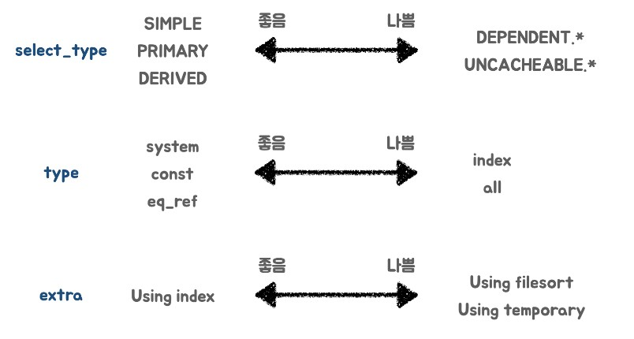

# Query 최적화

## 1. Query 최적화의 필요성

- 시간 지연에 따른 User Experience
  - 0.1초 : 즉각적 응답
  - 1초 : 지연을 감지하고, 컴퓨터가 결과를 처리하고 있다는 느낌을 받지만, 아직 스스로 제어할 수 있다고 느낌
  - 10초 : 사용자가 집중력을 유지할 수 있는 한계로, 10초가 지나면 유저의 신경이 돌아오기 힘듬
- 보통 10초의 유저 경험은 사이트를 즉시 떠나게 하며, API 콜의 지연이 유저 경험에 영향을 주기 때문에 이러한 경우 Query 최적화를 고려해야 함

## 2. Query 튜닝 절차

1. 조회
   - 원하는 결과를 조회하고, 조회 건수, Fetch Time, Duration Time 등을 확인
2. 개선 대상 파악
   - 문제가 되는 조회 Query 확인
   - 실행 계획 확인
   - 조건절, Join / Sub Query 구조, order by 등 확인
   - index 현황 파악
3. 개선

## 3. 실행 계획

### 3-1. select_type
- SIMPLE : 단순한 SELECT 문
- PRIMARY : 서브 쿼리를 감싸는 외부 쿼리, UNION이 포함될 경우 첫번째 SELECT 문
- SUBQUERY : 독립적으로 수행되는 서브쿼리(SELECT, WHERE 절에 추가된 서브쿼리)
- DERIVED : FROM절에 작성된 서브쿼리
- UNION : UNION, UNION ALL로 합쳐진 SELECT 문
- DEPENDENT SUBQUERY : 서브쿼리가 바깥쪽 SELECT 쿼리에 정의된 컬럼을 사용하는 경우
- DEPENDENT UNION : 외부에 정의된 컬럼을 UNION으로 결합된 쿼리에서 사용하는 경우
- MATERIALZED : IN 절 구문의 서브쿼리를 임시 테이블로 생성한 뒤 조인을 수행
- UNCACHEABLE SUBQUERY : RAND()와 같이 조회마다 결과가 달라지는 경우

### 3-2. type
- system : 테이블에 데이터가 없거나 한 개만 있는 경우
- const : 조회되는 데이터가 단 1건일 때
- eq_ref : 조인이 수행될 때 드리븐 테이블 데이터에 PK 혹은 고유 인덱스로 단 1건의 데이터를 조회할 때
- ref : eq_ref와 같으나 데이터가 2건 이상일 경우
- index : 인덱스 풀 스캔
- range : 인덱스 레인지 스캔
- all : 테이블 풀 스캔

### 3-3. extra
- Distinct : 중복 제거 시
- Using where : WHERE절로 필터 시
- Using temporary : 데이터의 중간 결과를 저장하고자 임시 테이블을 생성할 때 (보통 DISTINCT, GROUP BY, ORDER BY 구문이 포함된 경우 임시 테이블을 생성하게 됨)
- Using index : 물리적인 데이터 파일을 읽지 않고 인덱스만 읽어서 처리할 때 (커버링 인덱스)
- Using filesort : 정렬 시

### 3-4. 실행 계획 개선 방향
- select_type
  - dependent type은 조회할 때마다 외부 테이블에 접근하게 되므로, 성능에 악영향을 미치기 때문에 지양해야 함
  - 조회시마다 결과가 다르게 나오지 않도록 개선해야 함
- type
  - 인덱스 레인지 풀 스캔이나 테이블 풀 스캔을 줄이는 방향으로 개선해야 함
- extra
  - sorting이나 group by를 위한 temp 테이블을 생성하지말고, 인덱스를 활용하여 sorting이나 group by를 수행할 수 있도록 함

## 4. Query 개선 추가 고려 사항

### 4-1. select를 할 때는 필요한 데이터만 뽑자
- select * 보다는 select column1, column2 ... 이렇게 사용해야 IO가 줄어들어 Query 성능을 개선 할 수 있음

### 4-2. like = '%something%'을 사용할 때, 가급적 %는 뒤에만 쓰자
- %를 앞에 붙이게 되면 something으로 시작하는 문자열을 모두 검색해야해서 연산의 시간이 증가하게 됨

### 4-3. group by를 사용할 때, group by 이전에 조건별로 필요한 데이터를 미리 정의해두자
- group by는 조건에 맞는 데이터를 추출한 후, 다시 재정렬하는 방법이기 때문에 정렬 이전에 데이터 양이 많아지면 그만큼 성능이 떨어지게 됨

### 4-4. 인덱스를 활용하자
- 인덱스를 활용하면 테이블을 풀스캔하지 않고 색인화 되어있는 파일을 스캔하여 검색 성능이 향상 됨

### 4-5. 성능 개선 팁 참고
https://plusns1s.tistory.com/8