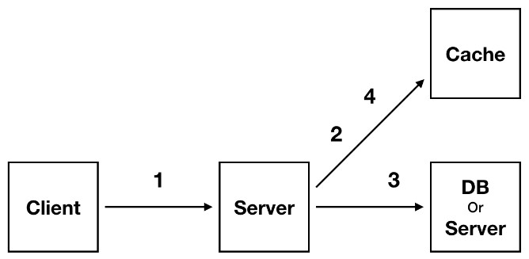
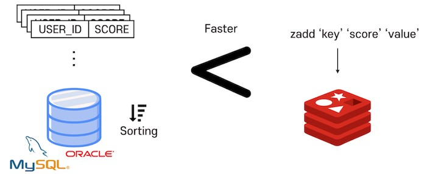
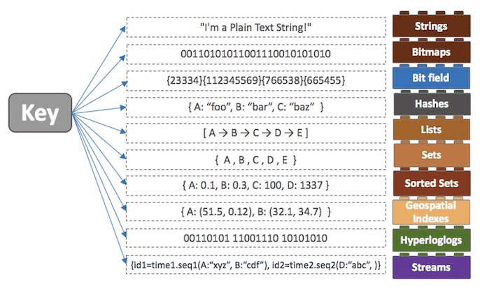

# Redis (+ Cache)

## 1. Cache
- 결과를 미리 저장해두어 DB나 API를 참조하지 않고 저장해둔 Cache를 이용하여 빠르게 서비스 하는 것
- Cache는 모든 결과를 저장해 놓는 것이 아니라, 서비스에서 많이 사용하는 20%만 저장해놓고 전체적인 효율을 끌어 올리는 것
- WEB-WAS-DB의 구조로 운영되는 서비스에서 사용자가 늘어나면서 DB에 무리가 간다면, Scale-In 혹은 Scale-Out과 함께 Cache Server를 검토해 볼 수 있음

### 1-1. Cache의 사용 구조

- 클라이언트가 웹 서버에 요청을 보내면, 웹 서버는 DB에 접근하기 전에 Cache에 요청한 데이터가 있는지 확인하고, 있다면 DB에 접근하지 않고 바로 클라이언트에게 데이터를 반환하는 구조 (Cache Hit)
- 만약, Cache에 요청한 데이터가 없다면, DB에서 원하는 데이터를 조회한 뒤 데이터를 클라이언트에게 반환 (Cache Miss)

### 1-2. Cache의 구분
- Look Aside Cache (Lazy Loading)
  - Cache에 데이터 존재 유무 확인
  - 데이터가 있다면 Cache의 데이터 사용
  - 데이터가 없다면 DB의 데이터 사용
  - DB에서 가져온 데이터를 Cache에 저장
- Write Back
  - 모든 데이터를 Cache에 저장
  - Cache의 데이터를 일정 주기마다 배치로 DB에 한꺼번에 저장
  - DB에 저장한 데이터를 Cache에서 제거

### 1-3. Cache의 주의할 점
- Cache는 DB의 부하를 줄여준다는 장점이 있지만, DB에 데이터를 저장하기 전에 Cache 서버가 죽게되면 데이터가 유실 된다는 단점이 있음

## 2. MemCached
- 오픈소스 분산 Memory 캐싱 시스템
- DB의 부하를 줄이고 어플리케이션의 속도 향상을 위해 사용되며, DB나 API 호출로 부터 받아오는 데이터를 key-value 형태로 Memory에 저장
- 시스템에서 사용되지 않은 일부 Memory를 활용할 수 있어 자원을 효율적으로 사용하여 성능을 향상시킬 수 있음
- 하지만, In Memory 기반의 시스템이기 때문에, 재부팅 시 데이터가 소멸하여 영구적인 저장용 시스템으로 사용할 수 없다는 단점이 있음

## 3. Redis(Remote Shared Dictionary Server)

- 오픈소스로서, NoSQL로 분류되기도 하며 MemCached와 같이 In Memory 솔루션으로 분류되기도 함
- 다양한 구조체 지원과 key-value로 구성되어 있어, 별도의 쿼리 없이 key를 통해 빠르게 결과를 가지고 올 수 있음
- 디스크에 데이터를 쓰는 구조가 아니라, Memory에서 데이터를 처리하기 때문에 작업 속도가 빠른 특징이 있음

### 3-1. Redis의 주요 특징
- 영속성을 지원하는 In Memory 데이터 저장소
- 다양한 자료구조 지원
- 싱글쓰레드 방식이기 때문에 연산을 원자적으로 수행할 수 있음
- 읽기 성능 증대를 위한 서버 측 지원
- 쓰기 성능 증대를 위한 클라이언트 측 지원
- 다양한 서비스에서 사용된 검증된 기술

### 3-2. Redis의 영속성
- Redis는 영속성을 보장하기 위해 데이터를 디스크에 저장하는데, 이를 통해 서버가 다운되더라도 디스크에 저장된 데이터를 읽어 Memory에 로딩할 수 있음
- 디스크 저장 방식
  - RDB(SnapShotting) : 순간적으로 메모리에 있는 내용 전체를 디스크에 옮겨 담는 방식
  - AOF(Append On File) : Redis의 모든 write와 update 연산 자체를 모두 log에 기록

### 3-3. Redis의 Collection

- Redis는 key-value 쌍 뿐 만 아니라 다양한 데이터 구조체를 지원함

### 3-4. Redis VS MemCached
||Redis|MemCached|
|---|---|---|
|쓰레드|싱글 쓰레드|멀티 쓰레드|
|데이터 구조|list, string, hashes 등 다양한 자료구조 지원|string과 integer만 지원|
|데이터 저장|Memory, Disk|Memory Only|
|처리 속도|MemCached보단 느리지만 큰 차이는 없음|디스크를 거치지 않아 Redis보다 더 빠름|
|Replication|지원|지원 안함|
|Partitioning Method|지원|지원 안함|
|영속성|영속성 있는 데이터 사용|지원 안함|
