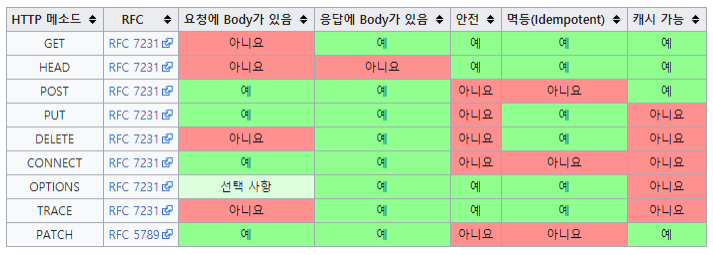
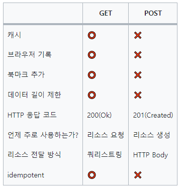

# GET & POST, REST API

## 1. HTTP Method
- 클라이언트가 웹 서버에게 사용자의 목적이나 종류를 알리는 수단

### 1-1. HTTP Method 종류와 특징
1. GET : 리소스 조회, 서버에 전달하고 싶은 데이터는 query를 통해 전달
2. POST : 요청 데이터 처리와 데이터 등록에 사용하며, 주로 신규 리소스를 등록하거나 프로세스 처리에 사용
3. PUT : 리소스를 대체, 해당 리소스가 없으면 생성
4. PATCH : 리소스 일부만 변경
5. DELETE : 리소스 삭제
6. HEAD : GET과 동일하지만, 메시지 부분을 제외하고 상태줄과 헤더만 반환
7. OPTIONS : 대상 리소스에 대한 통신 가능 옵션을 설명 (주로 CORS에서 사용)
8. CONNECT : 대상 자원으로 식별되는 서버에 대한 터널을 설정
9. TRACE : 대상 리소스에 대한 경로를 따라 메시지 루프백 테스트를 진행
    

### 1-2. HTTP 메소드의 속성
1. 안전 (Safe Methods)
   - 메소드를 호출해도 리소스를 변경하지 않음 
   - 주요 메소드 중에서 GET 메소드가 안전하다고 볼 수 있다
2. 멱등 (Idempotent Methods)
   - 메소드를 계속 호출해도 결과가 똑같음
   - GET, PUT, DELETE는 멱등하다고 볼 수 있지만, POST, PATCH는 멱등하다고 볼 수 없다
3. 캐시가능 (Cacheable Methods)
   - 캐싱을 해서 데이터를 효율적으로 가져올 수 있음
   - GET, HEAD, POST, PATCH가 캐시가 가능하지만, 주로 GET, HEAD만 쓰임

### 1-3. HTTP 상태코드
- 클라이언트가 보낸 요청의 처리 상태를 응답에서 알려주는 기능
1. 1XX (Informational) : 요청이 수신되어 처리 중
2. 2XX (Successful) : 요청 정상 처리
3. 3XX (Redirection) : 요청을 완료하려면 추가 행동이 필요
4. 4XX (Client Error) : 클라이언트 오류, 잘못된 문법 등으로 서버가 요청을 수행할 수 없음
5. 5XX (Server Error) : 서버 오류, 서버가 정상 요청을 처리하지 못함

## 2. GET & POST

### 2-1. GET
- 클라이언트에서 서버로 정보를 요청하기 위해 사용
- 즉, 서버에서 데이터를 가져와 읽거나 검색할 때 사용되는 method
- GET은 요청을 전송할 때, URL 주소 끝에 파라미터로 포함되어 전송되며, 이를 쿼리 스트링(Query String)이라 한다
  - ex) www.example-url.com/resources?name1=고니&name2=곽철용
  - 만약 요청 파라미터가 여러 개이면 &으로 연결한다 
- 어떤 값이나 내용, 상태등을 바꾸지 않는 경우에 사용
- 글의 내용에 대한 목록을 보여주거나 글의 내용을 보는 경우

### 2-2. POST
- 리소스를 생성, 업데이트하기 위해 서버에 데이터를 보내는데 사용
- 전송해야할 데이터를 HTTP 메시지의 Body에 담아 전송
- Body에 담아 전송하기 때문에, 길이의 제한이 없어 GET과 달리 대용량 데이터를 전송할 때 사용되며, 내용이 눈에 보이는 GET과 달리 내용이 보이지 않음
- 그래도 데이터 전송 시, 민감한 데이터인 경우 반드시 암호화하여 전달해야 함
- 글의 내용을 저장하고 수정하는 경우 사용

## 3. REST API

### 3-1. REST
- 어떤 자원에 대한 CRUD(Create, Read, Update, Delete) 연산을 수행하기 위해 URI(자원)로 요청을 보내는 것
- REST의 구성 요소
  - 자원(Resource) : HTTP URI
  - 자원의 대한 행위 : HTTP Method(GET, POST, PUT, DELETE)
  - 자원에 대한 행위의 내용(표현) : HTTP Message Pay Load로, JSON 혹은 XML을 통해 데이터를 주고 받는 것이 일반적
- REST의 특징
  - Server-Client 구조
    - 자원이 있는 쪽이 Server(REST Server), 자원을 요청하는 쪽이 Client
  - Stateless (무상태)
    - HTTP 프로토콜은 Stateless Protocol이므로, REST 역시 무상태성을 가짐
    - 세션과 쿠키와 같은 Client의 context 정보를 Server에 저장하지 않음
    - Server는 각각의 요청을 완전히 별개의 것으로 인식하고 처리하며, 각 API 서버는 Client의 요청만을 단순 처리함
  - Cacheable (캐시 처리 기능)
    - HTTP를 사용하므로, 웹에서 사용하는 기존의 인프라를 활용할 수 있으며, 그 중 강력한 기능인 캐시 처리가 가능하여 REST Server의 트랜잭션을 발생시키지 않고도 빠르게 응답 처리가 가능함
  - Layered System (계층화)
    - REST Server는 다중 계층으로 구성되며, API Server는 순수 비즈니스 로직을 수행하고, 그 앞단에 보안, 로드밸런싱, 암호화 등을 추가하여 구조상의 유연성을 줄 수 있음
  - Uniform Interface (인터페이스 일관성)
    - URI로 지정한 Resource에 대한 조작을 통일되고 한정적인 인터페이스로 수행하며, HTTP 표준을 따르는 모든 플랫폼에서 사용이 가능하기 때문에 특정 프로그래밍 언어나 기술에 종속되지 않음
- REST의 장점
  - HTTP 프로토콜의 인프라를 그래도 사용하므로, REST API 사용을 위한 별도의 인프라를 구축할 필요가 없음
  - HTTP 프로토콜 표준을 사용하므로, HTTP 프로토콜 표준을 따르는 모든 플랫폼에서 사용 가능
- REST의 단점
  - 표준 자체가 존재하지 않아 따로 정의가 필요함
  - 사용할 수 있는 메소드가 4가지(GET, POST, PUT, DELETE) 밖에 없음
  - 구형 브라우저에서는 호환이 되지 않아 지원되지 않는 동작이 있음 (ex. 익스플로러)

### 3-2. URI & URL
- URI : 인터넷 상 자원의 위치 (즉, 어떠한 파일의 위치)
- URL : 인터넷 상의 자원을 식별하기 위한 문자열의 구성
- 즉, URL ⊂ URI !!!

### 3-3. REST API
- REST의 원리를 따르는, REST 기반으로 구현한 API
- OpenAPI나 MSA 등의 서비스 대부분은 REST API를 따름
- REST API를 제공하는 서비스는 RESTful 하다고 함
  - CRUD 기능을 모두 POST로만 처리하거나, route에 resource, id 외의 정보가 들어가는 경우를 RESTful 하지 못하다 함
- REST API 설계 예시
  - URI는 동사보다는 명사, 대문자보다는 소문자 사용
  - 마지막에 슬래시(/)를 포함하지 않음
    - http://restapi.example.com/houses/apartments/ (X)
    - http://restapi.example.com/houses/apartments  (O)
  - 언더바(_) 대신 하이픈(-)을 사용
  - 파일 확장자는 URI에 포함하지 않음 (ex. jpg, pdf 등)
    - http://restapi.example.com/members/soccer/345/photo.jpg (X)
  - 행위를 포함하지 않음 (delete-post (X), post (O))