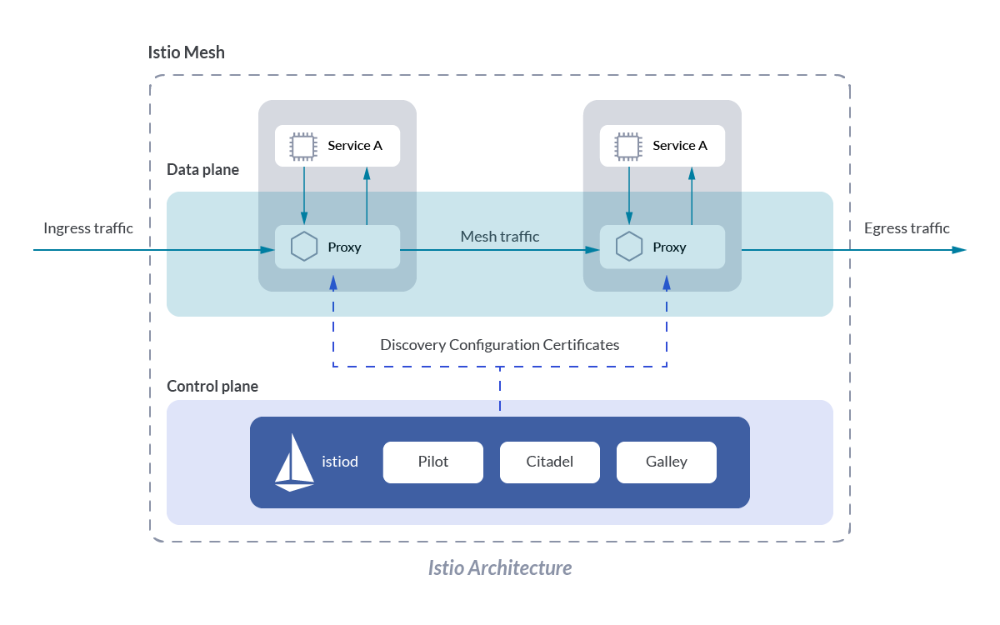
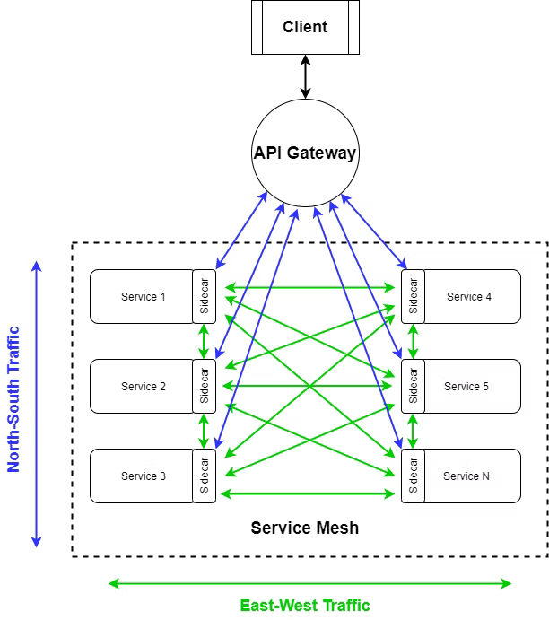
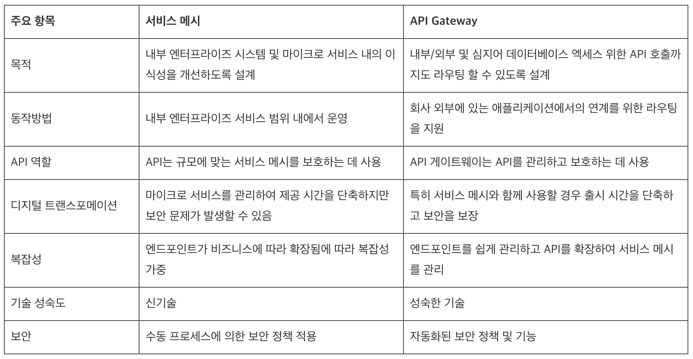

# Service Mesh

## 1. Service Mesh란?

### Service Mesh 이전
- 기존 Monolithic에서 MSA로 전환하면서 인프라, 특히 네트워크 관련 문제들이 중요해졌고, spring-cloud-netflix와 같은 라이브러리를 통해 해당 문제들을 해결하려 시도함
- 하지만, 서비스 간 커뮤니케이션을 통제하는 로직을 구현하며 비즈니스 로직에 집중하지 못하는 문제, JVM과 같은 특정 환경에 종속적이게 되는 문제 등이 존재하였음

### spring-cloud-netflix의 특징
- Client-side load balancing: 호출 가능한 엔드포인트 목록을 클라이언트에게 주고, 직접 결정하도록 함
- Service discovery: 정상 상태인 서비스들을 주기적으로 찾아 갱신하는 메커니즘
- Circuit breaking: 문제가 있는 서비스로의 부하를 줄여주는 기술
- Bulkheading: 클라이언트의 리소스 사용량을 임계값으로 제한하는 기술
- Timeouts: 서비스 호출 시에 시간 제한을 적용
- Retries: 실패한 요청을 재시도
- Retry budgets: 재시도에 제약 조건을 적용, 주어진 기간 동안 재시도 횟수를 제한
- Deadlines: 응답이 유효한 컨텍스트를 제공하고, 기간이 지나면 요청 처리를 무시

### Service Mesh 이후
- MSA를 위한 공통 관심사는 특정 비즈니스나 개발 언어 & 프레임워크에 종속적이지 않고 모든 시스템이 거의 동일하게 필요로 함 
- 따라서, 이러한 관심사들을 어플리케이션과 분리하여 인프라에 추가하여 어플리케이션 앞에 Proxy를 두어 공통 문제를 해결하고 트래픽을 제어 및 분산하자는 관점이 생겼으며, 이를 Service Mesh라고 함

### Service Mesh의 특징
- Service resilience
    - retries
    - timeout
    - circuit breaker
- Observability signals
    - request spike
    - latency
    - failure
    - throughput
- Traffic control capabilities
    - service discovery
    - zone-aware load balacing
    - health checking
    - rate limit
    - quotas
    - organizational policies
- Security
    - TLS

## 2. Service Mesh의 구성

### Side Car 패턴
- 어플리케이션 컨테이너와 독립적으로 동작하는 별도의 Proxy 컨테이너를 붙이는 패턴
- 어플리케이션 컨테이너와 독립적으로 동작하기 때문에 장애 시 서로 영향을 받지 않으며, Side Car 적용 및 변경 등의 경우에도 어플리케이션은 수정이 필요하지 않음

### Service Mesh 구성도

- Service Mesh는 기본적으로 Side Car 패턴으로 구성되며, 구현체로는 istio, linkerd, conduit 등이 있는데 보통 istio를 가장 많이 사용함
- Data Plane
	- 어플리케이션의 모든 트래픽이 처리되고 관찰되는 곳으로, 트래픽 설정과 보호 및 제어를 담당
	- Control Plane에 의해 구성되는 영역
- Control Plane
	- Service Mesh를 관리하는 영역으로, 담당자가 네트워크 동작을 조작할 수 있도록 API를 노출시킴
- Proxy
	- 보통 Proxy로는 Envoy를 사용하며, 각 Service에 Side Car 패턴으로 배포됨
	- HTTP, gRPC 등의 다양한 프로토콜을 지원하고, 서비스 간의 트래픽을 관리함
	- 서비스 호출에 대한 로깅, 모니터링, 보안 및 트래픽 라우팅, 로드 밸런싱 기능을 처리
	- Istio는 이러한 Envoy Proxy를 기반으로 Service Mesh를 구축하고 관리하는 플랫폼
- istiod
	- 서비스 디스커버리 : 클러스터 내 서비스와 인스턴스를 자동으로 감지하고 이를 Envoy Proxy에 통지
	- 트래픽 관리 : 트래픽 라우터의 구성을 관리하며 적절한 라우팅 규칙을 적용
	- 정책 및 보안 : mTLS 및 인증서 관리와 같은 보안 기능을 처리
- Ingress : 클러스터 외부에서 내부 서비스로 유입되는 트래픽
- Egress : 클러스터 내부에서 외부 나가는 트래픽

## 3. Service Mesh의 장점
- Service 간 통신의 모든 부분을 성능 메트릭으로 캡쳐할 수 있어, 런타임 환경에서 커뮤니케이션을 최적화하는 방안을 제안할 수 있음
- 문제나 장애를 손쉽게 인식하고 진단할 수 있으며, 장애가 발생한 서비스로부터 요청을 재 라우팅 할 수 있어 어플리케이션 복구 능력이 향상됨
- 인프라와 어플리케이션을 분리하여 개발자들은 비즈니스 로직에만 집중할 수 있음

## 4. Service Mesh와 API Gateway

- 외부에서 들어오는 트래픽 제어는 API Gateway, 내부 통신에 대한 제어는 Service Mesh가 담당
- 즉, API Gateway는 외부망과 내부망 사이에 위치하여 중앙집중식 제어로 외부에서 들어오는 트래픽에 대한 제어를 담당하고, Service Mesh는 어플리케이션 기능을 인프라 계층에 의해 관리되는 마이크로 서비스로 분리하여 서비스 내부 통신에 대한 제어를 담당함
	- API Gateway는 중앙집중식 제어로 SPOF(Single Point of Failure)를 유발하기도 함
- API Gateway는 Gateway Proxy 패턴을 사용하여, 호출자가 구현 내용을 알 필요 없이 Gateway만 호출하면 알아서 수행됨
- Service Mesh는 Side Car Proxy 패턴을 사용하여, 호출자의 Side Car에서 타겟 ip를 찾는 방법, failover를 수행하는 방법 등을 관리해야함
- 정리하자면, MSA에서 API Gateway는 노출되는 부분에 위치하여 내부 서비스를 보호 및 제어하는 역할을 하고, Service Mesh는 내부 서비스에 위치하여 서비스를 관리하는 구조로 사용됨

### Service Mesh & API Gateway 비교표

### 출처
- https://mangkyu.tistory.com/307
- https://junuuu.tistory.com/206
- https://libertegrace.tistory.com/entry/Service-Mesh-Service-Mesh%EC%99%80-Envoy-%EC%B0%8D%EB%A8%B9%ED%95%B4%EB%B3%B4%EA%B8%B0%EB%8F%84-%EC%A0%84%EC%9D%BC-%EC%88%98%EB%8F%84-%EC%9E%88%EC%9D%8C
