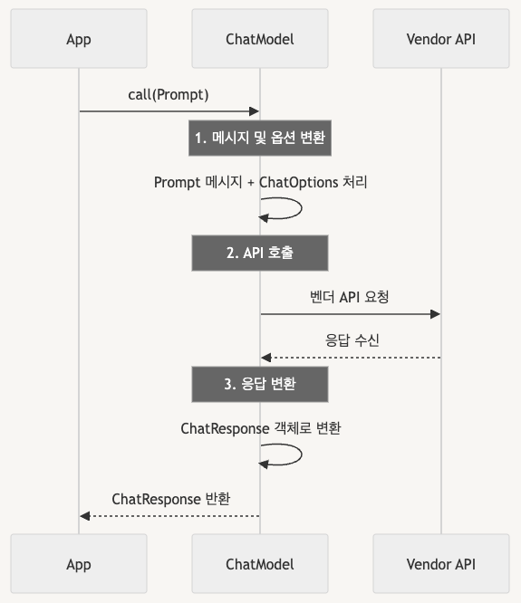

# Spring AI

## 1. MCP

<p align="center"></p>

- AI 모델과 외부 데이터 소스 및 도구 간의 안전하고 표준화된 통신을 위한 개방형 프로토콜
- MCP는 AI 어플리케이션과 다양한 데이터 소스를 연결하는 표준화된 인터페이스를 제공
### MCP 구성 요소
- Host : AI 모델을 통합하고 외부 데이터 소스에 연결하는 주요 어플리케이션
- Client : MCP 서버와 1:1 연결을 유지하는 컴포넌트
- MCP 서버 : 외부 데이터 소스와 통합되어 기능을 노출하는 구성 요소
- Tool : MCP 서버에서 제공하는 실행 가능한 기능
### MCP 통신 방식
- Stdio(표준 입출력) : 로컬 프로세스 및 명령줄 도구와 통신
- SSE(Server-Sent Events) : HTTP 기반으로 클라이언트와 서버 간의 이벤트 스트림 제공

## 2. Spring AI
- Spring에 다양한 AI 모델들을 쉽고 유연하게 쓸 수 있게 도와주는 프레임워크
### Spring AI의 장점
- ChatClient, EmbeddingClient와 같은 컴포넌트를 통해 AI 모델 호출을 HTTP 요청 보내듯 간단히 처리할 수 있으며, 설정도 yaml 파일에 추가하면 됨
- GPT, Claude 모델 등 벤더마다 다른 API를 쓰지 않아도 일관된 방법으로 요청이 가능함
- 텍스트를 청크로 나누거나, 벡터화해서 저장하는 등의 RAG 작업들을 Spring AI가 알아서 제공하며, 추상화가 잘되어있기 때문에 필요에 따라 설정만 변경하여 사용하면 됨
- MCP, Function Calling(함수 호출 기반 응답), Prompt Template(템플릿으로 프롬프트 구성) 등의 기능을 프레임워크 차원에서 기본적으로 지원

## 3. Spring AI 구조
### Prompt & ChatOptions
- Prompt
    - Spring AI에서 모델에 보낼 메시지와 모델 파라미터 옵션인 ChatOptions의 상위 클래스
    - 어떤 메시지를 보낼지, 어떤 옵션을 적용할지에 대한 내용을 담고 있음
    ```java
    public class Prompt implements ModelRequest<List<Message>> {
        private final List<Message> messages;
        private ChatOptions modelOptions;

        @Override
        public ChatOptions getOptions() {...}

        @Override
        public List<Message> getInstructions() {...}
    }
    ```
- ChatOptions
    - LLM 호출 시 사용할 파라미터들을 정의한 인터페이스
    - ChatOptions에서 제공하는 maxTokens, temperature, stopSequences 속성들은 벤더 간 자동 변환됨
    ```java
    public interface ChatOptions extends ModelOptions {
        String getModel();
        
        Float getFrequencyPenalty(); // frequencyPenalty
        Integer getMaxTokens(); // maxTokens
        Float getPresencePenalty(); // presencePenalty
        List<String> getStopSequences(); // stopSequences
        Float getTemperature(); // temperature
        Integer getTopK(); // topK
        Float getTopP(); // topP
        
        ChatOptions copy();
    }
    ```
### ChatModel
- Spring AI의 핵심 컴포넌트로, LLM과 기본적인 상호작용을 담당하는 인터페이스
- return 타입인 ChatResponse는 모델의 출력 메시지와 함께 사용된 프롬프트, 모델 파라미터, 응답 시간 등의 메타 정보도 포함되어 있음
```java
public interface ChatModel extends Model<Prompt, ChatResponse> {

    default String call(String message) {...}

    @Override
    ChatResponse call(Prompt prompt);
}
```
### 내부 동작 순서

<p align="center"></p>

- 입력으로 받은 Prompt를 벤터 API 형식에 맞게 변환
- 변환된 메시지를 사용하여 벤더 API 호출
- 벤더로부터 받은 응답을 ChatResponse 형식으로 변환하여 반환

## 4. Spring AI 예제 - Anthropic Claude를 활용한 챗봇

### application.yml
- Anrhropic API 키 및 모델 설정
    ```yaml
    spring:
    ai:
        anthropic:
        api-key: ${ANTHROPIC_API_KEY}
        chat:
            options:
            model: claude-3-7-sonnet-20250219
    ```
- Brave Search 및 파일 시스템 MCP 서버 등록
    - Brave Search는 웹 검색 기능, 파일 시스템 MCP 서버는 로컬 디렉토리에서 파일 생성 및 읽기를 위해 등록
    ```yaml
    spring:
        ai:
            mcp:
            client:
                stdio:
                connections:
                    brave-search:
                    command: npx
                    args:
                        - "-y"
                        - "@modelcontextprotocol/server-brave-search"
                    env:
                        BRAVE_API_KEY: ${BRAVE_API_KEY}

                    filesystem:
                    command: npx
                    args:
                        - "-y"
                        - "@modelcontextprotocol/server-filesystem"
                        - "./"
    ```
### ChatClient 생성
```java
@Bean
ChatClient chatClient(ChatModel chatModel, 
                        SyncMcpToolCallbackProvider toolCallbackProvider) {
    return ChatClient
        .builder(chatModel)
        .defaultTools(toolCallbackProvider.getToolCallbacks())
        .build();
}
```
### 서비스 구현
```java
String chat(String question) {
    return chatClient
      .prompt()
      .user(question)
      .call()
      .content();
}
```
### REST API 엔드포인트 생성
```java
@PostMapping("/chat")
ResponseEntity<ChatResponse> chat(@RequestBody ChatRequest chatRequest) {
    String answer = chatbotService.chat(chatRequest.question());
    return ResponseEntity.ok(new ChatResponse(answer));
}

record ChatRequest(String question) {}
record ChatResponse(String answer) {}
```

---

### 출처
- https://digitalbourgeois.tistory.com/887#google_vignette
- https://blog.sionic.ai/spring-ai-series-1
