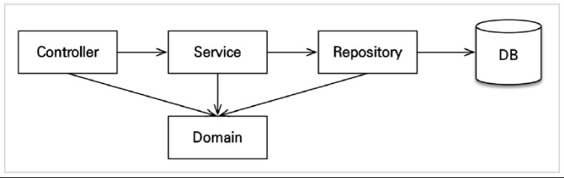

# Spring - Architecture

## 1. Spring MVC

### 1-1. MVC란?

<p align="center"></p>

- Model-View-Controller의 약자
- Model : 어플리케이션 계층의 정보나 데이터를 의미
- View : 화면 출력 로직을 담당
- Controller : Model과 View의 연결을 제어하는 역할

### 1-2. Controller

```java
@Controller
@RequestMapping("/board")
public class BoardController {

	@Autowired
	private BoardService boardService;
	
	@RequestMapping("boardList")
	public String boardList(HttpServletRequest request, BoardDto boardDto) throws Exception {
        
		List<BoardDto> list = this.boardService.selectBoardList(request, boardDto);
        model.put("list", list);

		return "/boardList";
	}
	
	@RequestMapping("boardList2")
	public ModelAndView boardList2(HttpServletRequest request, BoardDto boardDto) throws Exception {
		ModelAndView mv = new ModelAndView();

		List<BoardDto> list = this.boardService.selectBoardList(request, boardDto);
        model.put("list", list);

		// mv.setViewName("/fo/board/boardList2");
		return mv;
	}
}
```

- @Controller
  - 선언 시 해당 클래스에서 HTTP 요청을 처리하는 Controller로 명시
  - Dispatcher에서 @Controller 맵핑 된 클래스에게 위임
  - @RequestMapping 을 통하여 요청을 처리할 메소드에 호출
  - 필요한 비즈니스 로직을 호출(Service)
- @RequestMapping
  - @Controller 선언 된 클래스에서만 사용 가능
  - 요청 URI을 Controller의 메소드와 매핑할 때 사용
  - 메소드 내 View Name이 없을 경우 path로 설정한 URI가 그대로 View Name이 됨
  - Method 를 선언해서 여러 기능 중특정 요청만 받을 수 있음
  - 리턴 타입이 String일 경우, 핸들러에서 ModelAndView 인스턴스에 View Name를 담음

### 1-3. Service

```java
// BoardService
public interface BoardService {

	public List<BoardDto> selectNoticeBoardList(HttpServletRequest request, BoardDto boardDto) throws Exception;
}
```

```java
// BoardServiceImpl (구현체)
@Service
public class BoardServiceImpl implements BoardService {

	@Autowired //@Resource
	private BoardDao boardDao;

	public List<BoardDto> selectNoticeBoardList(HttpServletRequest request, BoardDto boardDto) throws Exception {
		return boardDao.selectBoardList(boardDto);
	}
}
```

- Spring에서 비즈니스 로직을 처리
- Service interface 생성하고, ServiceImpl 구현체에 비즈니스 로직 구현
- @Service(“id”) 형식으로 해당 Service의 이름을 줄 수 있음

### 1-4. DAO (Data Access Object)

```java
@Repository
public class BoardDao {
	
	@Autowired //@Resource
	private SqlSessionTemplate sqlSession;

	public List<BoardDto> selectNoticeBoardList(BoardDto boardDto) {
		return sqlSession.selectList("noticeBoard.selectNoticeBoardList", boardDto);
	}
}
```

- 실제로 커넥션을 통해 DB에 접근하는 객체
- Connection Pool로 DB에 연결한 Connection을 통해서 사용자의 여러 요청 처리
  - Connection Pool
    - WAS가 실행되면서 DB와 미리 연결을 해놓은 객체들을 저장하는 공간. 
    - 클라이언트에서 요청이 오면 Connection을 빌려주고, 처리가 끝나면 다시 Connection을 반납하여 Pool에 저장하는 방식
    - 사용자가 요청을 할 때마다 커넥션 객체를 생성하여 연결하고 종료하는 방식은 비효율적이기 때문에 Connection Pool을 사용함
- 사용자의 요청 마다 커넥션을 생성하지 않고, 모든 DB와의 연결을 DAO 객체로 효율적으로 관리
- @Repository : 주로 DB와 직접 연결하는 클래스를 의미

### 1-5. SQL Mapper
- RDBMS의 데이터를 관리하기 위해 설계된 특수 목적의 프로그래밍 언어
- MyBatis의 Mapper는 Bean 객체를 PreparedStatement 파라미터와 ResultSets으로 대신 쉽게 맵핑해주는 역할을 함

```xml
<?xml version="1.0" encoding="UTF-8"?>
<!DOCTYPE mapper PUBLIC "-//mybatis.org//DTD Mapper 3.0//EN" "http://mybatis.org/dtd/mybatis-3-mapper.dtd">

<mapper namespace="board">
	<select id="selectBoardList" parameterType="neo.apps.board.dto.boardDto" resultType="neo.apps.board.dto.boardDto">
		SELECT
			IDX
			, TITLE
			, CONTENT
			, HIT_CNT
			, REG_ID
			, REG_DATE
		FROM
			T_BOARD
	</select>
</mapper>
```

### 1-6. DTO(Data Transfer Object)
- 어플리케이션 계층 간에 데이터를 전달하는 역할
- DTO는 로직을 갖고 있지 않은 순수한 데이터 객체이며, 일반적으로 getter, setter 메소드만 가진 클래스를 말함

```java
package neo.apps.board.dto;

public class BoardDto {
	
	public int idx;
	
	public String title;
	
        // ... 생략 ...

	public String getReg_date() {
		return reg_date;
	}

	public void setReg_date(String reg_date) {
		this.reg_date = reg_date;
	}

	@Override
	public String toString() {
		return "NoticeBoardDto [idx=" + idx + ", title=" + title + ", content=" + content + ", hit_cnt=" + hit_cnt
				+ ", reg_id=" + reg_id + ", reg_date=" + reg_date + "]";
	}
}
```

## 2. Spring Boot & JPA

### 2-1. Spring Boot & JPA Architecture 구조

<p align="center"></p>

- 계층형 구조
  - Controller : 웹 계층
  - Service : 비즈니스 로직, 트랜잭션 처리
  - Repository : JPA로 DB에 직접 접근하는 계층
  - Domain : 엔티티가 모여있는 계층 (모든 계층에서 사용)
- 개발 순서
  - Domain 생성
  - Repository 생성
  - Service 생성
  - Controller 생성

### 2-2. 예시 1 - 회원 Domain 개발

<p align="center"></p>

- Respository는 직접 DB에 접근하기 위해 JPA가 필요 => EntityManager 필요
- @PersistenceContext : 과거에 직접 EMF에서 EM을 가져오는 것들을 모두 Annotation으로 대체함
- 나중에 Spring Data jpa를 통해 @PersistenceContext은 @Autowired로 대체할 수 있어서 결국은 Lombok의 @RequiredArgsConstructor를 쓸 수 있음

<p align="center"></p>

- @Transactional
  - 과거에 em에서 transaction을 가져와서 시작 / 종료 했던 작업을 @Transactional Annotation으로 대체
  - DB를 사용하는 모든 작업은 반드시 각 Transaction 안에서 수행 되어야 함
- @RequiredArgsConstructor
  - Lombok을 사용해서 생성자 자동주입의 코드를 간결화 한 것
  - @AllArgsConstructor는 모든 필드를 주입하는데, 상황에 따라 주입이 필요하지 않은 필드도 있기 때문에 일반적으로 필요한 것만 주입하는 이 옵션이 많이 쓰임

### 2-3. 예시 2 - 상품 Domain 개발

<p align="center"></p>

- Entity 자체에 비즈니스 로직을 추가
- Service에서 추가할 수도 있지만, Entity에 추가하는 방법은 응집력을 높이며, 이러한 패턴을 도메인 모델 패턴 이라고 함 (Service 계층은 단순히 요청을 위임하는 역할만 수행)

<p align="center"></p>

<p align="center"></p>

- @Transactional(readOnly = true)
- DB를 조회만 하는 메소드에 작성시 더티채킹처럼 수정과 같은 작업을 생략하여 속도를 향상시킬 수 있음
- 보통 조회하는 기능이 많기 때문에 전체를 readOnly로 놓고 수정/삭제등의 메소드에 따로 @Transactional 을 지정함

### 2-4. 예시 3 - 주문 Domain 개발

<p align="center"></p>

- 생성 메소드
  - Order 객체를 생성하는 메소드
  - Entity에 유지시키면 추후 변경이 있어도 이 부분만 수정하면 되기 때문에 Entity에 생성 메소드를 따로 가지고 있는것이 좋음
  - 생성 메소드를 만든 경우에 다른 사람이 직접 Service에서 new로 객체를 생성하지 못하게 생성자를 protected로 막는 것이 좋음
- 비즈니스 로직
  - 주문 취소
- 조회 로직
  - 전체 주문 가격 조회 : 필드 간 연산을 통해 계산해야 하는 로직을 조회 메소드로 만듬

<p align="center"></p>

<p align="center"></p>

<p align="center"></p>

- 로직
  - 주문(Order) 생성
  - 주문(Order) 취소
- Order와 OrderItem Entity에 생성메소드를 만들었기 때문에 그 외 생성을 막기 위해 기본 생성자를 protected로 막을 필요가 있음 (혹은 Lombok을 통해 기본생성자의 Access level을 수정할 수도 있음)
- Order만 저장 : Entity 설계시 내부에 Cascade 속성을 지정해서 연관 엔티티의 연쇄작용을 걸어주었기 때문
- 주문 취소
  - jpa의 사용으로 주문 취소시 해당 객체를 찾은 뒤 변경해주기만 하면 됨 (SQL이었으면 다시 DB에 저장하는 과정이 필요)
  - Dirty Checking으로 수정이 간편한 JPA

### 2-5. 예시 4 - 테스트 코드 작성

<p align="center"></p>

- @SpringBootTest : 스프링을 띄워서 테스트하기 위한 Annotation
- @Transactional : Test코드에 작성시 수행 후 자동 Rollback이 된다
- @Rollback(false) : 자동 Rollback을 끄기 위한 Annotation
- JUnit4 --> JUnit5 : 테스트 코드 프레임워크 JUnit 버전 upgrade로 기대 예외를 걸어주는 옵션 방식이 변경
- Test 환경에서 test/resources/application.yml을 작성하면 Test환경에만 적용하는 설정파일을 둘 수 있다
  - DB 정보들 빈칸으로 둘 경우 자동으로 h2의 메모리 버전으로 실행함 (메모리 방식이라서 h2 db콘솔을 킬 필요가 없음)


참고 1 : https://linked2ev.github.io/spring/2019/08/14/Spring-2-%EC%8A%A4%ED%94%84%EB%A7%81-MVC-%ED%8C%A8%ED%84%B4/
<br/>
참고 2 : https://velog.io/@neity16/4-%EC%8A%A4%ED%94%84%EB%A7%81-%EB%B6%80%ED%8A%B8%EC%99%80-JPA-%ED%99%9C%EC%9A%A9-3-%EC%95%84%ED%82%A4%ED%85%8D%EC%B2%98-%EA%B5%AC%EC%A1%B0-Service-Repository-%EA%B0%9C%EB%B0%9C