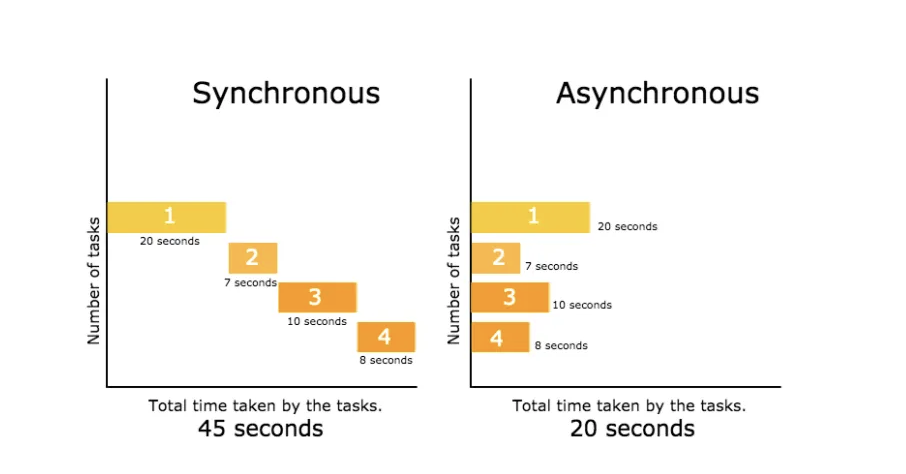
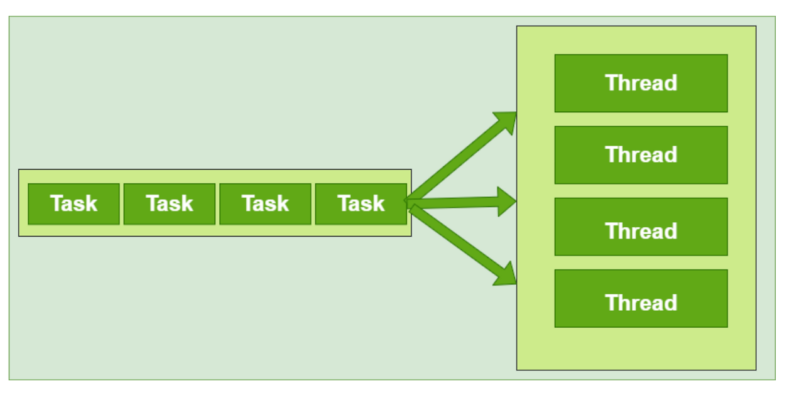

# Spring - @Async & Thread Pool

## 1. 비동기(Asynchronous)

<p align="center"></p>

- 비동기란, 작업을 요청하고 결과를 기다리지 않고 병렬적으로 처리하는 방식

## 2. @EnableAsync & @Async 적용

### @EnableAsync 적용

- 방법 1) SpringBootApplication에 적용
    ```java
    @EnableAsync
    @SpringBootApplication
    public class MySpringApplication {
        ...
    }
    ```
    - 별도의 TaskExecutor를 설정하지 않으면 SimpleAsyncTaskExecutor가 적용되기 때문에 권장되지 않는 방법
    - SimpleAsyncTaskExecutor
        - 각 작업 마다 새로운 Thread를 생성하고 비동기 방식으로 동작
        - concurrencyLimit 프로퍼티를 이용하여 지정된 수보다 요청이 많을 경우 제한 (default는 unlimit)
        - Thread Pool 방식이 아니기 때문에 Thread를 재사용하지 않음

- 방법 2) AsyncConfigurer 인터페이스 활용
    ```java
    @EnableAsync
    @Configuration
    public class AsyncConfig implements AsyncConfigurer {

        @Override
        public Executor getAsyncExecutor() {
            ThreadPoolTaskExecutor executor = new ThreadPoolTaskExecutor();
            executor.setCorePoolSize(5);
            executor.setMaxPoolSize(5);
            executor.setQueueCapacity(5);
            executor.setKeepAliveSeconds(30);
            executor.setThreadNamePrefix("async-executor-");
            executor.initialize();
            return executor;
        }
    }
    ```
    - AsyncConfigurer 인터페이스를 구현하여 별도의 TaskExecutor 설정

- 방법 3) @Bean 활용
    ```java
    @EnableAsync
    @Configuration
    public class AsyncConfig {

        @Bean
        public Executor asyncExecutor1() {
            ThreadPoolTaskExecutor executor = new ThreadPoolTaskExecutor();
            executor.setCorePoolSize(15);
            executor.setThreadNamePrefix("exec1-");
            executor.initialize();
            return executor;
        }

        @Bean
        public Executor asyncExecutor2() {
            ThreadPoolTaskExecutor executor = new ThreadPoolTaskExecutor();
            executor.setCorePoolSize(15);
            executor.setThreadNamePrefix("exec2-");
            executor.initialize();
            return executor;
        }
    }
    ```
    - @Bean을 통해 TaskExecutor를 직접 Spring Bean으로 등록하여 사용할 수 있으며, 다수의 Bean 등록도 가능함
    - dev / stg / prd 프로필 별로 다른 Thread Pool을 활용하고 싶을 때 유리

### @Async 적용

```java
public class AsyncService {
	@Async
    public void asyncMethod(){
    	...
    }
}
```
- 비동기 방식을 사용할 메소드에 @Async를 적용하면 비동기 방식으로 태스크 처리를 할 수 있음

### @Async의 원리
- @Async는 기본적으로 Spring AOP에 의해 프록시 패턴 기반으로 동작 (AdviceMode = PROXY인 경우(default))
- STEP 1) @Async 어노테이션이 적용된 메소드가 호출되면, Spring은 비동기 실행을 처리하기 위한 프록시 객체를 생성
- STEP 2) 해당 메소드는 TaskExecutor에 의해 Thread Pool에 작업으로 등록됨
- STEP 3) 해당 메소드는 호출자와 별도의 Thread에서 작업이 진행되며, 호출자 메소드는 Blocking 없이 즉시 리턴됨

### @Async의 적용 조건
- public 메소드에서만 적용이 가능함
- self-invocation 불가 (같은 클래스의 메소드 호출 불가)

## 3. ThreadPoolTaskExecutor

### ThreadPoolTaskExecutor를 활용한 Thread 관리

- @Async 어노테이션을 사용할 때, 별도의 TaskExecutor를 설정하지 않으면 SimpleAsyncTaskExecutor가 사용되며, Thread Pool을 사용하지 않고 매 요청마다 새로운 Thread를 생성해 작업을 수행하기 때문에 리소스를 낭비할 수 있음
- 따라서, ThreadPoolTaskExecutor와 같은 Thread Pool 기반의 TaskExecutor를 사용하도록 설정해야함
- 다만, Spring Boot의 default는 ThreadPoolTaskExecutor(corePoolSize의 default는 8)이며, Spring Framework의 default가 SimpleAsyncTaskExecutor

### ThreadPoolTaskExecutor의 주요 옵션
- corePoolSize = 1
    - Thread Pool에 항상 살아있는 최소 Thread 수
    - 예상 최대 동시 작업 수에 가까운 값으로 설정하는 것이 좋음 (ex. 8코어 CPU → corePoolSize 8)
- maxPoolSize = Integer.MAX_VALUE
    - Thread Pool이 확장할 수 있는 최대 Thread 수
    - [Thread Pool 크기 + 초과 요청을 담는 Queue의 크기]가 넘는 요청이 들어온 경우, Thread Pool이 얼만큼 확장할지
- queueCapacity = Integer.MAX_VALUE
    - Thread Pool에서 사용할 최대 Queue의 크기
- threadNamePrefix = “클래스이름-”
    - 생성된 각 Thread의 이름 접두사
- keepAliveSeconds = 60
    - Thread Pool 내 Thread 개수가 corePoolSize 초과인 상태에서, 대기 상태의 Thread가 종료될 때까지의 대기 시간

```yaml
spring:
  task:
    execution:
      pool:
        core-size: 5
        max-size: 5
        queue-capacity: 5
        keep-alive: 30s
```

### ThreadPoolTaskExecutor의 동작 방식

<p align="center"></p>

- STEP 1) Thread Pool에 Task를 등록하면, Thread Pool에 corePoolSize 만큼의 Thread가 존재하는지 확인
- STEP 2) Thread에 Task 할당
    - Thread Pool의 Thread 수가 corePoolSize보다 작으면, Thread Pool에 새로운 Thread를 생성하고 Task를 할당 (corePoolSize는 Thread Pool에 항상 유지되어야하는 Thread의 최소 수로, 대기중인 기존 Thread가 존재해도 새롭게 생성)
    - Thread Pool의 Thread 수가 corePoolSize보다 크면, Thread Pool의 대기 상태에 있는 Thread에게 Task를 할당
- STEP 3) Thread Pool에 존재하는 모든 Thread가 작업중이면(대기중인 Thread가 없으면), BlockingQueue에 Task를 넣고 대기시킴
    - BlockingQueue에 Task가 가득 찬 경우, 현재 Thread Pool의 Thread 수가 maxPoolSize를 넘지 않으면 새로운 Thread를 생성하여 Task를 할당
    - 만약 Thread Pool의 Thread 수가 maxPoolSize에 도달한 상태에서 새로운 요청이 들어오면, 더 이상 Thread를 생성할 수 없고, Queue에도 대기시킬 수 없기 때문에 TaskRejectedException 발생
- STEP 4) Thread가 Task를 마치면, BlockingQueue에 대기중인 Task가 있는지 확인
    - 대기중인 Task가 있으면, 해당 Task를 가져와 수행
    - 대기중인 Task가 없으면, 해당 Thread는 대기 상태로 돌아감
    - 만약 Thread Pool의 Thread 개수가 corePoolSize보다 크면, keepAliveTime이 지나고 해당 Thread는 Thread Pool에서 제거됨

### ThreadPoolTaskExecutor의 예외 처리

- RejectedExecutionHandler를 통해 ThreadPoolTaskExecutor에서 더 이상 Task를 처리할 수 없을 때의 예외 처리 전략을 설정할 수 있음
- 전략 1) AbortPolicy : TaskRejectedException을 발생시키며 종료
- 전략 2) CallerRunsPolicy : Thread Pool을 호출한 Thread에서 처리
- 전략 3) DiscardPolicy : 해당 요청을 무시
- 전략 4) DiscardOldestPolicy : Queue에 있는 가장 오래된 요청을 삭제하고 새로운 요청을 받음 (queueCapacity가 0인 경우 StackOverFlowError 발생)

```java
@EnableAsync
@Configuration
public class AsyncConfig implements AsyncConfigurer {

    @Override
    public Executor getAsyncExecutor() {
        ThreadPoolTaskExecutor executor = new ThreadPoolTaskExecutor();
        executor.setRejectedExecutionHandler(new ThreadPoolExecutor.DiscardPolicy());
        executor.initialize();
        return executor;
    }
}
```

```java
@EnableAsync
@Configuration
public class AsyncConfig implements AsyncConfigurer {

    @Override
    public Executor getAsyncExecutor() {
        ThreadPoolTaskExecutor executor = new ThreadPoolTaskExecutor();
        executor.setRejectedExecutionHandler((r, exec) -> {
            throw new IllegalArgumentException("더 이상 요청을 처리할 수 없습니다.");
        });
        executor.initialize();
        return executor;
    }
}
```

## 4. Thread Pool 설정 최적화

### 참고
- https://xxeol.tistory.com/44
- https://velog.io/@think2wice/Spring-Async-Thread-Pool%EC%97%90-%EB%8C%80%ED%95%98%EC%97%AC-Async