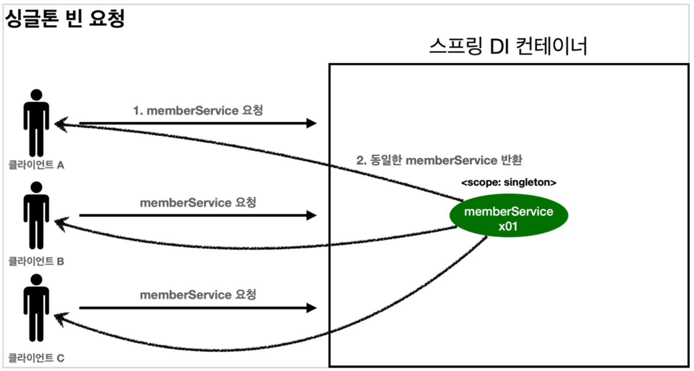
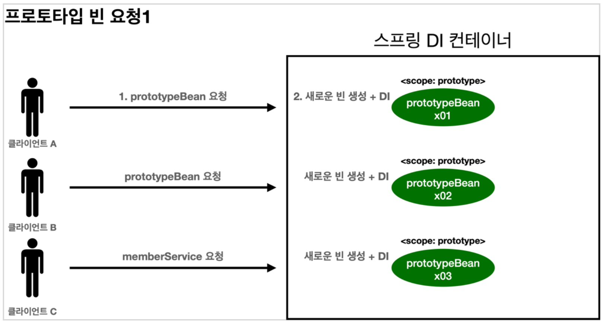
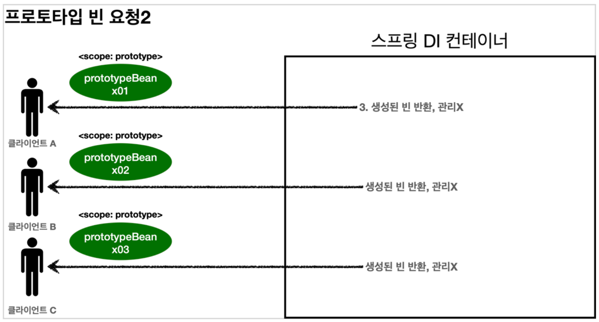

# Spring - 빈 스코프

## 1. 빈 스코프
- 싱글톤 스코프
	- 기본 스코프로, 스프링 컨테이너의 시작과 종료까지 유지되는 가장 넓은 범위의 스코프
	- 스프링 빈은 기본적으로 싱글톤 스코프이기 때문에 스프링 컨테이너의 시작과 함께 생성되며, 스프링 컨테이너가 종료될 때까지 유지됨
- 프로토타입 스코프 
	- 스프링 컨테이너가 생성과 의존 관계 주입까지만 관여하고 그 이후는 더 관리하지 않는 매우 짧은 범위의 스코프
- 웹 관련 스코프
	- request: 웹 요청이 들어오고 나갈때 까지 유지되는 스코프
	- session: 웹 세션이 생성되고 종료될 때 까지 유지되는 스코프
	- application: 웹의 서블릿 컨텍스트와 같은 범위로 유지되는 스코프

## 2. 싱글톤 스코프와 프로토타입 스코프
- 스프링 컨테이너에 조회하면 항상 같은 인스턴스의 스프링 빈을 반환하는 싱글톤 스코프와 달리, 프로토타입 스코프는 항상 새로운 인스턴스를 생성해서 반환함

### 2-1. 싱글톤 빈 요청

<p align="center"></p>

- 싱글톤 스코프의 빈을 스프링 컨테이너에 요청
- 스프링 컨테이너는 본인이 관리하는 스프링 빈을 반환
- 이후에 스프링 컨테이너에 같은 요청이 와도 객체 인스턴스의 스프링 빈을 반환함

### 2-2. 프로토타입 빈 요청 1단계

<p align="center"></p>

- 프로토타입 스코프의 빈을 스프링 컨테이너에 요청
- 스프링 컨테이너는 이 시점에 프로토타입 빈을 생성하고, 필요한 의존 관계를 주입함

### 2-3. 프로토타입 빈 요청 2단계

<p align="center"></p>

- 스프링 컨테이너는 생성한 프로토타입 빈을 클라이언트에 반환
- 이후에 스프링 컨테이너에 같은 요청이 오면 항상 새로운 프로토타입 빈을 생성해서 반환함

### 2-4. 정리
- 스프링 컨테이너는 프로토타입 빈을 생성하고 의존 관계 주입과 초기화까지만 처리함
- 클라이언트에 빈을 반환한 후, 스프링 컨테이너는 생성된 프로토타입 빈을 관리하지 않음
- 프로토타입 빈을 관리할 책임은 프로토타입 빈을 받은 클라이언트에 있기 때문에 @PreDestroy와 같은 종료 메소드가 호출되지 않음

## 3. Provider
- 스프링은 일반적으로 싱글톤 빈을 사용하기 때문에, 만일 싱글톤 빈과 프로토타입 빈을 함께 사용하는 경우 싱글톤 빈이 프로토타입 빈을 사용하게 되어 프로토타입 빈이 싱글톤 빈과 함께 계속해서 유지되는 문제가 발생함
- 사실 프로토타입 빈을 사용하는 목적은 주입 시점에만 새로 생성하는 것이 아니라, 사용할 때마다 새로 생성해서 사용하는 것
- 이러한 문제를 해결하기 위한 간단한 방법은 싱글톤 빈이 프로토타입 빈을 사용할 때마다 컨테이너에 새로 요청하는 것이지만, 이렇게 되면 스프링 컨테이너에 종속적인 코드가 되며 단위 테스트도 어려워지는 문제가 생김
- 따라서, 스프링 컨테이너에서 지정한 프로토타입 빈의 필요한 의존 관계를 찾아주는 Dependency Lookup(DL) 기능만 수행할 수 있는 방법이 필요함

### 3-1. ObjectProvider
- 지정한 빈을 컨테이너에서 대신 찾아주는 DL 서비스를 제공하는 ObjectFactory에서 편의 기능이 추가된 것
- ObjectProvider는 ObjectFactory를 상속하며, 옵션이나 스트림 등의 편의 기능이 있다는 장점이 있음 (다만, 둘 다 별도의 라이브러리가 필요하며, 스프링에 의존적이라는 공통점이 있음)
- ObjectProvider의 getObject()를 호출하면 내부에서 스프링 컨테이너를 통해 해당 빈을 찾아서 반환함 (DL)
- 스프링이 제공하는 기능을 사용하지만, 기능이 단순하므로 단위테스트를 만들거나 mock 코드를 만들기 훨씬 쉬우며, 딱 DL의 기능만 제공함

### 3-2. JSR-330 Provider
- javax.inject:javax.inject:1 라이브러리를 추가하여 사용
- provider의 get() 을 호출하면 내부에서 스프링 컨테이너를 통해 해당 빈을 찾아서 반환
- 자바 표준이고, 기능이 단순하므로 단위테스트를 만들거나 mock 코드를 만들기 훨씬 쉬우며, 딱 필요한 DL 정도의 기능만 제공
- 자바 표준이기 때문에 스프링이 아닌 다른 컨테이너에서도 사용 가능함

### 3-3. 정리
- 프로토타입 빈은 매번 사용할 때마다 의존 관계 주입이 완료된 새로운 객체가 필요할 때 사용
- 하지만, 실무에서는 싱글톤 빈으로 대부분의 문제를 해결할 수 있기 때문에 프로토타입 빈을 사용하는 일은 매우 드뭄
- 보통은 스프링의 편리한 기능을 사용가능한 ObjectProvider를 사용하지만, 스프링 컨테이너가 아닌 다른 컨테이너를 사용한다면 JSR-330 Provider를 사용해야 함

## 4. 웹 스코프
- 웹 스코프는 웹 환경에서만 동작하는 스코프로, 프로토타입 스코프와는 다르게 스프링이 해당 스코프의 종료 시점까지 관리함 (따라서, 종료 메소드가 호출됨)

### 4-1. 웹 스코프의 종류
- request: HTTP 요청 하나가 들어오고 나갈 때 까지 유지되는 스코프, 각각의 HTTP 요청마다 별도의 빈 인스턴스가 생성되고, 관리된다.
- session: HTTP Session과 동일한 생명주기를 가지는 스코프
- application: 서블릿 컨텍스트( ServletContext )와 동일한 생명주기를 가지는 스코프
- websocket: 웹 소켓과 동일한 생명주기를 가지는 스코프

### 4-2. 웹 스코프와 프록시
- 스프링 어플리케이션을 실행하는 시점에 생성되고 주입이 가능한 싱글톤 빈과 달리, 웹 스코프는 실제 고객의 요청이 와야 생성할 수 있기 때문에 에러가 발생하지 않도록 처리하는 방법이 필요함
- 방법에는 ObjectProvider를 사용하거나, 프록시를 사용하는 방법이 있는데, 주로 프록시 방법으로 처리됨

```java
@Component
@Scope(value = "request", proxyMode = ScopedProxyMode.TARGET_CLASS)
public class MyLogger {
}
```

- 위와 같이 코드를 작성하게되면, HTTP request와 상관없이 CGLIB 라이브러리로 가짜 프록시 객체를 만들어 다른 빈에 미리 주입해둘 수 있음
- 가짜 프록시 객체는 실제 요청이 왔을 때, 내부에서 진짜 빈을 요청하는 위임 로직이 있음
- 가짜 프록시 객체는 원본 클래스를 상속받아 만들어졌기 때문에, 이 객체를 사용하는 클라이언트 입장에서는 원본인지 아닌지 알 수 없으며(다형성), 이러한 프록시 객체 덕분에 클라이언트는 싱글톤 빈을 사용하듯이 편리하게 request 스코프를 사용할 수 있음
- 참고로 꼭 웹 스코프가 아니여도 프록시는 사용할 수 있으며, 이런 특별한 스코프는 꼭 필요한 곳에만 최소화하여 사용하는 것이 유지보수 측면에서 유리함


