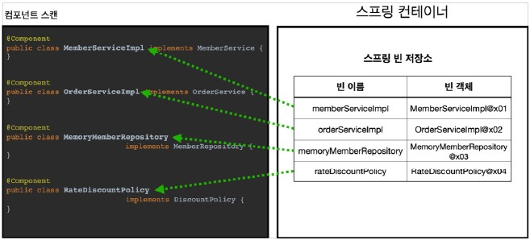
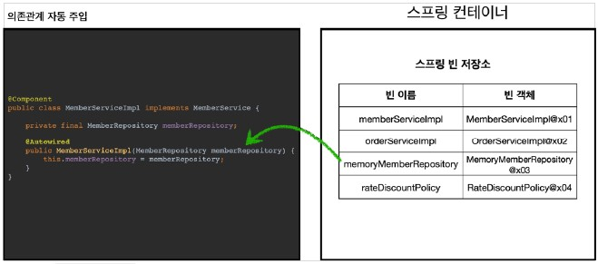

# Spring - ComponentScan & Autowired

## 1. 컴포넌트 스캔과 의존 관계 자동 주입
- Spring 빈을 등록하는 방법은 Java 코드의 @Bean이나 XML의 \<bean> 등을 통해서 설정 정보에 직접 입력하는 방법이 있긴 하지만, 만약 등록해야 할 Spring 빈의 수가 많아지면 관리 측면에서 어려움이 발생하게 됨
- 따라서, Spring은 설정 정보가 없어도 자동으로 Spring 빈을 등록하는 @ComponentScan 기능을 제공하며, 의존 관계 또한 자동으로 주입하는 @Autowired 기능도 제공함
- ComponentScan은 @Component 애노테이션이 붙은 클래스를 스캔해서 Spring 빈으로 등록하는 것

### 1-1. @ComponentScan

- @ComponentScan은 @Component가 붙은 모든 클래스를 Spring 빈으로 등록함
- 이 때, Spring 빈의 기본 이름은 클래스명을 사용하되, 맨 앞글자만 소문자를 사용한다.
    - 빈 이름 기본 전략: MemberServiceImpl 클래스는 memberServiceImpl
    - 빈 이름 직접 지정: 만약 스프링 빈의 이름을 직접 지정하고 싶으면, @Component("memberService")와 같이 이름을 부여

### 1-2. @Autowired : 의존관계 자동 주입

- 생성자에 @Autowired를 지정하면, Spring 컨테이너가 자동으로 해당 Spring 빈을 찾아서 주입함
- 이때 기본 조회 전략은 타입이 같은 빈을 찾아서 주입하는 것이며, getBean(MemberRepository.class) 와 동일하다고 이해하면 됨
- 주의할 점은 만일 같은 타입이 여러 개라면 충돌이 발생함

## 2. ComponentScan의 이해

### 2-1. 탐색할 패키지의 시작 위치 지정

- 모든 Java 클래스를 다 ComponentScan하면 시간이 오래 걸리기 때문에, 필요한 위치부터 탐색하도록 시작 위치를 지정할 수 있음
- 사용 방법
  - basePackages : 탐색할 패키지의 시작 위치 지정. 이 패키지를 포함해서 하위 패키지를 모두 탐색함
    - basePackages = {"hello.core", "hello.service"} 이렇게 여러 시작 위치를 지정함
  - basePackageClasses : 지정한 클래스의 패키지를 탐색 시작 위치로 지정
- 만약 지정하지 않으면 @ComponentScan이 붙은 설정 정보 클래스의 패키지가 시작 위치
- 권장하는 방법
    - 패키지 위치를 지정하지 않고, 설정 정보 클래스의 위치를 프로젝트 최상단에 두는 것
    - 참고로 스프링 부트를 사용하면 스프링 부트의 대표 시작 정보인 @SpringBootApplication를 이 프로젝트 시작 루트 위치에 두는 것이 관례 (그리고 이 설정안에 바로 @ComponentScan이 들어있기 때문에 스프링 부트는 따로 @ComponentScan을 사용하지 않아도 됨)

### 2-2. ComponentScan 기본 대상
- ComponentScan은 @Component 뿐만 아니라 아래의 어노테이션도 대상에 포함
    - @Component : 컴포넌트 스캔에서 사용
    - @Controlller : 스프링 MVC 컨트롤러에서 사용
    - @Service : 스프링 비즈니스 로직에서 사용
    - @Repository : 스프링 데이터 접근 계층에서 사용
    - @Configuration : 스프링 설정 정보에서 사용
- ComponentScan의 용도 뿐만 아니라 다음 어노테이션이 있으면 스프링은 부가 기능을 수행함
    - @Controller : 스프링 MVC 컨트롤러로 인식
    - @Repository : 스프링 데이터 접근 계층으로 인식하고, 데이터 계층의 예외를 스프링 예외로 변환해줌
    - @Configuration : 앞서 보았듯이 스프링 설정 정보로 인식하고, 스프링 빈이 싱글톤을 유지하도록 추가 처리를 함
    - @Service : 사실 @Service 는 특별한 처리를 하지 않지만, 개발자들이 핵심 비즈니스 로직이 여기에 있겠구나 라고 비즈니스 계층을 인식하는데 도움이 됨

### 2-3. 필터
- includeFilters : ComponentScan 대상을 추가로 지정
- excludeFilters : ComponentScan에서 제외할 대상을 지정
- FilterType 옵션
    - ANNOTATION: 기본값, 애노테이션을 인식해서 동작
     ex) org.example.SomeAnnotation
    - ASSIGNABLE_TYPE: 지정한 타입과 자식 타입을 인식해서 동작
     ex) org.example.SomeClass
    - ASPECTJ: AspectJ 패턴 사용
     ex) org.example..*Service+
    - REGEX: 정규 표현식
     ex) org\.example\.Default.*
    - CUSTOM: TypeFilter 이라는 인터페이스를 구현해서 처리
     ex) org.example.MyTypeFilter
- 참고로 @Component 면 충분하기 때문에, includeFilters를 사용할 일은 거의 없으며, excludeFilters는 여러가지 이유로 간혹 사용할 때가 있지만 많지는 않기 때문에 Spring의 기본 설정에 최대한 맞추어 사용하는 것이 권장됨

## 4. Spring 빈 중복 등록과 충돌

### 4-1. 자동 빈 등록 vs  자동 빈 등록

- ComponentScan에 의해 자동으로 Spring 빈이 등록되는데, 그 이름이 같은 경우 Spring은 오류를 발생시킴 (ConflictingBeanDefinitionException 예외 발생)

### 4-2. 수동 빈 등록 vs 자동 빈 등록

- 이 경우 수동 빈 등록이 우선권을 가짐 (수동 빈이 자동 빈을 오버라이딩 함)
- 만약 이러한 의도로 개발을 했다면 상관 없지만, 아니라면 고치기 정말 어려운 버그가 발생하기 때문에, 최근 스프링 부트에서는 수동 빈 등록과 자동 빈 등록이 충돌나면 오류가 발생하도록 기본 값을 바꾸었음