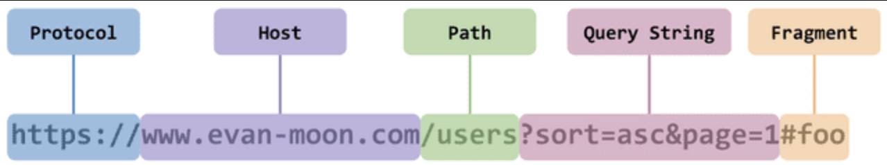
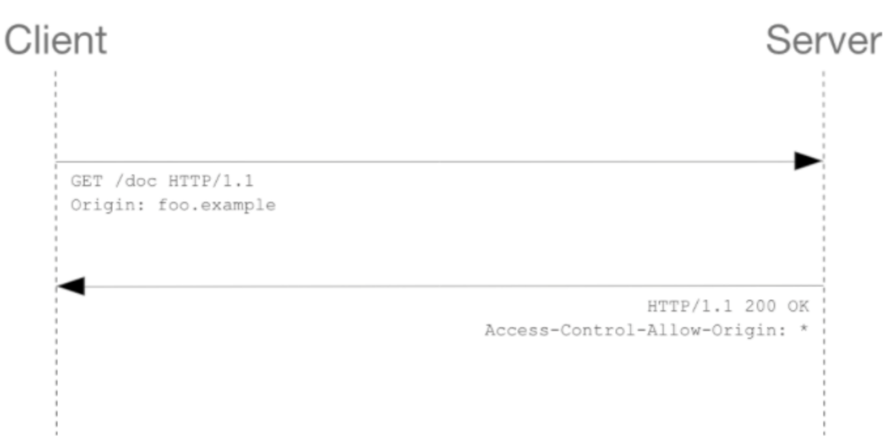
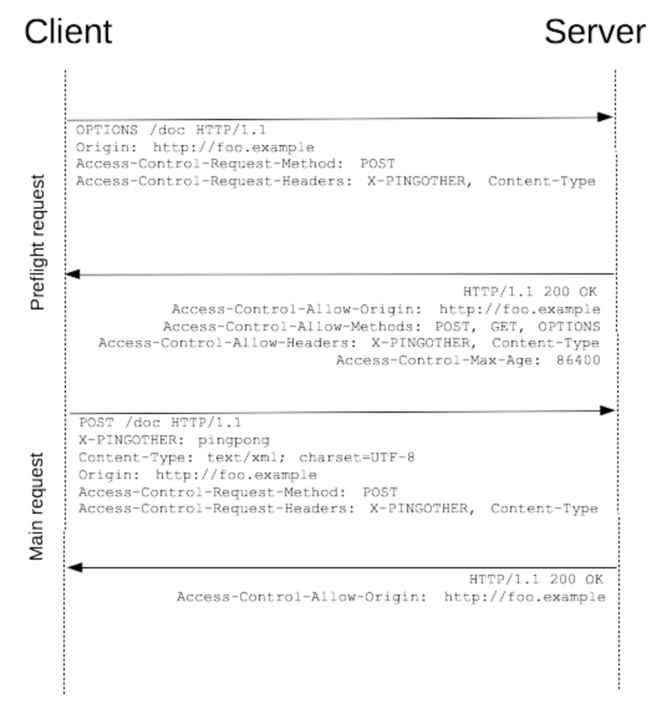

Spring - CORS & Spring Security CorsFilter

## 1. CORS(Cross-Origin Resource Sharing)

- 교차 출처를 공유할 수 있는 권한을 부여하도록 브라우저에 알려주는 정책
- 즉, 서로 다른 출처를 가진 서로의 Resource에 접근할 수 있도록 해줌
    - 출처 (Origin) : 프로토콜, 호스트, 포트        
	
  <p align="center"></p>
  
    - 즉, 서로 같은 출처는 프로토콜, 호스트, 포트가 동일한 것을 말하며, 여기서 하나라도 다르다면 Cross-Origin, 교차 출처가 되는 것
- 보안 상의 이유로 브라우저는 스크립트에서 시작한 Cross-Origin HTTP Request를 제한하며, SOP(Same Origin Policy)를 따름

## 2. CORS 시나리오

### Simple Request

<p align="center"></p>

- Prefilght Request 없이 요청을 보내고, 서버에서 Access-Control-Allow-Origin 헤더를 응답으로 보내는 것
- Credential이 없는 요청의 경우 와일드 카드(*)를 통해 브라우저 Origin에 상관없이 모든 리소스에 접근하도록 허용함
- Simple Request는 GET, POST, HEAD만 허용함

### Preflight Request

<p align="center"></p>

- 가장 일반적인 시나리오로, 먼저 OPTIONS 메소드를 통해 다른 도메인의 리소스로 HTTP Request를 보내고 실제 요청이 전송하기에 안전한지 확인하며, Cross-Site Request는 유저 데이터에 영향을 줄 수 있기 때문에 미리 전송(Preflighted)함
- Preflight Request
    - Access-Control-Request-Headers : 클라이언트가 요청을 보내는 헤더
    - Access-Control-Request-Method : 클라이언트가 요청을 보내는 HTTP 메소드
- Preflight Response
    - Access-Control-Allow-Credentials : 자격 증명(쿠키, 토큰 등)을 포함한 요청을 허용할지 여부
        - 값은 true or false이며, true인 경우 와일드 카드(*)를 사용할 수 없고 명시적인 출처를 지정해야함
        - true로 설정하고 와일드 카드를 사용하면 Spring에서 아래와 같은 오류가 발생함
            
            ```java
            java.lang.IllegalArgumentException: When allowCredentials is true, 
            allowedOrigins cannot contain the special value "*" 
            since that cannot be set on the "Access-Control-Allow-Origin" response header. 
            To allow credentials to a set of origins, 
            list them explicitly or consider using "allowedOriginPatterns" instead.
            ```
            
    - Access-Control-Allow-Headers : 해당 도메인에 대해 서버가 허용하는 헤더
    - Access-Control-Allow-Mehtods : 해당 도메인에 대해 서버가 허용하는 HTTP 메소드
    - Access-Control-Allow-Origin : 서버에서 허용한 출처(Origin)
    - max-age : Preflight는 요청을 두 번 보내기 때문에 리소스를 많이 사용하게 되는데, 이를 관리하기 위해 첫 요청에 캐시를 저장해두고, 서버는 max-age에 설정된 시간만큼 캐시를 저장함

### Credentials Request

<p align="center"></p>

- HTTP Cookie와 HTTP Authentication 정보를 사용
- Credentials이 필요한 CORS의 Frontend는 Response Header에 withCredentials=true, Backend는 Response Header에 Access-Control-Allow-Origin을 포함해야함
- Cross-site XMLHttpRequest나 Fetch 호출은 기본적으로 자격 증명을 보내지 않기 때문에 credentials 옵션에 인증과 관련된 정보를 담아 인증 보안을 강화함
- Access-Control-Allow-Credentials: true로 응답하지 않으면, 사용자 인증이 필요한 리소스에 대한 응답은 무시되고 웹 컨텐츠는 제공되지 않음

## 3. Spring Security

### CorsFilter

- CORS 설정은 Spring Security에 앞서 처리되어야 하는데, CorsFilter를 사용하면 해결할 수 있음

```java
@Bean
CorsConfigurationSource corsConfigurationSource() {
	CorsConfiguration configuration = new CorsConfiguration();

	configuration.setAllowedOriginPatterns(Arrays.asList("*"));
	configuration.setAllowedMethods(Arrays.asList("HEAD","POST","GET","DELETE","PUT"));
	configuration.setAllowedHeaders(Arrays.asList("*"));
	configuration.setAllowCredentials(true);
		
	UrlBasedCorsConfigurationSource source = new UrlBasedCorsConfigurationSource();
	source.registerCorsConfiguration("/**", configuration);
	return source;
}
```

### Spring MVC 적용

- @CrossOrigin 어노테이션 활용하여 적용

  ```java
  @RestController
  @RequestMapping("/account")
  public class AccountController {
    @CrossOrigin
    @RequestMapping(method = RequestMethod.GET, path = "/{id}")
    public Account retrieve(@PathVariable Long id) {
        // ...
    }
    
    @RequestMapping(method = RequestMethod.DELETE, path = "/{id}")
    public void remove(@PathVariable Long id) {
        // ...
  	}
  }
  ```
    - 모든 출처(Origin) 허용
    - @RequestMapping에 명시된 HTTP 메소드가 허용됨
    
  ```java
  @CrossOrigin(origins = "http://example.com", maxAge = 3600)
  @RestController
  @RequestMapping("/account")
  public class AccountController {
    @RequestMapping(method = RequestMethod.GET, path = "/{id}")
    public Account retrieve(@PathVariable Long id) {
        // ...
    }
   
    @RequestMapping(method = RequestMethod.DELETE, path = "/{id}")
    public void remove(@PathVariable Long id) {
        // ...
  	}
  }
  ```
    - 클래스 레벨에서 어노테이션을 적용하면, 해당 컨트롤러에 속해있는 메소드 모두에게 CORS 정책이 적용됨
    - @CrossOrigin 어노테이션을 통해 origins, methods, allowedHeaders, exposedHeaders, allowCredentials, maxAge 모두 설정할 수 있음
- 전역적으로 CORS 적용
    ```java
    @Configuration
    @EnableWebMvc
    public class WebConfig implements WebMvcConfigurer {
      @Override
      public void addCorsMappings(CorsRegistry registry) {
          registry.addMapping("/**");
                  .allowedOrigins("http://www.example.com")
                  .allowedMethods("*")
                  .allowCredentials(false)
                  .maxAge(3000);
      }
    }
    ```
    - JavaConfig를 통해 paths, origins, methods, allowedHeaders, exposedHeaders, allowCredentials, maxAge 모두 설정할 수 있음
    
### 출처
- https://velog.io/@chullll/Spring-Security-CORS
- https://ddonghyeo.tistory.com/56