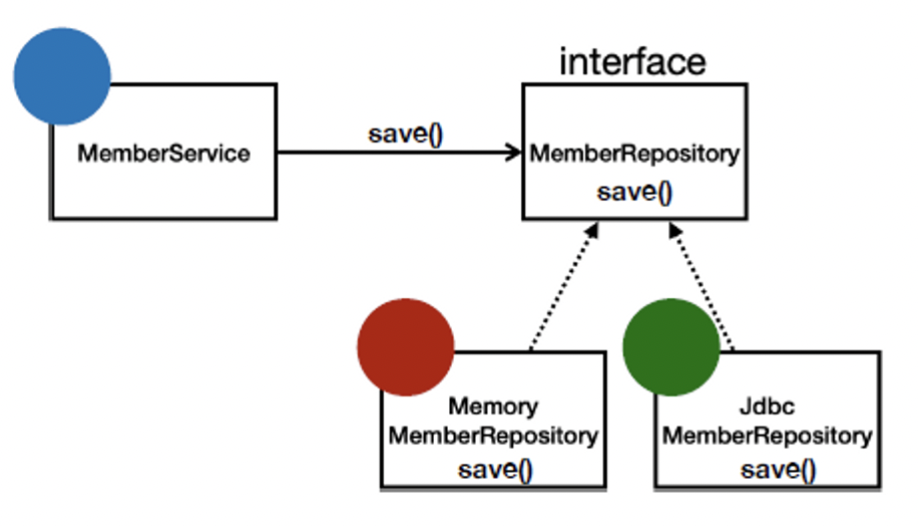

# Spring - 객체 지향 설계와 Spring

## 1. 객체 지향의 특징

### 1-1. 추상화
- 클래스의 공통된 속성을 뽑아내어 구현하는 것으로, 공통된 코드 작성을 줄여 비효율적인 코드를 줄이고 유지보수 측면에서도 유리한 점을 가져가는 것

### 1-2. 캡슐화
- 정보 은닉을 전제로, 관련있는 데이터와 동작들을 하나로 묶고 사용자의 내부적인 접근을 허용하지 않는 것
- 데이터 보호 : 은닉화를 통해 데이터의 접근을 제어할 수 있음
- 유지보수 : 캡슐화를 하게 되면 각 기능을 하나의 모듈처럼 활용하기 때문에 객체간의 이식성이 높고 독립성을 유지하여 유지보수 측면에서 이점이 있음
- 사용자 편의성 : 모듈화된 기능을 사용법만 익혀 바로 사용할 수 있음

### 1-3. 상속
- 자식 클래스가 부모 클래스에서 필드와 메소드를 물려받는 것으로, 중복된 코드를 줄일 수 있고 유지보수와 통일성, 그리고 다형성 면에서 장점이 있음

### 1-4. 다형성
- 하나의 객체가 여러가지 타입으로 표현될 수 있는 것으로, Java에서는 부모 클래스 타입의 참조 변수로 자식 클래스 타입의 인스턴스를 참조할 수 있도록 구현하여 하나의 타입으로 다양한 실행 결과를 얻을 수 있고, 객체를 부품화하여 유지보수를 용이하게 함
- 예시
  - 운전자 - 자동차
  - 키보드, 마우스 등 표준 인터페이스 
  - 정렬 알고리즘
  - 할인 정책 로직

## 2. 객체 지향 프로그래밍
- 객체 지향 프로그래밍은 컴퓨터 프로그램을 명령어의 목록으로 보는 시각에서 벗어나, 여러 개의 독립된 단위인 "객체"의 모임으로 파악하고자 하는 것. 각각의 객체는 메시지를 주고 받고, 데이터를 처리할 수 있음
- 객체 지향 프로그래밍은 프로그램을 유연하고 변경이 용이하게 만들기 때문에, 대규모 소프트웨어 개발에 많이 사용됨
- 유연하고 변경이 용이하다는 것은, 컴포넌트를 쉽고 유연하게 변경하며 개발할 수 있다는 것

## 3. 역할과 구현의 분리 (다형성)
- 역할과 구현으로 구분하면 세상이 단순해지고, 유연해지며 변경도 편리해진다.
    - 클라이언트는 대상의 역할(인터페이스)만 알면 된다.
    - 클라이언트는 구현 대상의 내부 구조를 몰라도 된다.
    - 클라이언트는 구현 대상의 내부 구조가 변경되어도 영향을 받지 않는다.
    - 클라이언트는 구현 대상 자체를 변경해도 영향을 받지 않는다.
- Java에서의 역할과 구현
    - 역할 = 인터페이스
    - 구현 = 인터페이스를 구현한 클래스, 구현 객체
    - 객체를 설계할 때 역할과 구현을 명확히 분리
    - 객체 설계시 역할(인터페이스)을 먼저 부여하고, 그 역할을 수행하는 구현 객체 만들기
- 객체의 협력 관계
    - 혼자 있는 객체는 없음
    - 클라이언트: 요청, 서버: 응답
    - 수 많은 객체 클라이언트와 객체 서버는 서로 협력 관계를 가짐
- 오버라이딩
    - 다형성으로 인터페이스를 구현한 객체를 실행 시점에 유연하게 변경할 수 있음
    - 클래스 상속 관계도 다형성, 오버라이딩 적용 가능

- 다형성의 본질
    - 인터페이스를 구현한 객체 인스턴스를 실행 시점에 유연하게 변경할 수 있음
    - 다형성의 본질을 이해하려면 협력이라는 객체 사이의 관계에서 시작해야함
    - 클라이언트를 변경하지 않고, 서버의 구현 기능을 유연하게 변경할 수 있음
- 역할과 구현을 분리하는 것의 한계
    - 역할(인터페이스) 자체가 변하면 클라이언트, 서버 모두에 큰 변경이 발생함. 즉, 인터페이스를 안정적으로 잘 설계하는 것이 중요함

## 4. SOLID 원칙

### 4-1. SRP: 단일 책임 원칙(single responsibility principle)
- 한 클래스는 하나의 책임만 가져야 함
- 하나의 책임이라는 것은 모호하다. 클 수 있고 작을 수 있으며, 문맥과 상황에 따라 다름
- 중요한 기준은 변경이다. 변경이 있을 때 파급 효과가 적으면 단일 책임 원칙을 잘 따른 것
- 예) UI 변경, 객체의 생성과 사용을 분리

### 4-2. OCP: 개방-폐쇄 원칙 (Open/closed principle) (중요!!!)
- 소프트웨어 요소는 확장에는 열려 있으나 변경에는 닫혀 있어야 함 (다형성 활용)
- 인터페이스를 구현한 새로운 클래스를 하나 만들어서 새로운 기능을 구현
- 문제점
  - 구현 객체를 변경하려면 클라이언트 코드를 변경해야 한다. 분명 다형성을 사용했지만 OCP 원칙을 지킬 수 없음
    ⇒ 객체를 생성하고, 연관관계를 맺어주는 별도의 조립, 설정자가 필요하다.

### 4-3. LSP: 리스코프 치환 원칙 (Liskov substitution principle)
- 프로그램의 객체는 프로그램의 정확성을 깨뜨리지 않으면서 하위 타입의 인스턴스로 바꿀 수 있어야 함
- 다형성에서 하위 클래스는 인터페이스 규약을 다 지켜야 한다는 것, 다형성을 지원하기 위한 원칙, 인터페이스를 구현한 구현체를 믿고 사용하려면 이 원칙이 필요함
- 단순히 컴파일에 성공하는 것을 넘어서는 이야기
- 예) 자동차 인터페이스의 엑셀은 앞으로 가라는 기능, 뒤로 가게 구현하면 LSP 위반, 느리더라도 앞으로 가야함

### 4-4. ISP: 인터페이스 분리 원칙 (Interface segregation principle)
- 특정 클라이언트를 위한 인터페이스 여러 개가 범용 인터페이스 하나보다 나음
- 자동차 인터페이스 -> 운전 인터페이스, 정비 인터페이스로 분리
- 사용자 클라이언트 -> 운전자 클라이언트, 정비사 클라이언트로 분리
- 분리하면 인터페이스 자체가 변해도 클라이언트에 영향을 주지 않으며, 인터페이스가 명확해지고 대체 가능성이 높아짐

### 4-5. DIP: 의존관계 역전 원칙 (Dependency inversion principle)
- 프로그래머는 “추상화에 의존해야지, 구체화에 의존하면 안된다.” 의존성 주입은 이 원칙을 따르는 방법 중 하나
- 쉽게 이야기해서 구현 클래스에 의존하지 말고, 인터페이스에 의존하라는 뜻
- 객체 세상도 클라이언트가 인터페이스에 의존해야 유연하게 구현체를 변경할 수 있으며, 구현체에 의존하게 되면 변경이 아주 어려워짐

## 5. 좋은 객체 지향 설계 원칙의 적용

### 5-1. SRP 단일 책임 원칙
- 한 클래스는 하나의 책임만 가져야 함
- 클라이언트 객체(OrderService)는 직접 구현 객체를 생성하고, 연결하고, 실행하는 다양한 책임을 가지고 있음
- SRP 단일 책임 원칙을 따르면서 관심사를 분리함
- 구현 객체를 생성하고 연결하는 책임은 AppConfig가 담당
- 클라이언트 객체는 실행하는 책임만 담당

### 5-2. DIP 의존관계 역전 원칙
- 프로그래머는 “추상화에 의존해야지, 구체화에 의존하면 안된다.” 의존성 주입은 이 원칙을 따르는 방법 중 하나
- 새로운 할인 정책을 개발하고 적용하려고 하니 클라이언트 코드도 함께 변경해야 했음. 왜냐하면 기존 클라이언트 코드(OrderServiceImpl)는 DIP를 지키며 DiscountPolicy 추상화 인터페이스에 의존하는 것 같았지만, FixDiscountPolicy 구체화 구현 클래스에도 함께 의존했음
- 클라이언트 코드가 DiscountPolicy 추상화 인터페이스에만 의존하도록 코드를 변경했으나, 클라이언트 코드는 인터페이스만으로는 아무것도 실행할 수 없음
- AppConfig가 FixDiscountPolicy 객체 인스턴스를 클라이언트 코드 대신 생성해서 클라이언트 코드에 의존관계를 주입했으며, 이렇게해서 DIP 원칙을 따르면서 문제도 해결함

### 5-3. OCP 개방-폐쇄 원칙
- 소프트웨어 요소는 확장에는 열려 있으나 변경에는 닫혀 있어야 함
- 다형성을 사용하고 클라이언트가 DIP를 지킴
- 애플리케이션을 사용 영역과 구성 영역으로 나눔
- AppConfig가 의존관계를 FixDiscountPolicy RateDiscountPolicy 로 변경해서 클라이언트 코드에 주입하므로 클라이언트 코드는 변경하지 않아도 됨
- 소프트웨어 요소를 새롭게 확장해도 사용 영역의 변경은 닫혀 있다!