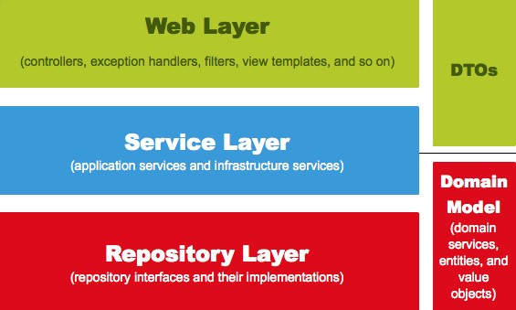
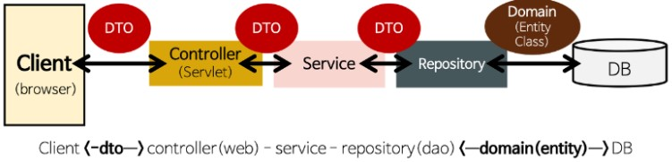
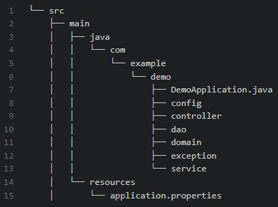
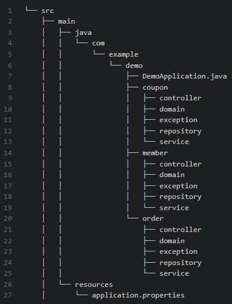

# Spring - Spring Boot 패키지 구조

## 1. MVC 패턴

### 1-1. Model
- 애플리케이션의 정보, 데이터를 나타냄 (데이터베이스, 처음 정의하는 상수, 초기화 값, 변수 등)
- 데이터를 파싱하거나, 데이터베이스와의 통신을 책임지는 컴포넌트
- Model의 규칙
  - 사용자가 편집하길 원하는 모든 데이터를 가지고 있어야 함
  - 뷰나 컨트롤러에 대하 어떠한 정보도 알지 말아야 함
  - 변경이 일어나면 변경 통지에 대한 처리 방법을 구현해야 함

### 1-2. View
- 사용자가 보는 화면으로, 사용자 인터페이스 요소를 의미
- 데이터를 기반으로 사용자들이 볼 수 있는 화면
- View의 규칙
  - Model이 가지고 있는 정보를 따로 저장해서는 안됨
  - Model이나 Controller와 같은 다른 구성요소를 몰라야 함
  - 변경이 일어나면 변경 통지에 대한 처리 방법을 구현해야 함

### 1-3. Controller
- Model과 View의 중간다리 역할
- 사용자가 데이터를 클릭하고 수정하는 것에 대한 이벤트를 처리

## 2. DAO & DTO & VO

### 2-1. DAO (Data Access Object)
- 데이터베이스에 접근하기 위한 객체로, DB에 접근하기 위한 로직과 비즈니스 로직을 분리하기 위해 사용

### 2-2. DTO (Data Transfer Object)
- 계층 간 데이터를 교환하기 위해 사용하는 객체로, 로직을 가지지 않는 순수한 데이터 객체(getter & setter 만 존재)

### 2-3. VO (Value Object)
- DTO와 유사하지만, getter만 가진 객체로 read-only(사용하는 도중에 변경 불가능, 오직 읽기만 가능)의 특징을 가짐

## 3. Spring Web Layer

### 3-1. Web Layer
- @Controller가 대표적이며, 이외에도 필터, 인터셉터, 컨트롤러 어드바이스 등이 포함됨
- 외부 요청과 응답에 대한 전반적인 영역을 의미

### 3-2. Service Layer
- @Service
- Controller와 Repository, DAO 중간에 위치
- @Transaction을 통해 트랜잭션과 도메인 간의 연산 순서를 보장해 줌

### 3-3. Repository Layer
- DB와 같은 데이터 저장소에 접근하는 영역
- JPA를 사용한다면 @Repository라고 생각하며 DAO라고도 생각해도 됨

### 3-4. DTOs
- 계층 간의 데이터 교환을 위한 객체

### 3-5. Domain Model
- 개발 대상으로, 도메인을 모든 사람이 동일한 관점에서 이해할 수 있고 공유할 수 있도록 단순화 한 것
- 비즈니스 로직 처리
- JPA를 사용한다면 @Entity가 사용되는 영역

### 3-6. Spring Web Layer 동작 과정

- Client(View)에서 DTO를 통해 요청을 보냄
- DTO를 통해 Controller에 도착하면 Controller에서 Service(비즈니스 로직)를 호출
- Service는 비즈니스 로직을 처리함
- Service가 비즈니스 로직을 처리하는 도중 DB에 접근해야 하는 경우 Repository로 이동하여 접근
- Repository는 DB에 접근하는 소스 코드가 존재하기 때문에 DB에 접근이 가능하며, 쿼리문을 통한 트랜잭션을 실행하는 경우 Domain(Entity Class)을 호출함
- Domain은 DB 테이블과 직접 매핑되는 비즈니스 로직들이 존재하는 것으로, JPA를 사용하면 @Entity가 선언됨

### 3-7. Spring Web Layer 정리
- Model : Service, DTO, Repository, Domain
- View : FrontEnd
- Controller: Controller

## 4. 계층형 구조 & 도메인형 구조

### 4-1. 계층형 구조

- 각 계층을 대표하는 디렉터리를 기준으로 코드를 구성하는 것
- 장점 : 프로젝트의 이해도가 낮아도 전체적인 구조 파악을 빠르게 할 수 있음
- 단점 : 한 디렉터리 안에 클래스가 밀집됨

### 4-2. 도메인형 구조

- 도메인 디렉터리를 기준으로 코드를 구성하는 것
- 장점 : 도메인 관련 코드를 응집할 수 있음
- 단점 : 프로젝트의 이해도가 낮을 경우 전체적인 구조를 파악하기 어려움

### 4-3. 계층형 Directory 구조

- src/main/java
  - web(controller)
  - service
  - db
    - repository(dao)
    - entity
  - global(공통적으로 사용되는 것들)
    - auth
    - exception
  - model(dto)
    - config
- src/main/resources
  - static
    - js, css, img
  - templates
    - thymeleaf
  - application.properties
  - ㅇㅇㅇ.properties
- src/test/java
- src/test/resources

### 4-4. 도메인형 Directory 구조
- src/main/java
  - domain
    - graduation
      - controller
      - entity
      - service
      - repository
      - exception
      - model(dto)
    - blog
      - controller
      - entity
      - service
      - repository
      - exception
      - model(dto)
  - global(공통적으로 사용되는 것들)
    - auth
    - exception
    - common
      - request
      - response
    - config

---

참고 : https://velog.io/@sunil1369/Spring-boot-%ED%8C%A8%ED%82%A4%EC%A7%80-%EA%B5%AC%EC%A1%B0