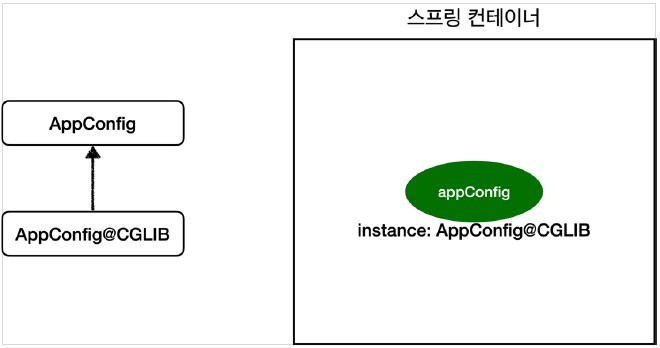

# Spring - 싱글톤 컨테이너

## 1. 웹 어플리케이션과 싱글톤

### 1-1. Spring이 없는 순수한 DI 컨테이너

<p align="center"></p>

- Spring이 없는 순수한 DI 컨테이너인 AppConfig는 요청할 때마다 객체를 새로 생성함
- 만약, 트래픽이 초당 100이 나오면 1초마다 100개의 객체가 생성되고 소멸되기 때문에 메모리 낭비가 심함
- 따라서, 객체가 딱 1개만 생성되고 공유하도록 설계해야 함 (싱글톤 패턴)

### 1-2. 싱글톤 패턴
- 클래스의 인스턴스가 딱 1개만 생성되는 것을 보장하는 디자인 패턴
- 따라서, private 생성자를 사용하여 외부에서 임의로 new 키워드를 사용하지 못하도록 설계해야 함
- 싱글톤 패턴을 적용하면 요청이 올 때마다 객체를 생성하는 것이 아니라, 이미 만들어진 객체를 공유해서 효율적으로 사용할 수 있음
- 싱글톤 패턴의 구현
    ```java
    package hello.core.singleton;
    public class SingletonService {
        //1. static 영역에 객체를 딱 1개만 생성해둔다.
        private static final SingletonService instance = new SingletonService();
        
        //2. public으로 열어서 객체 인스턴스가 필요하면 이 static 메서드를 통해서만 조회하도록 허용한다.
        public static SingletonService getInstance() {
            return instance;
        }

        //3. 생성자를 private으로 선언해서 외부에서 new 키워드를 사용하여 객체 생성을 못하게 막는다.
        private SingletonService() {
        }

        public void logic() {
            System.out.println("싱글톤 객체 로직 호출");
        }
    }
    ```

### 1-3. 싱글톤 패턴의 문제점
- 싱글톤 패턴을 구현하기 위해 코드의 양이 너무 많아짐
- 의존관계상 클라이언트가 구체 클래스에 의존하기 때문에 DIP를 위반함
- 클라이언트가 구체 클래스에 의존해서 OCP 원칙을 위반할 가능성이 높음
- 테스트하기 어려우며, 내부 속성을 변경하거나 초기화 하기 어려움
- private 생성자로 자식 클래스를 만들기 어렵기 때문에 유연성이 떨어짐
- 안티패턴으로 불리기도 함

## 2. 싱글톤 컨테이너 (= Spring 컨테이너)

<p align="center"></p>

- Spring(= 싱글톤) 컨테이너는 싱글톤 패턴의 문제점을 해결함과 동시에 객체 인스턴스를 싱글톤으로 관리함
- Spring 컨테이너는 싱글톤 패턴을 적용하지 않아도 객체 인스턴스를 싱글톤으로 관리하며, 이렇게 싱글톤으로 객체를 생성하고 관리하는 기능을 싱글톤 레지스트리라 함
- Spring 컨테이너의 기능 덕분에 싱글톤 패턴의 모든 단점을 해결할 수 있음
  - 싱글톤 패턴을 위한 지저분한 코드가 들어가지 않아도 됨
  - DIP, OCP, 테스트, private 생성자로부터 자유롭게 싱글톤을 사용할 수 있음
- Spring 컨테이너는 고객의 요청이 올 때 마다 객체를 생성하는 것이 아니라, 이미 만들어진 객체를 공유해서 효율적으로 재사용할 수 있음
- 참고로 스프링의 기본 빈 등록 방식은 싱글톤이지만, 싱글톤 방식만 지원하는 것은 아니며, 요청할 때 마다 새로운 객체를 생성해서 반환하는 기능도 제공함

### 2-1. 싱글톤 방식의 주의점
- 객체 인스턴스를 하나만 생성해서 공유하는 싱글톤 방식은 여러 클라이언트가 하나의 같은 객체 인스턴스를 공유하기 때문에 싱글톤 객체는 상태를 유지(stateful)하게 설계하면 안됨
    - 특정 클라이언트에 의존적인 필드가 있으면 안됨
    - 특정 클라이언트가 값을 변경할 수 있는 필드가 있으면 안됨
    - 가급적 읽기만 가능해야 함 (가급적 값을 수정해선 안됨)
    - 필드 대신에 자바에서 공유되지 않는, 지역변수, 파라미터, ThreadLocal 등을 사용해야 함
- 만약, 스프링 빈의 필드에 공유 값을 설정하면 정말 큰 장애가 발생할 수 있음

## 3. @Configuration과 싱글톤

<p align="center"></p>

- Spring 컨테이너는 싱글톤 레지스트리이기 때문에, Spring 빈이 싱글톤이 되도록 보장해주어야 함
- 그래서 Spring은 클래스의 바이트코드를 조작하는 라이브러리를 사용하며, 이 로직은 @Configuration을 적용한 AppConfig에 있음
- 사실 AnnotationConfigApplicationContext 에 파라미터로 넘긴 값은 Spring 빈으로 등록되기 때문에 AppConfig도 Spring 빈이 되는데, 이 Spring 빈을 조회하여 클래스 정보를 출력하면 class hello.core.AppConfig가 아닌 AppConfig$$EnhancerBySpringCGLIB$$bd479d70로 출력됨
- 이는 내가 만든 클래스가 아니라 Spring이 CGLIB라는 바이트코드 조작 라이브러리를 사용해서 AppConfig 클래스를 상속받은 임의의 다른 클래스를 만들고, 그 다른 클래스를 Spring 빈으로 등록한 것
- @Bean이 붙은 메서드마다 이미 Spring 빈이 존재하면 존재하는 빈을 반환하고, Spring 빈이 없으면 생성해서 Spring 빈으로 등록하는 식으로 반환하는 코드가 동적으로 만들어지기 때문에 싱글톤이 보장되는 것
- 정리
    - @Bean만 사용해도 스프링 빈으로 등록되지만, 싱글톤을 보장하지 않음
    - 즉, 스프링 설정 정보는 항상 @Configuration 을 사용해야 함