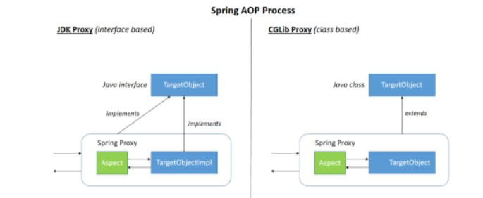
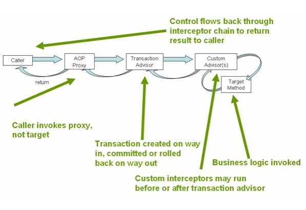
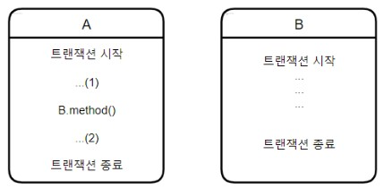
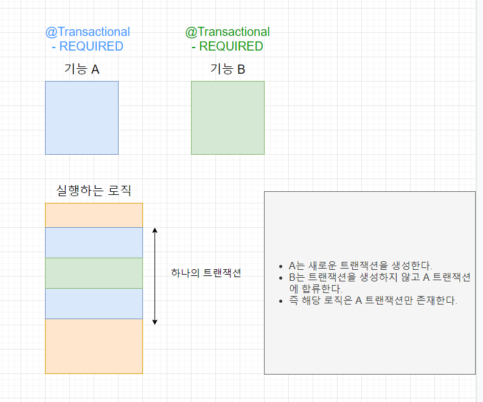
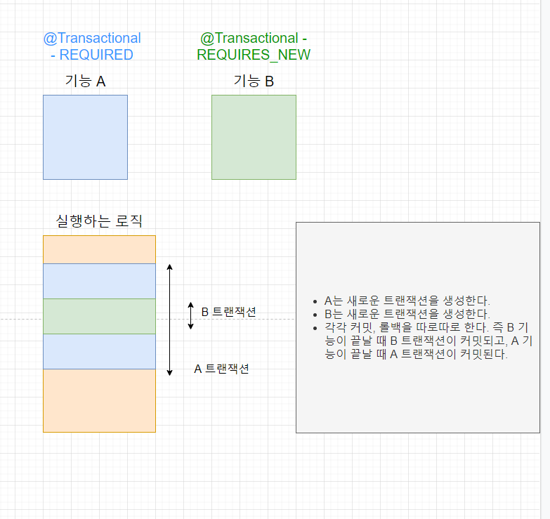
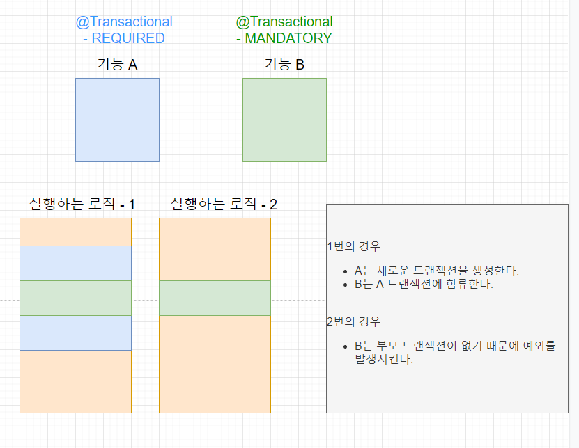
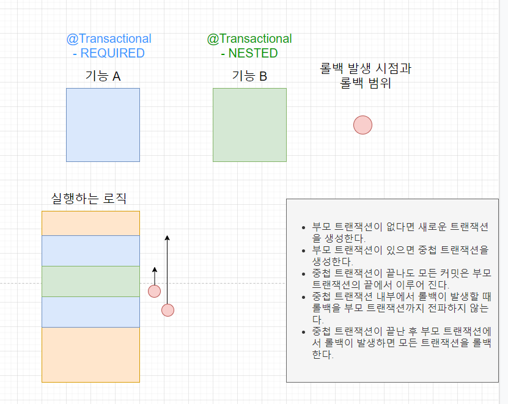
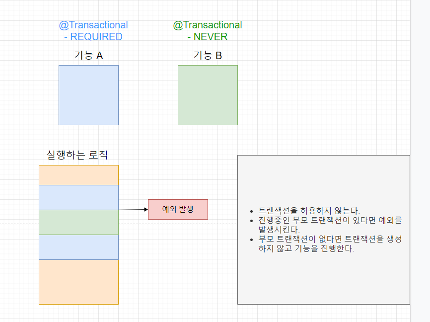

# Spring - Transaction 사용 방법

## 1. Transacion의 필요성
- 만약 DB의 데이터를 수정하는 도중 예외가 발생했다면, 데이터들은 수정이 되기 전 상태로 돌아가 다시 수정 작업을 진행해야 하는데, Transaction은 여러 작업을 진행하다가 문제가 발생했을 경우 이전 상태로 rollback하기 위해 사용됨
- Transaction은 더 이상 쪼갤 수 없는 최소 작업 단위를 의미하며, commit으로 성공하거나, rollback으로 실패 이후 취소되어야 함
- Transaction의 ACID
  - 원자성(Atomicity) : 트랜잭션 내에서 실행한 작업들은 모두 성공하거나 모두 실패해야 함
  - 일관성(Consistency) :데이터베이스의 무결성 제약 조건과 같이 데이터베이스는 일관성있는 상태를 유지해야 함
  - 격리성(Isolation) : 동시에 실행되는 트랜잭션들은 서로에게 영향을 미치지 않게 격리되어야 하며, 격리성은 동시성과 관련된 성능 이슈로 인해 격리 수준을 선택할 수 있음
  - 지속성(Durability) : 트랜잭션이 성공적으로 끝나면 그 결과가 항상 기록되어야 함

## 2. JDBC Transaction
```java
Connection connection = dataSource.getConnection(); // (1) 
try (connection) { 
        connection.setAutoCommit(false); // (2) 
        // execute some SQL statements... 
        connection.commit(); // (3) 
} catch (SQLException e) { 
        connection.rollback(); // (4) 
}
```
- Java에서 데이터베이스 트랜잭션을 시작하는 유일한 방법
- getConnection()으로 데이터베이스와 연결하고, setAutoCommit(false)으로 개발자가 원할 때 commit 또는 rollback하게 할 수 있음
- 하지만, 이러한 방법은 두 개 이상의 DB에 접근해야 하는 작업을 하나의 Transaction으로 만들 수 없다는 단점이 있으며, Java Transaction API(JTA)를 이용할 수 있으나 API를 직접 다루는 것은 의도치 않은 에러를 발생시킬 수 있음

## 3. PlatformTransactionManager
- Spring에서는 PlatformTransactionManager 인터페이스 추상화를 통해 해당 인터페이스를 Spring 설정 파일을 거쳐 Bean으로 등록하고, DI를 받아 사용함
- PlatformTransactionManager는 TransactionManager의 최상위 인터페이스로, 인터페이스에 각자의 환경에 맞는 TransactionManager 클래스를 주입함
- JDBC 및 MyBatis 등의 JDBC 기반 라이브러리는 DataSourceTransactionManager를 주입하고, Hibernate는 HibernateTransactionManager, JPA는 JpaTransactionManager 클래스를 주입

```java
// PaymentService.java
public class PaymentService {

    private PlatformTransactionManager transactionManager;

    public void setTransactionManager(PlatformTransactionManager transactionManager){
        this.transactionManager = transactionManager;
    }

    public void transactionCode() throws Exception {
        TransactionStatus status = this.transactionManager.getTransaction(new DefaultTransactionDefinition());

        try {
            // execute some SQL statements... 
            this.transactionManager.commit(status);
        } catch (RuntimeException e) {
            this.transactionManager.rollback(status);
            throw e;
        }
    }
}
```
```xml
// applicationContext.xml
<bean id="paymentService" class="spring.test.service.PaymentService">
    <property name="paymentDao" ref="paymentDao" />
    <property name="transactionManager" ref="transactionManager" />
</bean>

<bean id="transactionManager" class="org.springframework.jdbc.datasource.DataSourceTransactionMager">
    <property name="dataSource" ref="dataSource" />
</bean>
```

## 4. @Transactional
```java
public class UserService {
        @Transactional 
        public Long registerUser(User user) {
                // execute some SQL that e.g. 
                // inserts the user into the db and retrieves the autogenerated id 
                // userDao.save(user); 
                return id;
        } 
}
```
- 일반적으로 가장 많이 사용하는 선언적 Transaction 방식
- 설정에서 @EnableTransactionManagement를 추가한 뒤(Spring Boot에서는 자동으로 설정되어 있음), Transaction을 사용하고 싶은 클래스 및 메소드에 @Transaction을 사용하면 됨
- @Transactional이 있으면 JDBC에서 필요한 코드를 삽입해 줌(ex. getConnection(), setAutoCommit(false))

### 4-1. Spring AOP

<p align="center"></p>

- AOP 프록시 생성 과정에서 타겟 객체가 하나 이상의 인터페이스를 구현하고 있는 클래스라면 JDK Dynamic Proxy를 사용하고, 그렇지 않다면 CGLIB을 사용
- JDK Dynamic Proxy
  - java.lang에 포함되어 있는 Reflection의 Proxy 클래스를 동적으로 생성하는 것
  - 타겟의 인터페이스를 기준으로 Proxy를 생성하는 것이 핵심
- CGLIB (Code Generator Library)
  - Spring Boot에서는 CGLIB이 default이며, 클래스의 바이트코드를 조작하여 Proxy 객체를 생성함
  - CGLIB을 통해 인터페이스가 아닌 타겟에 대해 Proxy를 생성할 수 있음

### 4-2. @Transactional의 동작 과정
- @Transactional을 클래스나 메소드에 명시하면, AOP를 통해 타겟이 상속하고 있는 인터페이스 또는 타겟을 상속한 Proxy 객체가 생성되며, 이때 Proxy 객체의 메소드를 호출하면 전 후로 Transaction 처리를 수행함

<p align="center"></p>

- Caller에서 AOP Proxy를 타며, 이때 타겟을 호출하지는 않고 Proxy를 호출함
- AOP Proxy에서 Transaction Advisor를 호출하고, 이 과정에서 commit이 되거나 rollback이 됨
- 만약 Custom Advisor가 있다면, Transaction Advisor 실행 전후로 동작하며, Custom Advisor는 타겟 메소드를 호출하고 비즈니스 로직을 호출함
- 후에 순서대로 return

## 5. Transaction 경계 설정 전략
- 일반적으로 Transaction의 시작과 종료는 Service 레이어 내부 메소드에 달려 있음
- Transaction 경계를 설정하는 방법은 PlatformTransactionManager를 사용하여 Transaction을 코드를 통해 임의로 지정하는 방법과 AOP를 이용하여 지정하는 방법이 있으며, 이 중에서 AOP를 활용한 @Transactional 어노테이션이 주로 사용됨

```java
// JPA를 사용한 트랜잭션 코드

//Defalut Propagation : REQUIRED
@Transactional
public void invoke() {
    System.out.println("*** invoke start");
    insert1();
    insert2();
    System.out.println("*** invoke end");
}

//Defalut Propagation : REQUIRED
public void insert1() {
    bookRepository.save(new Book("오브젝트"));
}

//Defalut Propagation : REQUIRED
public void insert2() {
    bookRepository.save(new Book("스프링"));
}
```

- invoke start : invoke() 메소드가 시작되기 전, DB 커넥션을 얻음
- participation in exsting transaction : invoke() 메소드 내에서 insert1()과 insert2()에서 실행되는 Transaction은 기존 Transaction에 참여하고, 기본 Transaction 전파 설정은 REQUIRED임
- invoke end : invoke() 메소드가 실행된 이후, Transaction을 commit하고, 커넥션을 반환함
- 위와 같이 Spring AOP 방식 Transaction은 메소드 단위로 관리되며, 메소드가 끝날 때 까지 commit이나 커넥션 반환이 이뤄지지 않고 동일한 커넥션을 사용하기 때문에, 처리시간이 긴 메소드의 경우는 Transaction 단위를 조정하여 DB Lock 지속시간이 너무 길어지지 않거나 DB Connection Pool의 커넥션 수가 모자라지 않도록 해야함

## 6. Transacion 전파
- Transaction 전파란, 임의의 한 Transaction 경계에서 이미 진행 중인 Transacion이 존재하거나 혹은 존재하지 않을 때 동작 방식을 결정하는 것

<p align="center"></p>

- 만일 A Transacion이 시작되고 아직 끝나지 않은 시점에서 B가 호출된다면, B는 어느 Transacion에서 동작해야 할까?
- 시나리오 1
  - A Transacion이 시작되고 아직 끝나지 않은 경우, B는 새로운 Transaction을 만들지 않고 A Transaction에 참여하며, 해당 Transaction에서 예외가 발생한다면 A와 B 모두 한 Transaction에 묶여 있으므로 A와 B 모두 rollback이 됨
- 시나리오 2
  - B는 A Transaction과 별도의 Transacion을 만들 수 있으며, 이러한 경우 B Transacion 경계를 빠져나가는 순간 B Transaction은 독립적으로 commit되거나 rollback되고, A Transacion에서 만약 예외가 발생하더라도 B Transaction은 아무런 영향이 없음
- 위와 같은 경우에서 A Transacion과 B Transaction은 서로 다른 Service 레이어에 속해야 함을 주의해야 함

### 6-1. REQUIRED (기본값)
<p align="center"></p>

- 가장 많이 사용되는 Transaction 전파 속성으로, 이미 진행 중인 Transacion이 없으면 새로 시작하고, 진행 중인 Transacion이 있다면 기존 Transaction에 참여

### 6-2. REQUIRES_NEW
<p align="center"></p>

- 앞선 Transaction의 존재 유무와 상관없이 새로운 Transaction을 만들어 독립적으로 동작시키기 때문에, 독립적인 Transaction이 보장되어야 하는 코드에 적용함

### 6-3. MANDATORY
<p align="center"></p>

- 이미 진행 중인 Transaction이 있다면 해당 Transaction으로 합류하는 것은 REQUIRED와 같지만, 만약 진행 중인 Transaction이 없다면 예외를 발생시킨다는 점이 다름
- 독립적인 Transaction을 생성하면 안되는 경우에 사용

### 6-4. NESTED
<p align="center"></p>

- 이미 실행 중인 Transaction이 존재한다면, Transaction 내부에 다시 Transaction을 만드는 중첩 Transaction을 만듬
- 중첩 Transaction은 부모 Transaction의 commit과 rollback에 영향을 받지만, 중첩 Transaction 자신은 부모 Transaction에 영향을 주지 않음
- REQUIRED와 마찬가지로 부모 Transaction이 존재하지 않으면, 독립적으로 Transaction을 생성해서 사용

### 6-5. NEVER
<p align="center"></p>

- Transaction이 존재하면 예외를 발생시켜 Transaction을 사용하지 않도록 강제함

### 6-6. SUPPORTS
- 이미 진행중인 Transaction이 존재하면 해당 Transaction에 합류하고, 이미 진행중인 Transaction이 없다면 Transaction 없이 진행

### 6-7. NOT_SUPPORTED
- Transaction이 존재하면 해당 Transaction 자체를 무시

## 7. @Transactional 사용시 주의할 점

### 7-1. Inner Method에서의 동작
```java
public class BooksImpl implements Books {

        public void addBooks(List<String> bookNames) {
                bookNames.forEach(bookName -> this.addBook(bookName));
        }

        @Transactional
        public void addBook(String bookName) {
                Book book = new Book(bookName);
                bookRepository.save(book);
                book.setFlag(true);
        }
}
```

- 위 코드에서는 addBook() 메소드에 @Transactional이 적용되지 않으며, 해당 코드를 실행해도 변경 감지가 동작하지 않아 DB에 저장된 book 정보의 Flag 컬럼이 정상적으로 업데이트되지 않음
- 그 이유는, Proxy가 적용되면 클라이언트는 Proxy를 타겟 객체로 생각하고 Proxy 메소드를 호출하는데, Proxy는 타겟 객체를 호출하는 과정에만 동작하고 타겟 객체의 메소드가 자기 자신의 다른 메소드를 호출할 때는 Proxy가 동작하지 않기 때문
- 따라서, 위 코드에서 addBook() 메소드는 Proxy로 감싸진 메소드가 아니기 때문에 @Transactional이 동작하지 않음

### 7-2. Private Method에서의 동작
- @Transactional을 사용하면, Transaction 처리를 위해 빈 객체에 대한 Proxy 객체를 생성하고, Proxy는 타겟 클래스를 상속하여 생성됨
- 따라서, 상속이 불가능한 Private 메소드의 경우, @Transactional이 동작하지 않음

### 7-3. Spring TransactionTemplate
- DBMS의 종류에 따라 DB Lock 지속 시간, Read Consistency의 차이, 서비스의 동시성 등을 고려한다면, 메소드 단위로 경계가 설정되는 AOP 방식의 Transaction이 비효율적일 수 있음
- 만약 실행 시간이 아주 긴 메소드에 AOP로 Transaction을 사용하면 불필요하게 DB 커넥션을 점유하거나, DB Lock이 유지되는 시간이 길어질 수 있음
- 따라서, 이러한 경우 개발자가 직접 Transaction의 경계를 설정할 필요가 있으며, 이때 Spring에서 setter를 통해 TransactionTemplate을 주입 받고, TransactionTemplate 생성 및 Transaction 속성을 설정할 수 있음

```java
public class TransactionInvoker {

        private final A1Dao a1dao;
        private final A2Dao a2dao;
        private final TransactionTemplate transactionTemplate;

        public void setTransactionManager(PlatformTransactionManager transactionManager){
                this.transactionTemplate = new TransactionTemplate(transactionManager);
                this.transactionTemplate.setPropagationBehavior(TransactionDefinition.PROPAGATION_REQUIRED);
        }

        public void invoke() throws Exception{
                // Business Logic ...
                doInternalTransaction();
        }

        private void doInternalTransaction() throws Exception{
                transactionTemplate.execute(new TransactionCallbackWithoutResult(){
                    public void doInTransactionWithoutResult(TransactionStatus status){
                            try{
                                    a1dao.insertA1();
                                    a2dao.insertA2(); 
                            }
                            catch(Exception e){
                                    status.setRollbackOnly();
                            }
                            return;
                    }
                });
        }
}
```
