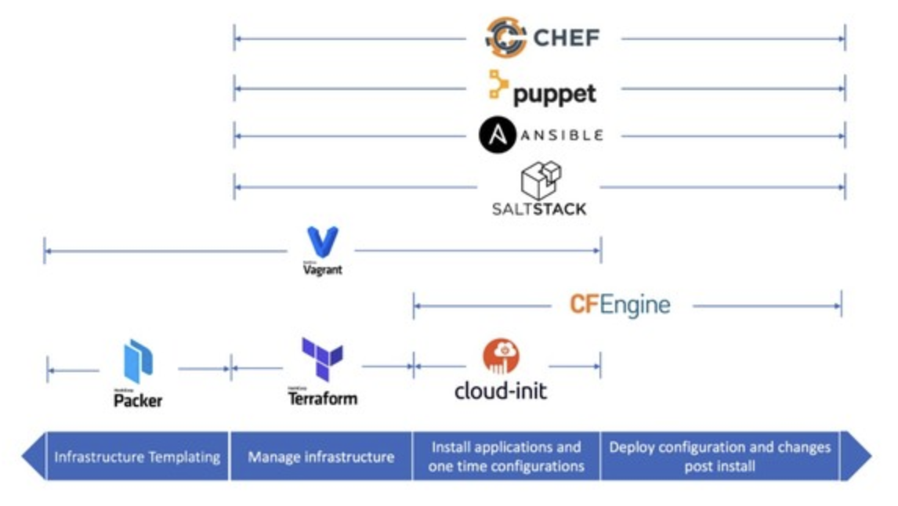

# Terraform

## 1. IAC (Infrastructure as Code)

### IAC란?
- 가상화 기술의 발전으로 여러 대의 서버를 더 많이 그리고 더 쉽게 만들 수 있는 환경이 되었지만, 늘어나는 서버에 대한 프로비저닝과 운영에 대한 이슈가 발생
- 이러한 이슈를 해결하기 위해 서버 구축과 운영에 대한 자동화가 필요해졌고, 이러한 환경에서 프로그래밍 코드로 인프라를 구축/운영할 수 있는 IAC가 발생하게 됨
- IAC는 코드로 인프라를 관리한다는 개념으로, Terraform에서는 하시코프 설정 언어(HCL, Hashicorp Configuration Language)를 사용해 클라우드 리소스를 선언, 즉 인프라를 사람이 읽을 수 있는 코드로 만들고, 이를 통해 버전 관리와 공유 및 재사용이 가능해짐

### IAC의 종류

<p align="center"></p>

- 프로비저닝 도구 (Provisioning Tool)
	- 일반적으로 운영팀의 담당자가 컴퓨터나 가상 호스트를 사용해 개발팀에서 필요한 라이브러리나 서비스를 설치하는 것을 의미
	- 프로비저닝 영역에서는 개발팀이 사용한 코드 버전과 동일한 버전을 사용해 네트워크, 서버, DB를 구성함
	- Terraform, Cloudformation
- 구성 관리 도구 (SCM Tool)
	- 성능, H/W 속성과 라이프사이클 전반에 걸친 요구사항, 설계 및 운영 정보의 일관성 등을 설정하고 유지하기 위한 시스템 프로세스
	- 프로비저닝이 인프라에 대한 배포가 위주라면, 구성 관리는 어플리케이션의 구성 설정을 관리하는 영역
	- Chef, Puppet, Ansible

## 2. Terraform

### Terraform이란?
- Terraform은 Hashicorp에서 오픈소스로 개발중인 클라우드 인프라스트럭처 자동화를 지향하는 IAC 도구
- 자동화 : 수동으로 서버를 생성하는게 아니라 코드로 생성하기 때문에 서버 운영 및 관리를 자동화할 수 있음
- 속도 & 안전 : 코드로 실행되기 때문에 수동으로 작업하는 것보다 더 빠르며, 사람이 하는 실수를 방지할 수 있음
- 문서화 : 모든 인프라가 코드로 기록되고 관리되기 때문에 새로운 개발자라도 Terraform 코드를 보면 전체적인 인프라 구성을 이해할 수 있음
- 형상관리 : git을 통해 형상관리가 가능하며, 인프라 변경 기록을 쉽게 볼 수 있음
- 리뷰 및 테스트 : 수동으로 서버 작업을 하는 경우에는 실제로 실행하기 전에 리뷰하는 것이 어려웠는데, Terraform의 경우 코드 리뷰와 테스트를 통해 문제가 실제로 발생되는 것을 예방할 수 있음

### Terraform의 기본 구성
- 프로비저닝 (Provisioning)
	- 어떤 프로세스나 서비스를 실행하기 위한 준비 단계
	- 네트워크나 컴퓨팅 자원을 준비하는 작업
- 프로바이더
	- Terraform과 외부 서비스를 연결해주는 기능
	- AWS, GCP, Azure와 같은 범용 클라우드 서비스를 포함하여 Github, Datadog과 같은 특정 기능을 제공하는 서비스
- 리소스
	- 프로바이더가 제공해주는 조작 가능한 대상의 최소 단위
	- 예를 들어, AWS 프로바이더는 aws_instance 리소스 타입을 제공하며, 이 리소스 타입을 사용해 Amazon EC2의 가상 머신 리소스를 선언하고 조작할 수 있음
- 계획 (Plan)
	- Terraform 프로젝트 디렉토리 아래 모든 .tf 파일을 실제로 적용 가능한지 확인하는 작업
- 적용 (Apply)
	- Terraform 프로젝트 디렉토리 아래 모든 .tf 파일의 내용대로 리소스를 생성, 수정, 삭제

## 3. Terraform의 사용

### Terraform의 주요 파일
- variables.tf : 변수 정의 파일, Terraform에서 사용할 입력 변수 정의
    ```yaml
    variable "region" { 
        description = "AWS 리전을 정의합니다." 
        type = string 
        default = "ap-northeast-2" 
    }
    ```
- terraform.tfvars : 변수 값 설정 파일, 변수의 실제 값 지정
    ```yaml
    region = "us-east-1"
    ```
- main.tf : 핵심 인프라 정의 파일, 리소스 생성, 업데이트 및 삭제 정의
    ```yaml
    provider "aws" { 
        region = var.region 
    } 
    resource "aws_vpc" "example" { 
        cidr_block = "10.0.0.0/16" 
        tags = { 
            Name = "example-vpc" 
        } 
    }
    ```
- outputs.tf : 출력 값 정의 파일, Terraform 실행 후 필요한 정보 출력
    ```yaml
    output "vpc_id" { 
        value = aws_vpc.example.id 
        description = "생성된 VPC ID" 
    }
    ```
- version.tf : 버전 제어 파일, Terraform 버전 및 공급자 플러그인의 버전 정의
    ```yaml
    terraform { 
        required_version = ">= 1.0" 
        required_providers { 
            aws = { 
                source = "hashicorp/aws" 
                version = "~> 4.47" 
            } 
        } 
    }
    ```

### Terraform 주요 명령어
- terraform init : 작업 디렉토리 초기화 
- terraform validate : 구성 파일 유효성 검사 
- terraform plan : 실행 계획 확인 
- terraform apply : 인프라 적용 
- terraform destroy : 생성된 인프라 제거 
- terraform output : 출력값 확인 
- terraform fmt : 코드 스타일 정리

---
### 참고
- https://btcd.tistory.com/20
- https://somaz.tistory.com/185