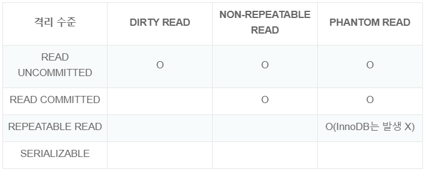
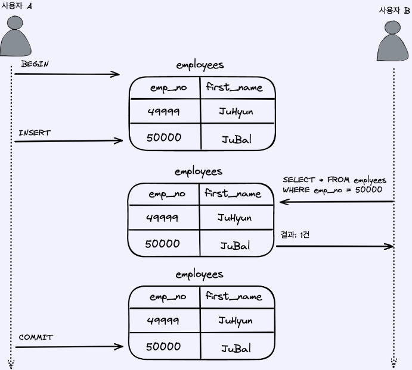
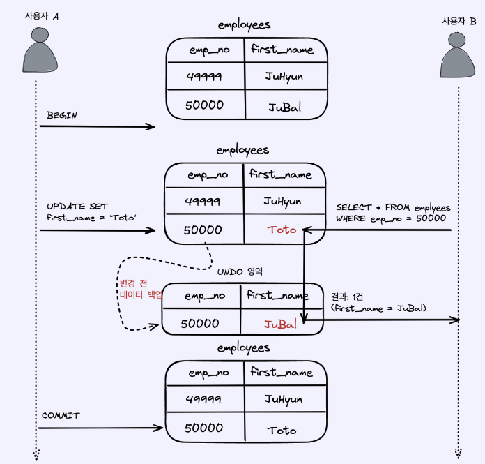
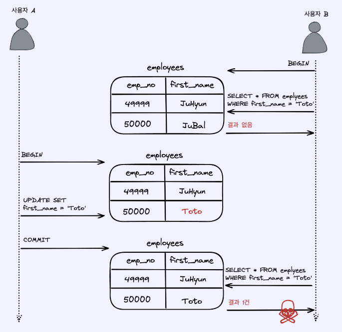
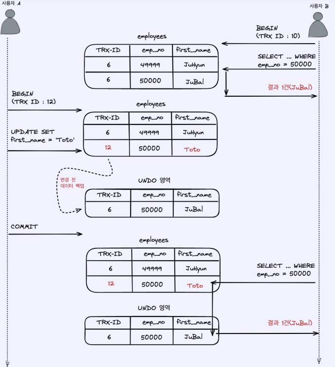
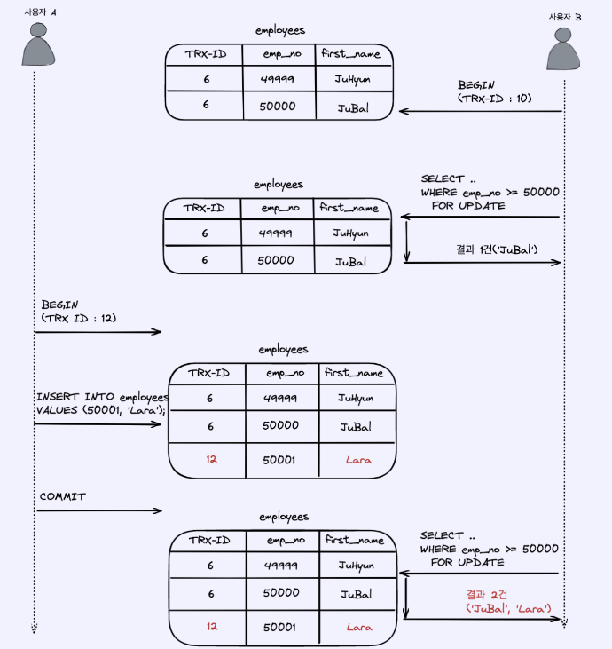

# 트랜잭션 격리 수준 (Transaction Isolation Level)

## 1. 트랜잭션
- DB의 상태를 변화시키기 위해서 수행하는 작업의 단위를 뜻하며, 데이터 정합성을 보장해주고, 100% 적용(COMMIT) 혹은 아무것도 적용되지 않음(ROLLBACK)을 보장하는 것
- 트랜잭션의 ACID
  - 원자성(Atomicity)
    - 트랜잭션 내에서 실행한 작업들은 모두 성공하거나 모두 실패해야 함
  - 일관성(Consistency)
    - 데이터베이스의 무결성 제약 조건과 같이 데이터베이스는 일관성있는 상태를 유지해야 함
  - 격리성(Isolation)
    - 동시에 실행되는 트랜잭션들은 서로에게 영향을 미치지 않게 격리되어야 하며, 격리성은 동시성과 관련된 성능 이슈로 인해 격리 수준을 선택할 수 있음
  - 지속성(Durability)
    - 트랜잭션이 성공적으로 끝나면 그 결과가 항상 기록되어야 함

## 2. MySQL의 격리 수준
- 트랜잭션의 격리 수준이란, 동시에 여러 트랜잭션이 처리될 때 특정 트랜잭션이 다른 트랜잭션에서 변경하거나 조회하는 데이터를 볼 수 있도록 허용할지 말지를 결정하는 것

### 2-1. 격리 수준 4가지
- READ UNCOMMITTED (커밋되지 않은 읽기)
- READ COMMITTED (커밋된 읽기)
- REPEATABLE READ (반복 가능한 읽기)
- SERIALIZABLE (직렬화 가능)
- 격리 수준은 READ UNCOMMITTED이 가장 낮고, SERIALIZABLE가 격리 수준이 가장 높으며, SERIALIZABLE 격리 수준이 아니라면 특별한 성능의 개선이나 저하는 발생하지 않음

### 2-2. 트랜잭션 격리 수준에 따라 발생하는 문제

- 위의 표와 같이 격리 수준이 낮을수록 더 많은 문제가 발생하게 됨
- 따라서 일반적으로는 READ COMMITTED나 REPEATABLE READ 둘 중 하나의 전략을 사용함

### 2-3. READ UNCOMMITTED

- 각 트랜잭션의 내용이 COMMIT이나 ROLLBACK 여부와는 상관없이 다른 트랜잭션에서 보여지게 되는 것
- 이러한 경우 작업 도중 문제가 발생하여 작업이 완료되지 않았음에도 다른 트랙잭션에서 볼 수 있게되는데, 이러한 현상을 Dirty Read라 함
- 따라서, MySQL에서는 최소한 READ COMMITTED 이상의 격리 수준을 사용할 것을 권장함

### 2-4. READ COMMITTED

- READ COMMITTED 격리 수준에서는 어떤 트랜잭션에서 변경한 내용이 COMMIT되기 전까지는 다른 트랜잭션에서 그러한 변경 내역을 조회할 수 없음
- NON-REPEATABLE 문제

- 위와 같이 COMMIT을 하기 전 SELECT 쿼리와 COMMIT을 한 뒤 SELECT 쿼리 실행의 결과가 다르기 때문에 REPEATABLE READ 정합성에 어긋나게 됨
- 웹 어플리케이션에서는 큰 문제가 되지 않지만, 하나의 트랜잭션에서 동일한 데이터를 여러번 읽고 수정하는 경우 금전적 처리와 연결되면 문제가 발생할 수 있음

### 2-5. REPEATABLE READ

- MySQL InnoDB 스토리지 엔진에서 기본적으로 사용하는 격리 수준으로, READ COMMITTED에서 발생하는 NON-REPEATABLE 문제가 발생하지 않음
- REPEATABLE READ는 UNDO 영역에 백업된 이전 데이터를 통해 동일한 트랜잭션 내에서는 동일한 결과를 보여주기 때문
- 서로 다른 세션이 동일한 데이터에 접근했을 때, 각 세션마다 스냅샷 이미지를 보장해주는 MVCC 기술로 인해 잠금을 사용하지 않는 일관된 읽기를 제공
- PHANTOM READ 문제

- 위와 같이 다른 트랜잭션에서 수행한 변경 작업에 의해 데이터가 보였다가 안보였다가 하는 현상을 뜻함
- MySQL InnoDB는 MVCC 다중 버전 제어로 PHANTOM READ 문제를 해결하고 있기 때문에 MySQL에서는 REPEATABLE READ 격리 수준을 주로 사용함

### 2-6. SERIALIZABLE
- 가장 단순하면서 가장 엄격한 격리 수준
- 한 트랜잭션에서 읽고 쓰는 데이터를 다른 트랜잭션에서는 절대 접근할 수 없도록 함

 
참고 : https://zzang9ha.tistory.com/381