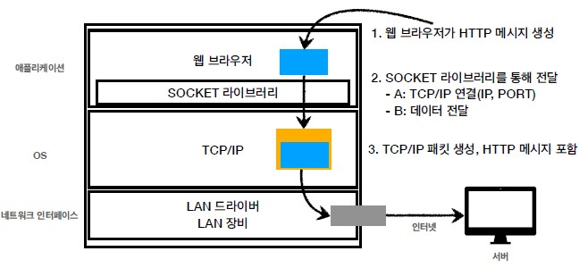
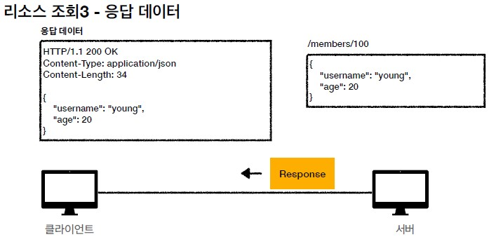

# URI & HTTP

## 1. URI

### 1-1. URI의 뜻
- Uniform: 리소스 식별하는 통일된 방식
- Resource: 자원, URI로 식별할 수 있는 모든 것(제한 없음)
- Identifier: 다른 항목과 구분하는데 필요한 정보
- URL & URN
  - URL(Uniform Resource Locator)
    - Locator : 리소스가 있는 위치를 지정
  - URN(Uniform Resource Name)
    - Name : 리소스에 이름 부여
  - 위치는 변할 수 있지만, 이름은 변하지 않음 

### 1-2. URL 분석
- scheme://[userinfo@]host[:port][/path][?query][#fragment]
- 예) https://www.google.com:443/search?q=hello&hl=ko
  - 프로토콜(https)
    - 프로토콜이란, 어떤 방식으로 자원에 접근할 것인가 하는 약속 규칙
    - http, https, ftp 등이 있음
  - userinfo
    - URL에 사용자 정보를 포함해서 인증하는 것으로, 거의 사용하지는 않음
  - 호스트명(www.google.com)
    - 호스트명으로, 도메인명 또는 IP 주소를 직접 사용 가능
  - 포트 번호(443)
    - http는 80 포트, https는 443 포트를 사용
    - 접속 포트로, 일반적으로 생략됨
  - 패스(/search)
    - 리소스 경로로 계층적 구조를 가짐
    - 예) /members/100, /items/iphone
  - 쿼리 파라미터(q=hello&hl=ko)
    - key=value의 형태
    - ?로 시작하며, &으로 추가가 가능 (&keyA=valueA&keyB=valueB)
    - query parameter나 query string으로 불리며, 웹 서버에 제공하는 파라미터나 문자 형태
  - fragment
    - html 내부 북마크 등에 사용되며, 서버에 전송되는 정보는 아님
    - 예) https://docs.spring.io/spring-boot/docs/current/reference/html/gettingstarted.html#getting-started-introducing-spring-boot

## 2. 웹 브라우저 요청 흐름

### 2-1. HTTP 요청 메시지 생성

### 2-2. HTTP 메시지 전송

### 2-3. 패킷 생성

### 2-3. 요청 패킷 전달

### 2-4. HTTP 응답

### 2-5. 응답 패킷 전달

## 3. HTTP

### 3-1. HTTP의 정의
- Hyper Text Transfer Protocol
- HTML, Image, JSON, XML 등 거의 모든 형태의 데이터 전송 가능
- 서버 간 데이터를 주고 받을 때도 대부분 HTTP를 사용
- 기반 프로토콜
  - TCP: HTTP/1.1, HTTP/2
  - UDP: HTTP/3
  - 현재 HTTP/1.1을 주로 사용하며, HTTP/2, HTTP/3도 점점 증가중
- HTTP의 특징
  - 클라이언트 서버 구조
  - 무상태 프로토콜(스테이스리스), 비연결성
  - HTTP 메시지
  - 단순함, 확장 가능

### 3-2. 클라이언트 서버 구조
- Request Response 구조
- 클라이언트는 서버에 요청을 보내고, 응답을 대기
- 서버가 요청에 대한 결과를 만들어서 응답
- 클라이언트는 UI 및 사용성 관련 기능이 들어가고, 서버에는 비즈니스 로직과 데이터 등이 들어감(이렇게 클라이언트와 서버를 분리해야 각각 독립적으로 개발을 진행할 수 있음)

### 3-3. 무상태(Stateless) 프로토콜
- Stateless
  - 서버가 클라이언트의 상태를 보존하지 않아 서버 확장성(스케일 아웃)이 높음
  - 다만, 클라이언트가 추가 데이터를 전송해주어야 하는 단점이 있음
- Stateless의 장점

- Stateless의 한계
    - 모든 것을 무상태로 설계 할 수 있는 경우도 있고 없는 경우도 있음
  - 무상태
    - 예) 로그인이 필요 없는 단순한 서비스 소개 화면
  - 상태 유지
    - 예) 로그인
  - 로그인한 사용자의 경우 로그인 했다는 상태를 서버에 유지해야 함 (일반적으로 브라우저 쿠키와 서버 세션등을 사용해서 상태 유지를 함)

### 3-4. 비연결성
- HTTP는 기본이 연결을 유지하지 않는 모델로, 일반적으로 초 단위 이하의 빠른 속도로 응답함
- 1시간 동안 수천명이 서비스를 사용해도 실제 서버에서 동시에 처리하는 요청은 수십개 이하로 매우 작기 때문에, 서버 자원을 매우 효율적으로 사용할 수 있음
  - 예) 웹 브라우저에서 계속 연속해서 검색 버튼을 누르지는 않는다.
- 비연결성의 한계와 극복
  - 한계
    - TCP/IP 연결을 새로 맺어야 함 ⇒ 3 way handshake 시간 추가
    - 웹 브라우저로 사이트를 요청하면 HTML 뿐만 아니라 자바스크립트, css, 추가 이미지 등 수 많은 자원이 함께 다운로드
  - 극복
    - HTTP 지속 연결(Persistent Connections)로 문제 해결
    - HTTP/2, HTTP/3에서 더 많은 최적화
- HTTP 초기

- HTTP 지속 연결(Persistent Connections)

### 3-5. HTTP 메시지의 구성

- 시작 라인
  - 요청 메시지
  - HTTP 메소드(GET, POST, PUT, DELETE 등)
  - 요청 대상
  - 응답 메시지
    - HTTP 상태코드
      - 200 : 성공
      - 400 : 클라이언트 요청 오류
      - 500 : 서버 내부 오류
- 헤더
  - HTTP 전송에 필요한 모든 부가 정보(메타 데이터)
- 메시지 바디
  - 실제 전송할 데이터로, HTML, 이미지, JSON, XML 등이 포함됨

## 4. HTTP 메소드

### 4-1. HTTP 메소드의 종류
- GET: 리소스 조회
- POST: 요청 데이터 처리, 주로 등록에 사용
- PUT: 리소스를 대체, 해당 리소스가 없으면 생성
- PATCH: 리소스 부분 변경
- DELETE: 리소스 삭제
- HEAD: GET과 동일하지만 메시지 부분을 제외하고, 상태 줄과 헤더만 반환
- OPTIONS: 대상 리소스에 대한 통신 가능 옵션(메서드)을 설명(주로 CORS에서 사용)
- CONNECT: 대상 자원으로 식별되는 서버에 대한 터널을 설정
- TRACE: 대상 리소스에 대한 경로를 따라 메시지 루프백 테스트를 수행

### 4-2. GET
- 리소스 조회
- 서버에 전달하고 싶은 데이터는 query(쿼리 파라미터, 쿼리 스트링)를 통해 전달
- 메시지 바디를 사용해서 데이터를 전달할 수 있지만, 지원하지 않는 곳이 많아 권장되지 않음

### 4-3. POST
- 새 리소스 생성(등록)할 때
  - 서버가 아직 식별하지 않은 새 리소스 생성
- 요청 데이터를 처리할 때
  - 단순히 데이터를 생성하거나, 변경하는 것을 넘어서 프로세스를 처리해야 하는 경우
    - 예) 주문에서 결제완료 -> 배달시작 -> 배달완료 처럼 단순히 값 변경을 넘어 프로세스의 상태가 변경되는 경우
  - POST의 결과로 새로운 리소스가 생성되지 않을 수도 있음
    - 예) POST /orders/{orderId}/start-delivery (컨트롤 URI)
- 다른 메서드로 처리하기 애매한 경우
  - 예) JSON으로 조회 데이터를 넘겨야 하는데, GET 메서드를 사용하기 어려운 경우 (사실 조회 데이터는 GET을 최대한 사용하는 것이 좋음)
- POST의 사용 예시
  - HTML 양식에 입력 된 필드와 같은 데이터 블록을 데이터 처리 프로세스에 제공
    - 예) HTML FORM에 입력한 정보로 회원 가입, 주문 등에서 사용
  - 게시판, 뉴스 그룹, 메일링 리스트, 블로그 또는 유사한 기사 그룹에 메시지 게시
    - 예) 게시판 글쓰기, 댓글 달기
  - 서버가 아직 식별하지 않은 새 리소스 생성
    - 예) 신규 주문 생성
  - 기존 자원에 데이터 추가
    - 예) 한 문서 끝에 내용 추가하기

### 4-4. PUT
- 리소스를 대체
  - 리소스가 있으면 대체, 리소스가 없으면 생성
  - 쉽게 이야기해서 덮어버림
- 클라이언트가 리소스를 식별하여, 클라이언트가 리소스의 위치를 알고 URI 지정 (POST와의 큰 차이점)

### 4-5. PATCH
- 리소스 부분 변경

### 4-6. DELETE
- 리소스 제거

## 5. HTTP 메소드의 속성

### 5-1. 안전
- 호출해도 리소스를 변경하지 않음
- Q: 그래도 계속 호출해서, 로그 같은게 쌓여서 장애가 발생하면요?
- A: 안전은 해당 리소스만 고려(리소스가 변하는지 안변하는지)한다. 그런 부분까지 고려하지 않는다.

### 5-2. 멱등
- 한 번 호출하든 두 번 호출하든 100번 호출하든 결과가 똑같음
- 멱등 메서드
    - GET: 한 번 조회하든, 두 번 조회하든 같은 결과가 조회됨
    - PUT: 결과를 대체하기 때문에 같은 요청을 여러번 해도 최종 결과는 같음
    - DELETE: 결과를 삭제하기 때문에 같은 요청을 여러번 해도 삭제된 결과는 똑같음
- 멱등하지 않은 메서드
    - POST: 멱등이 아님! 두 번 호출하면 같은 결제가 중복해서 발생할 수 있음
- 활용
    - 자동 복구 메커니즘
    - 서버가 TIMEOUT 등으로 정상 응답을 못주었을 때, 클라이언트가 같은 요청을 다시 해도 되는가?에 대한 판단 근거
- Q: 재요청 중간에 다른 곳에서 리소스를 변경해버리면?
    - 사용자1: GET -> username:A, age:20
    - 사용자2: PUT -> username:A, age:30
    - 사용자1: GET -> username:A, age:30 -> 사용자2의 영향으로 바뀐 데이터 조회
- A: 멱등은 외부 요인으로 중간에 리소스가 변경되는 것 까지는 고려하지는 않는다.

### 5-3. 캐시 가능

- 응답 결과 리소스를 캐시해서 사용해도 되는가?
- GET, HEAD, POST, PATCH 캐시가능
- 실제로는 GET, HEAD 정도만 캐시로 사용
    - POST, PATCH는 본문 내용까지 캐시 키로 고려해야 하는데, 구현이 쉽지 않음

## 6. HTTP 메소드의 활용

### 6-1. 클라이언트에서 서버로 데이터 전송

- 쿼리 파라미터를 통한 데이터 전송
  - GET
  - 주로 정렬 필터(검색어)
- 메시지 바디를 통한 데이터 전송
  - POST, PUT, PATCH
  - 회원 가입, 상품 주문, 리소스 등록, 리소스 변경
- 클라이언트에서 서버로 데이터 전송하는 4가지 상황
  - 정적 데이터 조회
    - 이미지, 정적 텍스트 문서
    - 조회는 GET 사용
    - 정적 데이터는 일반적으로 쿼리 파라미터 없이 리소스 경로로 단순하게 조회 가능
  - 동적 데이터 조회
    - 주로 검색, 게시판 목록에서 정렬 필터(검색어)
    - 조회 조건을 줄여주는 필터, 조회 결과를 정렬하는 정렬 조건에 주로 사용
    - 조회는 GET 사용
    - GET은 쿼리 파라미터 사용해서 데이터를 전달
  - HTML Form을 통한 데이터 전송
    - 회원 가입, 상품 주문, 데이터 변경
    - HTML Form submit시 POST 전송
      - 예) 회원 가입, 상품 주문, 데이터 변경
    - Content-Type: application/x-www-form-urlencoded 사용
      - form의 내용을 메시지 바디를 통해서 전송 (key=value, 쿼리 파라미터 형식)
      - 전송 데이터를 url encoding 처리
        - 예) abc김 -> abc%EA%B9%80
    - HTML Form은 GET 전송도 가능
    - Content-Type: multipart/form-data
      - 파일 업로드 같은 바이너리 데이터 전송시 사용
      - 다른 종류의 여러 파일과 폼의 내용 함께 전송 가능(그래서 이름이 multipart)
    - 참고: HTML Form 전송은 GET, POST만 지원
  - HTTP API를 통한 데이터 전송
    - 회원 가입, 상품 주문, 데이터 변경
    - 서버 to 서버
      - 백엔드 시스템 통신
    - 앱 클라이언트
      - 아이폰, 안드로이드
    - 웹 클라이언트
      - HTML에서 Form 전송 대신 자바 스크립트를 통한 통신에 사용(AJAX)
      - 예) React, VueJs 같은 웹 클라이언트와 API 통신
    - POST, PUT, PATCH: 메시지 바디를 통해 데이터 전송
    - GET: 조회, 쿼리 파라미터로 데이터 전달
    - Content-Type: application/json을 주로 사용 (사실상 표준)
      - TEXT, XML, JSON 등등

### 6-2. HTTP와 Ajax
- HTTP는 클라이언트가 요청 메세지(Request)를 보내고 서버가 응답메세지(Response)를 반환하는 형식으로 사용되는데, HTTP에서는 전송 계층 프로토콜로 TCP를 사용하고 네트워크 계층 프로토콜로 IP를 사용함 (이를 합쳐 TCP/IP라고 부름)
- Ajax
  - Asynchronous(비동기적) Javascript + XML로 XMLHttpRequest라는 자바스크립트 객체를 이용하여 웹 서버와 비동기로 통신하고 DOM을 이용하여 웹 페이지를 동적으로 갱신하는 프로그래밍 기법
  - 주로 JSON과 text 데이터를 사용하고 있으며, Ajax의 포인트는 필요한 부분만 DOM으로 변경한다는 것
  - 또한, 통신이 비동기적으로 이루어지기 때문에 서버가 데이터를 다 보내지 않은 상태라 하더라도 클라이언트를 자유롭게 사용할 수 있음
- Ajax의 장점
  - 최소한의 데이터 통신으로 속도가 빠르고 부하가 적음
  - 비동기 통신이기 때문에 클라이언트가 다른 작업을 할 수 있음
  - 웹 페이지의 갱신을 클라이언트가 담당하여 페이지 전환대신 일부분만 변경하여 빠른 렌더링이 가능함